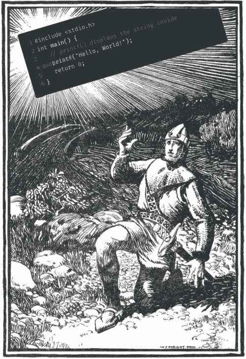
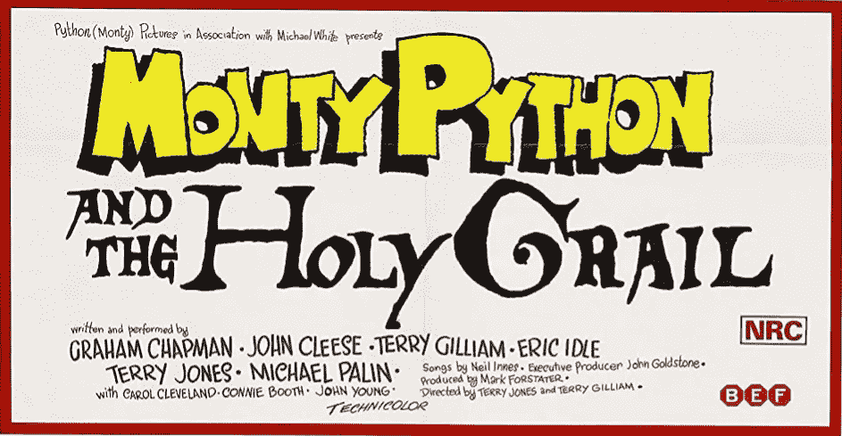

# 介质上代码块的圣杯

> 原文：<https://blog.devgenius.io/the-search-for-the-holy-grail-of-code-blocks-on-medium-502071931cac?source=collection_archive---------2----------------------->



一个开发者最终找到了在媒体上制作一个像样的代码块的方法

## 如何让代码在介质上好看？这里是你的选择纲要！

作为一名职业软件开发人员，当我在媒体上写东西时，我很可能会添加一些代码。那么如何让代码看起来更好呢？


# 我们是说…‘你好，世界’的骑士！

对于本文中的例子，我们需要一些代码。我们就用 c 中经典的“Hello World”吧。

没有任何格式，该代码如下所示:

# include<stdio.h>int main(){
//printf()显示引号内的字符串
printf("Hello，World！");
返回 0；
}</stdio.h>

很糟糕，对吧？谢天谢地，Medium 提供了一种制作代码块的方法。


# 如果你不安抚我们，我们将再次对你说“你好，世界”。

R 给出代码块，[媒体帮助中心](https://help.medium.com/hc/en-us/articles/215194537)声明:

> 若要开始一个代码块，请转到新行并键入`` `(三个反勾号)。

这很简单，但是默认代码块看起来并不令人兴奋或满足:

```
#include <stdio.h>
int main() {
   // printf() displays the string inside quotation
   printf("Hello, World!");
   return 0;
}
```

没有颜色，没有迹象表明这是什么语言，或者哪个部分是重要的。这一切都相当乏味。但是如果这不是我们想要的，那我们想要什么呢？


# 我们想要…一个代码块！一个看起来不错的。而且不太贵。

首先，我们想要漂亮的颜色！[**或**](https://en.wikipedia.org/wiki/Syntax_highlighting) 的语法高亮，正如它的正式称呼。

Medium 上的一些文章有非常漂亮的代码片段。很多颜色！但当你试图选择代码时，它变成了一个图像。有点像撞墙。哎哟🤕

所以我们要的第二样东西是可以选择(或者至少复制)的**代码。**

第三，我更喜欢对所有代码示例使用一个工具。这意味着从 70 年代的经典语言(如 Altair BASIC、Bourne Shell 和 C)到当代语言(如 Rust、Swift 和 TypeScript)的支持。

由于媒介不能给我们提供好的东西，我们将不得不寻找媒介之外的解决方案。现在我们知道我们在寻找什么，我们有什么选择？


# 你必须带着密码块回到这里，否则，你将永远不能活着穿过这片树林。

因为我们想使用媒体之外的东西，我们将不得不使用[嵌入](https://help.medium.com/hc/en-us/articles/214981378-Embeds)。再次引用帮助中心的话:

> 媒体上的嵌入通过专用嵌入服务 [Embed.ly](http://embed.ly/) 处理。Embedly 保留了一个目前超过 300 个[支持的嵌入式提供商](http://embed.ly/providers)的列表，这些提供商已经与 Embedly 服务直接集成。来自这些服务的内容可以嵌入到介质中。

所以为了找到一个允许我们嵌入代码块的提供商，我们必须访问提供商列表:【https://embed.ly/providers。在浏览了整个名单后，有 24 个可能的候选人。

他们大致分为四类:

1.  特定于语言的代码编辑器
2.  特定于 Web / Javascript 的代码编辑器
3.  通用代码编辑器
4.  代码/代码片段粘贴工具

前两组可以去掉，因为它们只提供对一种(或几种)语言的支持。如果你*对只嵌入一种语言的代码感兴趣，嵌入可以用于 [C](https://webassembly.studio/) 、 [Kotlin](https://play.kotlinlang.org/) 、 [Rus](https://webassembly.studio/) t、 [Scala](https://scalafiddle.io/) 和 [Swift](https://swiftsnip.com/) 。*

在 Javascript/Web 领域，这个列表更长: [CodePen](https://codepen.io/) 、 [Codeply](https://www.codeply.com/) 、 [CodesAndBox](https://codesandbox.io/) 、 [JsBin](https://jsbin.com/?html,output) 、 [JsComplete](https://jscomplete.com/) 、[JSF middle](https://jsfiddle.net/)、 [JSitor](https://jsitor.com/) 和 [Runkit](https://runkit.com/) 都提供 CSS/HTML/JS(有时还有其他的比如 Sass)。

就通用代码编辑器而言，只有 [Glitch](https://glitch.com/) 和 [Repl.it](https://repl.it/) 。

如果你想展示你的代码*运行*，这些编辑器可能非常有用，但如果你只想*展示*你的代码，它们就没那么有用了。这就是我们将重点转移到“粘贴”工具的地方。


# 这是一个很好的代码块。我特别喜欢这些颜色，…但有一个小问题。

这组中第一批失败的两位候选人是[code embedded . dev](https://codeembed.dev/)和 [Pastie](http://pastie.org/) 。因为它只有临时的粘贴。因为它的语言集有限。不用担心，这仍然留给我们五个选择。

我将向您展示它们的外观(在 C 示例中使用我们的“Hello World”)，无需进一步说明:

## 碳

## Github Gist

Github 上 C 语言的“你好，世界”

## Pastebin

[](https://pastebin.com/537TjB2A) [## 你好，Pastebin.com

### 客人 2020 年 5 月 31 日 13 从来不是帕斯捷潘的会员？注册，它解锁许多很酷的功能！我们使用 cookies

pastebin.com](https://pastebin.com/537TjB2A) 

# 帕斯特里

《帕斯捷里的 C》中的“你好，世界”

## Snipit

关于 Snipit 的 C 语言“你好，世界”

此时，您可能已经注意到了有关 Pastebin 示例的一些情况。可悲的是，这并不奏效。😭问题出在 Medium、Embedly 还是 Pastebin，我不知道。我确实知道，如果它不起作用，它对我们就毫无用处。

> 这意味着最后一轮将在 **Carbon、Github Gists、Pastery 和 Snipit** 之间进行。

其余四种工具均满足我们的要求。它们有语法突出显示，支持多种语言，并且可以选择文本。不过，有一个明确的区别:Github Gists 和 Snipit 只有一个(轻)主题。作为付费功能，Snipit 确实提供了更多这样的功能。Carbon 和 Pastery 有很多主题。碳，事实上，可以让你改变所有关于代码外观的东西。

让我们更详细地看一下:

*   [**Carbon**](https://carbon.now.sh/)自 2017 年发布以来，Carbon 在开发社区引起了不小的轰动。由[迈克·菲克斯](https://twitter.com/fixitup2)、[布莱恩·丹尼斯](https://github.com/briandennis)和[杰克·德克斯海默](https://github.com/jakedex)创作。代码[可在 Github](https://github.com/carbon-app/carbon) 上获得。使用 Github 创建一个帐户来跟踪代码片段。通过第三方插件支持许多 IDE/编辑器和 CLI。功能太多，不多说了。一些亮点:
    设置任何主题(背景图片、颜色、阴影、字体、隐藏字符、行高、行号、填充、大小)
    设置图片的主题颜色
    使用 Github Gist 作为基础(只需将 Gist ID 粘贴到 URL 中)
    导出为 SVG 或 PNG
*   [**Github Gists**](https://gist.github.com/)Gists 是 Github 运营的最知名的。它需要一个 Github 帐户。自动检测用于语法突出显示的编程语言。缺点是每个要点只能嵌入一个文件。这意味着你必须为你文章中的每个代码块创建一个要点。如果你还把清单用于其他目的，这会给你的清单增加一些混乱。大多数 IDE/编辑器都有 API 和第三方插件。一个主题适合所有人。
*   [**Pastery**](https://www.pastery.net/)由两位希腊开发者( [Stavros Korokithakis](https://twitter.com/stavros) 和 [Stelios Petrakis](https://twitter.com/stelabouras) )制作，用 [Django](https://www.djangoproject.com/) 编写。代码不是开源的，但是有一个 Gitlab repo 来跟踪问题。需要一个帐户(基于电子邮件)来制作不会过期的片段。编程语言是自动检测的，但也可以手动设置。可以为所有片段(过去和未来)设置 30 个主题中的一个。有一个 API。Atom、Emacs、Sublime、Vim、VS Code、Xcode 和命令行都有插件。
*   [**Snipit**](https://snipit.io/)由[杜卡](https://twitter.com/andreiduca)打造。代码不是开源的，但是有一个位存储桶来跟踪问题。需要一个帐户(通过 Github 或谷歌)。编程语言可以手动设置。VSCode 提供集成。只有一个主题可用(除非你愿意支付更多)。Snipit 支持“列表”和“标签”,这使得管理代码片段变得更加容易。尤其是当你有很多代码示例的时候。

所以现在你要做出选择:**哪一个是你的圣杯？**


# 你已经找到了代码块，你必须把它放在这个代码块旁边，只是稍微高一点，这样你就可以得到中间有一条小路径的两层效果。

对我来说，最明显的赢家是碳。对于简单的例子和格式化代码(比如 CSV 和 Markdown)，Gist 工作得很好。但是除此之外，碳看起来太好了。它是唯一的开源解决方案，这也很有帮助…而且它还有另一个好处。

Carbon 有一个将代码导出为图像的功能。

我知道……我清楚地声明过我不希望我的嵌入图片。

但这与嵌入无关！

一个 tweet 示例，展示了 Carbon 的代码图像特性

通过能够导出代码的图像，它可以用作文章的“特色图像”。

这意味着**每当文章被分享时，代码**就会出现在 Twitter 或 LinkedIn 等地方。

对我来说，这足以赢得其他(也相当不错的)选择。

我希望你已经做出了你的选择。不管它是什么，它会让你的代码看起来很漂亮！

我错过了什么吗？让我知道(通过 Twitter，LinkedIn，或在评论中)，我会确保更新这篇文章。

# 这篇文章的主题


本文使用的所有图像均由[沃尔特·j·恩赖特](https://en.wikipedia.org/wiki/Walter_J._Enright)为《 [*亚瑟王和他的骑士们*](https://www.goodreads.com/book/show/3102350-king-arthur-and-his-knights) 》(作者[莫德·l·拉德福德](https://en.wikipedia.org/wiki/Maude_Radford_Warren))一书制作。它们出版于 1903 年。这本书(及其所有内容)现在都在公共领域，并且可以在古腾堡计划上获得。



“巨蟒和圣杯”电影海报的一部分

部分标题是对 1975 年英国喜剧电影《巨蟒与圣杯》的修改。这句话出自[的骑士们口中，他们说“你！](https://en.wikipedia.org/wiki/Knights_Who_Say_%22Ni!%22)”，用部分文字替代。(“Hello World”代替“Ni”，“Code-block”代替“灌木林”，“colors”代替“laurels”)