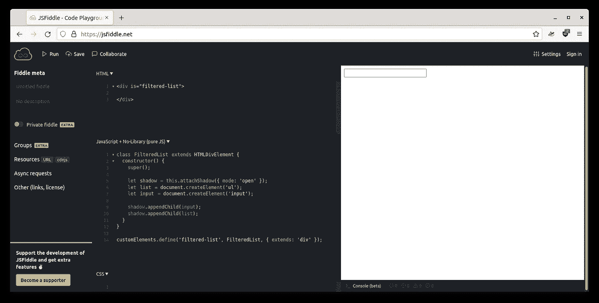
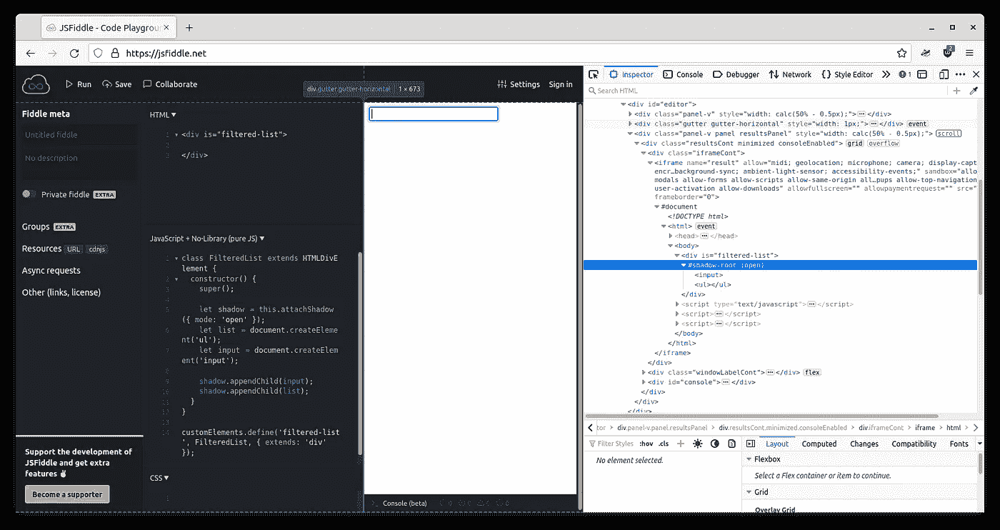

# HTML5 web 组件的阴影 DOM

> 原文：<https://blog.devgenius.io/the-shadow-dom-of-an-html5-web-component-d99af7844192?source=collection_archive---------8----------------------->


[妮可·约翰逊](https://unsplash.com/@victorious_light?utm_source=medium&utm_medium=referral)在 [Unsplash](https://unsplash.com?utm_source=medium&utm_medium=referral) 上的照片

我们将在 HTML5 教程的后面部分展示使用 HTML5 web 组件构建 web 应用程序的原生 Javascript 方法。到目前为止，我们为我们的[响应式](/the-responsive-layout-for-our-rust-web-application-8fb46fe14c8f) RSS 阅读器[应用程序](/initial-setup-for-a-rust-web-application-using-web-components-and-native-javascript-modules-ee832c062e8a)创建了一些 [web 组件](/html5-rss-reader-writing-the-first-web-components-949eec88dbf9)，我们看到了如何设计它们的样式并[扩展它们](/html5-rss-reader-writing-specialized-web-components-8c8a972e681a)，但是有一个核心方面我们需要讨论:影子 DOM。如果为 web 组件激活，shadow DOM 允许该组件的内容对外界隐藏。它是这样工作的:

```
class FilteredList extends HTMLDivElement {
  constructor() {
    super();

    let shadow = this.attachShadow({ mode: 'open' });
    let list = document.createElement('ul');
    let input = document.createElement('input'); shadow.appendChild(input);
    shadow.appendChild(list);
  }
}customElements.define('filtered-list', FilteredList, { extends: 'div' });
```

在上面的例子中，我们创建了一个名为`FilteredList`的复合元素，它有一个列表和一个文本框:就像我们对`CustomList`所做的一样，只是这次过滤`input`被包含在组件中。在`CustomList`的情况下，过滤`input`在`index.html`的组件之外。

我们将一个阴影 DOM 附加到`FilteredList`上，并用`mode: open`对其进行设置(我们稍后会看到这意味着什么)。然后我们将列表和文本框添加到影子 DOM 中。



JSFiddle 中的项目结构

我们可以在结果中看到`input`出现了，但这不是我们现在感兴趣的。让我们看看 DOM:



我们的过滤列表的 DOM

简化后，DOM 看起来像这样:

```
<body>
  <div is="filtered-list">
    #shadow-root (open)
      <input>
      <ul></ul>
  </div>
</body>
```

`FilteredList`的影子 DOM 是包含在`#shadow-root`节点中的所有内容。一个组件可以有一个单独的阴影 DOM，有些组件不能有它，比如 image 元素。可以是`open`，意思是可以在 Javascript 中使用元素`myCustomElement.shadowRoot`的`shadowRoot`属性访问影子 DOM 内容，也可以是`closed`，`shadowRoot`返回`null`。在这两种情况下，普通的 CSS 都无法定位影子 DOM 的内容。

## 设计 web 组件的样式


[杰瑞米·托马斯](https://unsplash.com/@jeremythomasphoto?utm_source=medium&utm_medium=referral)在 [Unsplash](https://unsplash.com?utm_source=medium&utm_medium=referral) 上的照片

我们可以通过向 shadow DOM 添加一个`style`元素来添加样式:

```
class FilteredList extends HTMLDivElement {
  constructor() {
    super();

    let shadow = this.attachShadow({ mode: 'open' });
    let list = document.createElement('ul');
    let input = document.createElement('input');
    let style = document.createElement('style'); style.textContent = '.list { color: red; }';
    list.classList.add('list'); shadow.appendChild(input);
    shadow.appendChild(list);
    shadow.appendChild(style);
  }
}customElements.define('filtered-list', FilteredList, { extends: 'div' });
```

这将使我们能够在影子 DOM 中拥有一个`<style>`节点，为 web 组件的内容提供 CSS 类。我们还可以使用 CSS 对象模型来提供样式:我们可以以任何我们想要的方式拥有组件，外部世界不能干涉。

这是创建业务组件库的一个很好的方法，例如，我们希望所有公司应用程序的所有组件的外观都相同。在这种情况下，我们希望锁定样式，并防止其他人改变它。如果我们进一步想出售组件库并阻止其他人使用它们的内部组件，我们使用`closed` shadow DOM。

无论哪种方式，通常的 CSS 选择器都不能从组件外部接触到组件。这不行:

```
<style>
  .list input {
    color: red;
  }
</style>
```

对于外界来说，`FilteredList`中没有`input`标签。为了让 CSS 样式化`input`，组件必须首先通过将它导出为组件`part`来允许它:

```
class FilteredList extends HTMLDivElement {
  constructor() {
    super();

    let shadow = this.attachShadow({ mode: 'open' });
    let list = document.createElement('ul');
    let input = document.createElement('input'); list.setAttribute('part', 'list');
    input.setAttribute('part', 'input'); shadow.appendChild(input);
    shadow.appendChild(list);
  }
}customElements.define('filtered-list', FilteredList, { extends: 'div' });
```

现在组件将`input`元素导出为`input`部件，将`ul`导出为`list`部件。这样，我们可以使用 CSS 来设计这些部分的样式，如下所示:

```
<style>
  div::part(list) {
    color: red;
  }
  div::part(input) {
    color: blue;
  }
</style>
```

上述样式可以放在应用程序中任何地方的任何 CSS 文件中，它将成功地将导出的组件作为目标。不幸的是，如果你的 web 组件有可能包含其他 web 组件的模板，事情就变得复杂了，比如我们的`CustomList`包含了一个`ArticleListItem`。在这些情况下，主组件需要再次导出所包含组件的一部分，以使它们可以被访问，这就把我们带到了下一点。

## 何时使用阴影 DOM


Clint Patterson 在 [Unsplash](https://unsplash.com?utm_source=medium&utm_medium=referral) 上拍摄的照片

我们需要清楚地了解我们希望组件如何工作。没有必要总是隐藏他们的造型。例如，在我们的 RSS 阅读器中，出于几个原因，我特意为组件使用了简单的 CSS 样式。首先，我们不是在构建一个组件库:我们的组件只是其他 web 组件的混合。像`CustomList`这样的其他组件甚至没有 UI:它只是向`ul`元素添加了一些行为。

这种类型的复合 web 组件不一定符合封闭和受保护的部分。他们只是添加功能或混合现有组件。然而，如果我们为一组需要看起来相同的企业业务产品构建一个组件库，我们将从样式化列表、输入和其他标签开始，并将其隐藏在影子 DOM 中。通过这种方式，我们可以使用`part`语法精确地控制我们想要留给定制样式的内容。

同样的事情也适用于`open`或`closed`阴影 DOM。如果您想密封您的组件，以便 Javascript 无法检测到它们，请使用`closed` shadow DOM。这对于你想出售的私有组件或者像保存密码这样的私有功能非常有用。如果 Javascript 看不到影子 DOM 中包含私有信息的输入，那么该信息在组件中是安全的。

还有另一种可能，复制当前由 React 等框架引领的 Javascript 趋势，将样式包含在组件中。这也可以使用包含`style`标签的`closed` shadow DOM 来实现。所有的特性都在那里并且可以实现，只是不要简单地复制 React 或者只是封闭所有的组件:思考和计划，允许或不允许 CSS 根据你的需要来设计你的组件，而不是简单地跟随潮流。这基本上是整个 web 组件教程的目的。

这一部分到此结束，接下来是最后一部分，我们将在组件中加载 RSS 数据。这一次没有 Github 链接，这只是一篇展示 shadow DOM 的说明性文章，讨论它，并尝试设置在哪里以及如何使用它的例子。

我们还(主要是不由自主地)上了一堂简短的(也许很无聊的)“生活/编码”课:不要只是跟风。不要因为有框架就使用框架。试着考虑你的应用程序，并应用最适合你的。它可以是 React，它可以与 Redux 反应，它可以与 React 路由器，Redux，Redux Thunk，React 动画和许多其他东西反应。或者它可以是一个只有 Javascript 的应用程序，带有 web 组件和本地模块。你说了算。浏览器已经支持这一切。web 组件教程到此结束，下次再见！