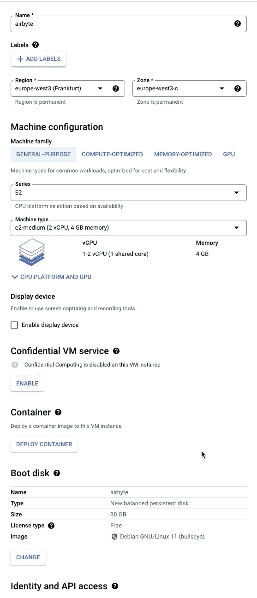

# 在谷歌云平台计算引擎上设置 airbyte 的最短路径(也可以用手机访问！)

> 原文：<https://blog.devgenius.io/the-shortest-way-to-setup-airbyte-on-google-cloud-platform-compute-engine-accessible-with-mobile-ac868f294adc?source=collection_archive---------4----------------------->

我们都知道在本地设置 airbyte 是一个非常简单的过程，但它是有限的，因为只有你可以访问它，如果你一天不打开你的计算机，数据将不会在你的数据仓库中处理，或者即使你关闭了你的计算机，你将需要再次运行 docker 和所有这些问题

出于这个原因，我们应该将它部署在一台虚拟机上，它只是一台 24/7 开机的计算机，通过它，我们基本上是在云上运行它，它将像我们使用的任何其他 ETL/ELT 软件一样工作，但您最终将支付比这些工具更少的费用

为了这篇文章，我正在 GCP 的**计算引擎**上设置 airbyte。我们首先创建一个虚拟机实例，在此基础上创建一个虚拟机，配置如下**计算引擎- >虚拟机实例- >创建实例**



对于服务帐户，请使用我在文章中经常提到的具有最高访问权限的帐户(计算管理应该没问题)，区域是可选的，对于我们的工作来说，e2.medium 足够好，因为 airbyte 文档也建议这样做，但是如果处理非常大量的数据，计算能力应该相应地调整，需要注意的一个重要事项是将磁盘大小增加到 30 GB，并允许 HTTP 和 HTTPs 流量，因为这与此方法相关

在我们设置好 VM 实例(可能需要几分钟)之后，我们只需点击 SSH 按钮就可以连接到它，它将打开一个终端窗口


现在是复制粘贴这些命令并等待必要的工具安装的时候了

*   安装`docker`

```
*# In your ssh session on the instance terminal*
sudo apt-get update
sudo apt-get install -y apt-transport-https ca-certificates curl gnupg2 software-properties-common
curl -fsSL https://download.docker.com/linux/debian/gpg | sudo apt-key add --
sudo add-apt-repository "deb [arch=amd64] https://download.docker.com/linux/debian buster stable"
sudo apt-get update
sudo apt-get install -y docker-ce docker-ce-cli containerd.io
sudo usermod -a -G docker $USER
```

*   安装`docker-compose`

```
*# In your ssh session on the instance terminal*
sudo apt-get -y install wget
sudo wget https://github.com/docker/compose/releases/download/1.26.2/docker-compose-$(uname -s)-$(uname -m) -O /usr/local/bin/docker-compose
sudo chmod +x /usr/local/bin/docker-compose
docker-compose --version
```

在所有安装完成后输入 logout，然后终端窗口将关闭。再次点击 SSH 按钮，重新打开窗口，一个新的终端窗口将如预期的那样打开。现在，要安装 airbyte，请键入以下命令

```
*# In your ssh session on the instance terminal*
mkdir airbyte && cd airbyte
wget [https://raw.githubusercontent.com/airbytehq/airbyte/master/{.env,docker-compose.yaml}](https://raw.githubusercontent.com/airbytehq/airbyte/master/{.env,docker-compose.yaml})
docker-compose up -d
```

现在在搜索中键入 firewall，然后转到 **firewall** 和**创建一个名为 airbyte 的防火墙规则**


具有以下配置，然后对于 **ipv4 范围**,您可以选择 0.0.0.0/0 的全局范围，也可以在 google 上键入什么是我的 IP，它会是类似 192.168 的内容…..比如一个中间有句号的数字，用最简单的方式解释它，然后复制粘贴到允许的 ip 范围内。通过这种方式，当你连接到当前的 wifi 网络时，你将只能连接到 airbyte，以再次简单地解释它，或者使用 VPN 将你路由到你的网络。所以如果你现在在星巴克连接到他们的网络，不要使用那个 ip，但是当你在家里或办公室的时候，请使用那个 ip！最后，在目标标签中只需输入 airbyte，因为这将用于告诉您的虚拟机该 ip 已被列入白名单

创建规则后，返回到您的虚拟机实例，单击名称，然后按 edit


在您的网络标签下添加 airbyte 并保存。现在，最后一步只是复制虚拟机实例的外部 IP，并转到该 IP 地址的端口 8000，在那里您将看到 airbyte 应用程序！你应该这样做-


所以网址会是[**http://外部**](http://EXTERNAL) **IP:8000/** 就这样吧！你将进入 airbyte 的启动页面，在这里你只需要输入你的电子邮件

您已经成功地在线部署了一个应用程序，并且它将全天候运行，如果您在同一个网络上(并且您请求桌面站点)或者如果您的手机上有 VPN，您甚至可以从您的手机上访问它！立即开始英语教学过程！

如果你喜欢我的文章，如果你能在我的[媒体账户](https://medium.com/@suhasthakral)上给我一个关注，那就太好了