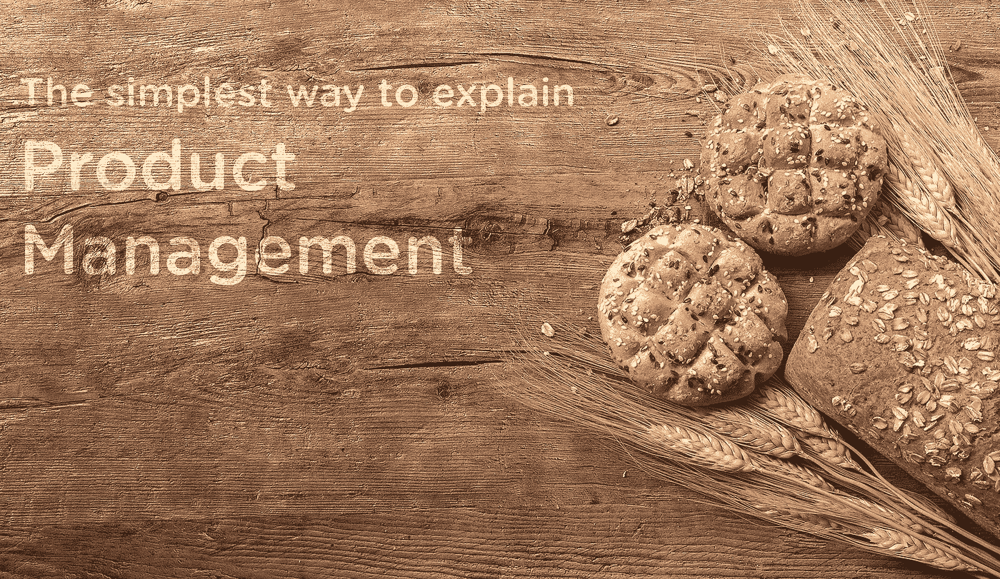
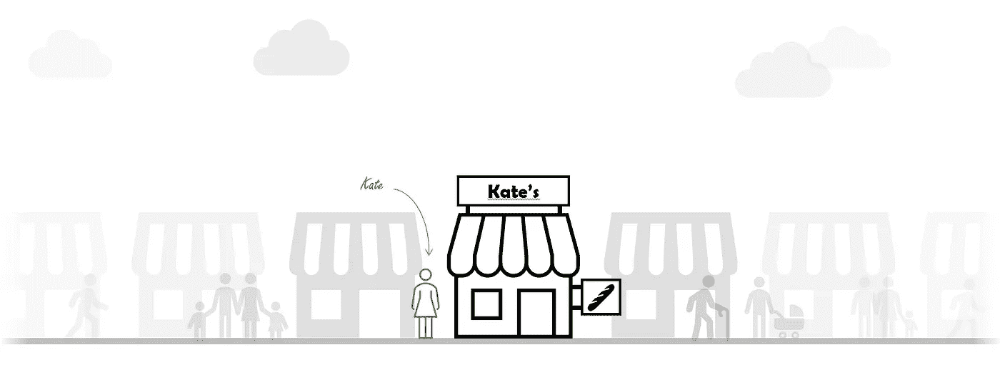
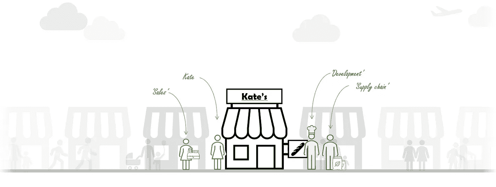
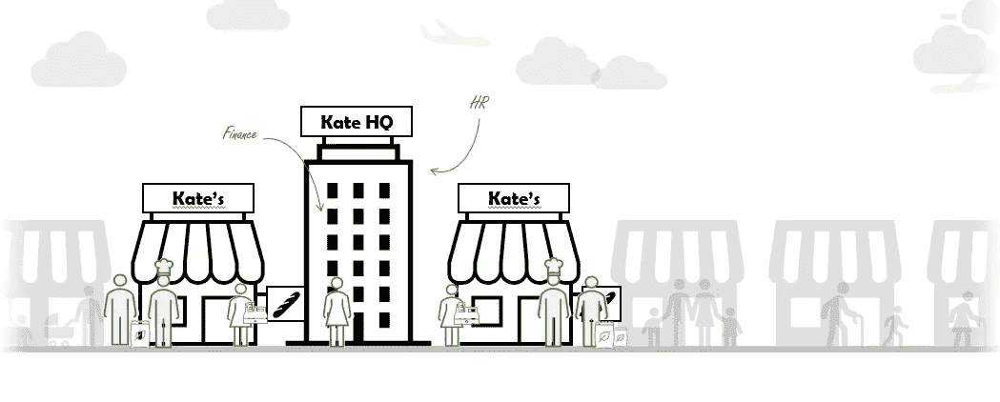
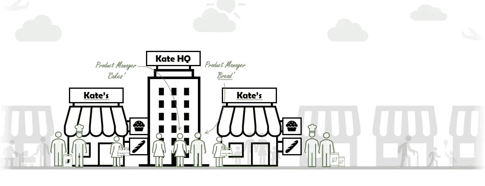
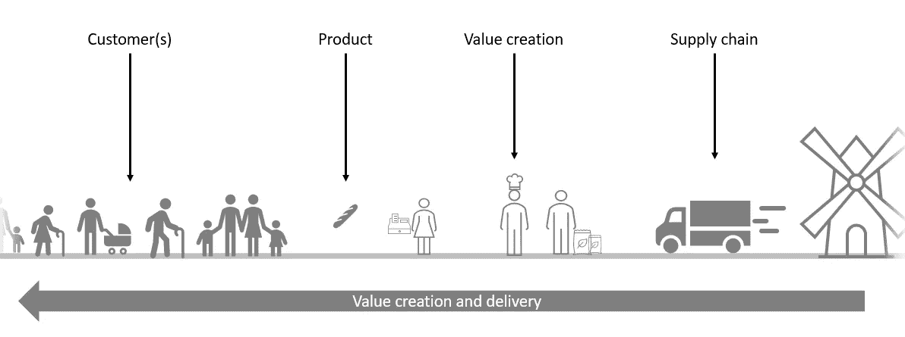

# 解释产品管理的最简单方法

> 原文：<https://blog.devgenius.io/the-simplest-way-to-explain-product-management-bc741b77800d?source=collection_archive---------1----------------------->

# 产品管理 101

在我担任产品经理的这些年里，我曾多次被问到这个问题:“什么是产品管理？产品经理是做什么的？”

让我尽量简单地解释一下产品管理。

Ales Krivec 通过 Unsplash 提供的原始图像

# 什么是公司？

公司是一个提供产品或服务以换取金钱的组织。就这么简单。人们工作是为了制造某物(一种产品)，或者为某人做某事(一种服务)。作为回报，他们挣钱。

## 一个例子:凯特的面包店

见见凯特。她拥有一家面包店。(为什么是面包店？因为每个人都可以参与这种类型的业务)。她每天烤新鲜的面包，然后卖给邻居。凯特是她组织中的每一个角色。

她的产品——*面包*——满足了顾客的直接需求:他们需要吃。

凯特的面包店正在向当地社区出售面包

凯特的面包店很成功。对她面包的需求越来越大，她自己烤不了足够的面包。她雇了一个人去**卖**面包，这样她就可以继续烤面包了。她现在的公司*里有 ***销售*** 。随着公司的发展，她雇人为她烤面包，确保正确的原料是从 T21 采购的，还有库存的。*

凯特的面包店正在扩大，她的组织中有了一些新的角色

随着公司的发展，凯特再也没有时间实际烤面包了。Kate 负责剩下的，基本做 ***总务管理*** 。

一个机会出现了，她开了第二家商店。这意味着她必须雇用更多的人，并且必须对各个地点进行会计核算。她创建了一个 ***人力资源部*** 来处理所有人事相关事宜，并创建了一个 ***财务部*** 来为她做会计。

凯特的面包店正在扩建，有了一家新店和一个总部

凯特的顾客告诉她，他们喜欢她的面包。然而，他们也喜欢(1)在面包上加点东西，喜欢(2)一些糖果和糕点，喜欢(3)一些牛奶配面包。她从市场上获得的客户需求的三个非常具体的例子。她决定推出一个新的产品线来满足顾客的需求: ***糕点和蛋糕*** 。毕竟，她有原料，她的劳动力中有面包师，可以在她的店里卖；这与她销售的现有产品非常契合。

由于对这两种产品的要求完全不同，她现在雇了一个人来照看产品*面包*，另一个人负责她的*糕点和蛋糕。*

## 欢迎**产品经理**！

这些产品经理负责确保产品满足客户需求，公司能够交付这些产品。例如，这意味着他们检查产品是否美味和新鲜(质量控制)，是否符合客户的需求(例如，他们是否有胡萝卜或苹果蛋糕)，价格是否合适，以便客户愿意支付该价格，等等。

Kate 的公司现在有两位产品经理了！

# 因此...什么是产品管理

什么是产品管理，众说纷纭。也有各种定义。你经常会读到“产品经理*拥有*产品”或者“产品经理*代表*组织中的客户”或者“产品经理负责向客户提供价值”这样的话。所有这些陈述都是真实的。部分地。

> 产品经理负责确保产品满足客户需求，公司能够交付这些产品

通过我自己的经验，以及对产品经理角色的调查，我确信产品经理没有一顶帽子。产品经理负责**平衡**将产品(或服务)交付给客户的所有利益。一个好的产品经理的成败在于他平衡公司和客户利益的能力，同时又不丧失将产品交付给客户的能力。

> 产品经理平衡客户、业务和产品或服务的价值传递漏斗的利益

## 什么是什么？

那是什么意思？客户、业务、价值传递漏斗？

顾客是用钱购买你的产品的人。每个顾客都有购买你产品的特定行为和动机。你应该明白这些。

**业务**指的是你对一种产品收取的价格，以及你为了将该产品提供给顾客而必须付出的成本。基本上你应该计算产品最终是否能够赚钱。

**价值传递漏斗**是创造产品并将其送到客户手中所需的整个过程。这包括供应链、制造、研究、开发、包装、运输等。在产品接触到顾客之前，你需要了解接触产品的每一只手。

## 不要只关注一个。平衡。

产品管理就像一张三条腿的桌子:腿相等就超级稳。如果一条腿不平衡，桌子就会翻倒。

假设一个产品经理只专注于**业务**。他最终会交付带来大量收入的产品，并使其成本得到充分优化。但是没有人想买这种产品，因为它太贵了，而且公司无法提供。

如果你过于关注**用户**，你可能会创造出人们喜欢的东西，但*却无法维持一项业务*。你必须明白，产品的售价必须涵盖背后整个漏斗的成本。Spotify 在最初几年处理了这个问题。他们能够向客户提供更高的价值，但他们很难盈利。他们清楚地了解用户的需求，并拥有合适的基础设施来持续地向市场提供这些需求。他们没能以有利可图的方式交付产品。(顺便说一下，他们令人印象深刻地扭转了这一局面)。

如果你过于关注**价值传递漏斗**，你就有可能无法向客户传递任何价值，也无法维持业务。你是为了过程而优化过程。

重要提示:产品经理必须理解并**平衡**各种观点。然而，这并不意味着他对组织的这些部分负责。例如:产品经理不应该解决供应链中的问题，也不应该进行销售。

## 产品经理做什么活动？

作为产品经理，你将承担各种责任。概括来说，它们是:

*   **您了解客户通过购买您的产品解决了什么问题或需求**。在凯特的面包店有两种顾客:一种买面包，另一种买糕点。即使这是一个人，产品也能满足不同的需求。例如:面包是给购买者自己的，因此应该符合他自己的口味。蛋糕是与朋友或家人分享，因此有一个更普遍欣赏的味道，它应该看起来令人愉快，应该足够几个人吃。当一个产品经理谈论他的客户的需求时，他指的就是这个。
*   你知道市场。在凯特的面包店，了解每天有多少人购买面包和蛋糕非常重要。有了这些信息，你就可以确保每天都有足够的面包。了解市场对于确保你能创造合理的商业案例也很重要。
*   **你知道竞争**。知道两个街区外的另一家面包店正在半价出售胡萝卜蛋糕也很重要。本周你的胡萝卜蛋糕销量可能会减少！如果他们的面包价格是你的一半，你将很难说服你的顾客买你的面包。
*   **你了解产品是如何制造的，以及如何交付给你的客户**。如果有人问你胡萝卜蛋糕是什么做的，你可以解释给他们听。你甚至可以给他们粗略的制作过程。你知道烘烤需要 30 分钟。诸如此类……你需要了解完整的交付渠道，这样你就可以优化它，按时按质交付产品。

(有一篇由[克里斯·迈尔斯](https://productcoalition.com/what-is-product-management-heres-what-35-product-managers-think-2eff7b9098ea)写的很棒的文章，可以帮助你更好地理解产品管理角色，它的任务和职责)

# 每个产品经理都不一样

根据你工作的组织，你的任务和职责会有所不同。为了保持平衡，你可能需要在一端更加努力。总的来说，我认为产品经理的角色有两种变化。

1.  快速消费品产品经理
2.  (常规)消费品或基于软件的产品的产品经理

在快速消费品细分市场，产品经理通常负责一个细分市场或一类产品。该角色的重点通常是建立正确的产品组合和维持供应链。我个人没有这种类型的产品管理经验(并且对这个领域也没有很强的亲和力)。这些产品经理较少参与产品创造和开发。他们通常为那些自己不生产产品，而是卖给最终客户的公司工作。

(常规)消费品或基于软件的产品的产品经理通常负责几个产品。他们与产品有更密切的关系，并且*应该*参与产品的创造和开发。[进一步阅读 Marty Cagan 的《灵感》,对科技公司的产品管理角色进行了出色的概述]

即使在这些公司里，你的角色也可能不同。通过了解你将在组织中的位置，你可以经常看到你的角色的重要性。就我个人而言，我与产品开发部有很强的亲和力，我会一直选择在开发部门工作。然而，你也可能在市场部、业务部门或综合管理部门工作。在开发过程中，你与产品创造的联系更加紧密。在营销部门，你更倾向于顾客。在业务单位或一般管理中，可能更关注业务元素。

# 结束的

我希望这篇文章能给你一个简单易懂的例子来说明什么是产品管理。产品经理是公司中了解客户及其需求、产品及其业务方面以及产品如何被创造并交付给客户的人。产品经理是能够在公司内部**平衡**这些观点的人。

我很高兴阅读你的想法和评论。

***喜欢这篇文章吗？你可能会喜欢我的其他文章***

 [## “你为什么想做产品经理？”

### 了解成为产品经理的抱负和现实的对话

medium.com](https://medium.com/swlh/why-do-you-want-to-be-a-product-manager-4a593becbd05)  [## 一种对你的待办事项进行优先排序的方法

### 如何在开发团队中区分特性的优先级？本文提供了一个实用的简单方法来帮助您构建…

medium.com](https://medium.com/swlh/a-method-for-prioritizing-your-backlog-549c7fac0e7f) 

Remco Magielse 是 Remco 的一名产品经理。CM.com 是一家专注于荷兰商务会话的高科技公司。曾在 [*飞利浦色相*](https://www.philips-hue.com/) *任系统工程师、产品经理。雷姆科获得了博士学位，论文题目为“* [*如何设计适应性照明环境:在设计中拥抱复杂性*](https://research.tue.nl/nl/publications/designing-for-adaptive-lighting-environments-embracing-complexity) *”。他撰写关于产品和软件开发、产品管理和用户体验以及产品管理所需的硬技能和软技能的文章。他对创新充满热情，并促成了大约 50 项专利。*