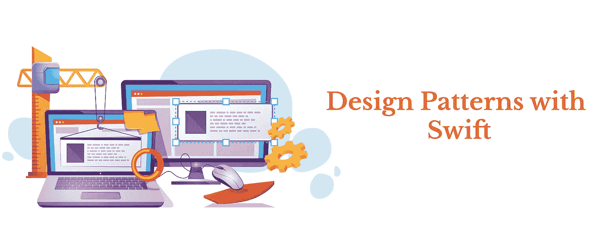

# 单例模式(创造性的)

> 原文：<https://blog.devgenius.io/the-singleton-pattern-c655ba62ed1b?source=collection_archive---------37----------------------->

Singleton 模式是一种软件设计模式，它将一个类的实例化限制到一个对象，确保一个类只有一个实例，并提供对它的全局访问点。

当我们只需要一个对象来协调整个系统时，这是很有用的。

*我们使用 let 关键字来确保 shredInstance 的值不会改变
不要忘记添加私有初始化器，以防止其他类调用它的默认初始化器*