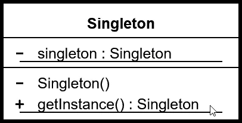

# Unity 中的单例模式

> 原文：<https://blog.devgenius.io/the-singleton-pattern-in-unity-b7b3bc051a62?source=collection_archive---------2----------------------->

## 将类限制为一个“单个”实例。

*   确保该类只有一个实例。
*   无需引用就可以从任何地方轻松访问该类。

关于这种模式有很多争论，因为它引入了全局状态，并且它也打破了可靠的单一责任原则(该类现在负责做两件事(该类的设计目的和确保只有一个实例)。

# 履行

首先，我们需要创建该类的私有静态实例，并在 Awake 方法中初始化它。

我们还想确保在场景重新加载时不会破坏游戏对象。使用“加载时不破坏”的组件必须在父游戏对象上。

现在我们需要添加公共的 Get 实例方法。

现在我们需要让班级播放环境音乐的音频剪辑。

现在从任何我想播放环境音乐的脚本中，我需要做的就是告诉 Singleton 播放剪辑。

现在，当我运行游戏时，它会播放其中一段音乐。如果我按下 R 键，场景会重新载入，并且场景中只有一个环境玩家。请注意，每次场景重新加载时，我都会收到一个警告，告诉我场景中已经有一个环境玩家了。

# 结论

单例模式解决了几个问题。

*   确保该类只有一个实例。
*   无需引用就可以从任何地方轻松访问该类。

为了在 Unity 中使用它，你也无用地让它成为一个持久的游戏对象。有更好的方法在你的游戏中拥有持久的游戏对象，也就是持久的游戏对象生成者。

这确实在 Unity 中造成了一些问题(你必须在至少一个场景中设置它),在使用它之前，它会将错误引入到你的项目中，它打破了坚实的原则，并且你会将全局状态引入到你的游戏中。就我个人而言，我尽量避免这种模式。