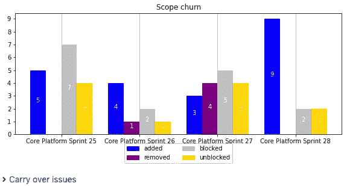

# 软件工程度量

> 原文：<https://blog.devgenius.io/the-software-engineering-metrics-c4ccb686447a?source=collection_archive---------5----------------------->

## 如何让工程团队所做的工作变得可见，以便他们能够不断自我改进

# 介绍

过去我写过一篇关于软件开发成本的文章 [**以及如何降低成本的技巧**](https://medium.com/grand-parade/the-cost-of-software-development-and-tips-how-to-reduce-it-60ba44e85948)**，在那里我集中讨论了在许多方面降低成本的技巧。这一次，我试图让工程师团队所做的工作可以被观察到，这样他们就可以不断地自我改进。如果我们收集了指标，我们将能够让团队专注于正确的改进，从而更快地完成工作。如果我们还知道“ [**如何用软件**](https://medium.com/grand-parade/how-to-make-an-impact-with-software-a3dbedfd7911) ”产生影响，那么成功的执行会建立业务合作伙伴和用户的信任。**

**我已经创建了一个名为[工程度量](https://github.com/LukaszSwolkien/EngineeringMetrics)的库，它提供了一个灵活的机制，可以从设计用来观察工作的许多方面的组件构建仪表板。计算一次的数据以后可以发布在 Confluence 网站上(吉拉 Confluence 宏支持动态数据刷新)。所有设置都可以在 jupyter 笔记本上完成。**

**有许多可用的工具，如吉拉的内置小工具、仪表盘和报告，或 Confluence 中的宏，或 eazyBI 等工具，但由于自定义代码，我们可以做任何事情(无需许可成本)。例如，我们可以整合来自不同来源的数据，如吉拉、Git、ServiceNow，并计算我们期望团队实现的关键结果的**数字度量**。我们可以将整个组织的所有内容放在一个页面上。**

**该库有算法和组件来可视化执行分析、依赖性分析、质量分析等。**

**几个注意:
1。除了 DORA metrics([DevOps Research&Assessment](https://cloud.google.com/devops))之外，该库还具有其他功能，从中我们可以了解我们在 devo PS 方面有多成功(DF —部署频率，MLT —变更的平均提前期，MTTR —平均恢复时间，CFR —变更失败率)。**

**2.还有其他方面没有包括在这个库中，这些方面非常重要，如软件对客户的影响、盈利能力、工程师的动机、参与度、满意度、信任度和态度。**

# **规划和执行**

**业务方面总是期望计划，然后执行，但是我们都知道通常软件项目是非常复杂的。最初的需求永远不够具体，也不完整，技术也是如此。没有两个项目是相同的。很多时候，看似简单的问题在现实中很难实现。开发团队“不知道他们不知道什么”，这意味着项目中的未知只有在出现时才能被识别。**

**正确的软件指示器可以帮助在软件工程团队和业务领导之间提供一个共同的语言。另一方面，如果我们期望团队调整过程，我们需要确保每个人都真正理解我们想要解决的问题。**

## **执行指标**

****执行指标**用于衡量承诺的工作量与交付的工作量。这个数据显示了团队的可预测性。与故事点不同，团队之间可以比较已完成的工作相对于计划的百分比。这些指标也可以在组织层面上进行汇总。**

**可用分析:**

*   **组织的执行摘要进度条形图**
*   **团队的执行历史进度条形图**
*   **目标、开始和结束日期等最后冲刺细节**
*   **范围变动历史记录**
*   **将不止一个 sprint 中尚未完成的问题遗留下来**

**主要结果示例:**

*   **团队提交的 90%的 sprint 内容已经交付。**

**组织层面主动冲刺的执行指标示例**

****

**小队执行历史示例**

****

*   **“按时完成”——在 sprint 中实际完成的工作项目。**
*   **“稍后完成”——在 sprint 中，但是在下一个迭代中完成的工作项目。因此,“稍后完成”项目的执行历史将随时间而改变。这样，我们可以检查是否有任何项目，我们从来没有交付由于不同的原因。我们还可以看到有多少工作是结转下来。**

**小队级别范围变动历史示例**

**“范围变动”图表显示了 sprint 中的问题数量，这些问题在每个 sprint 中被添加、删除、解除阻止和阻止。这些可能是产品路线图和/或组织间优先级调整问题的迹象，sprints 之间缺乏足够的预先规划(backlog 精化)，利益相关者数量不足导致需求缺失，生产事故，开发/QA 环境问题等**

****

**“遗留”——在不止一个 sprint 中的问题，还没有完成。**

# **解决依赖关系**

****依赖因子**计算具有外部依赖的问题的数量与尚未完成但经过细化的问题的总数之比(在 backlog 中估计的或已经为 sprint 计划的)。请注意，您需要指定工作负载&状态，以确定哪些问题已经准备好进行开发(细化之后)**

**根据以下规则计算依赖系数:**

*   **搜索直接或间接的“外部”依赖关系**
*   **链接类型是“被阻止”或“依赖于”。**
*   **如果相关依赖项的状态为“完成”，则会对其进行过滤。**
*   **此外，吉拉项目在封锁状态，没有链接。这是因为有些球队不使用吉拉**

**可用分析:**

*   **历史独立指标(“所有问题”与“有依赖关系的问题”，独立系数为 0-100 的堆积条形图位于 Y 轴，日期位于 X 轴)**
*   **按小组列出的外部依赖关系细分(吉拉外部项目)**
*   **按倡议分列的外部依赖细目(吉拉 Epic)**
*   **显示二级链接的依赖关系图**
*   **组织层面的内部与外部依赖关系**
*   **总独立性度量:sum(所有问题)/ sum(所有相关问题)**
*   **完全独立历史图表**

**主要结果示例:**

*   **所有团队的独立因素> 90%(不超过 10%的故事依赖于其他团队的工作)**
*   **单个团队独立因素> 80%**

**组织层面的独立性总结示例**

****

**在上面的例子中，度量显示 21%的工作被阻塞，93%的依赖应该很容易解决，因为是组织内部的。这意味着团队应该更好地区分工作的优先级，并且可能更频繁地召开工作积压细化会议，以便在计划之前检测潜在的依赖性。目标是在另一个团队在 sprint 中计划这样一个故事之前，解除他们的障碍。在 sprint 过程中发现的任何阻塞依赖都将导致项目在当前迭代中的剩余天数内下滑，并且至少再多一次 sprint。**

**为了更好地了解情况，我们可以进行更多的分析:**

**依赖分解的例子，找出我们依赖哪些团队，哪些项目被阻止。**

****

**通常在工作积压中有许多依赖项，我们可以看到它们的依赖图。很多时候，我们有很多用户故事被一个或多个不同的依赖关系阻塞，有时，甚至是一个依赖关系链。为了更好地了解情况，然后确定优先级，分析团队之间的依赖关系并检查依赖关系图是很重要的。**

****

# **跟踪项目进度**

****项目指标**是根据已完成的问题数量与为给定 epic(计划)定义的问题数量来计算项目进度。执行度量关注于 sprints，而不是给出给定项目完成了多少工作的细节。项目度量关注项目进展。**

**可用分析:**

*   **完成百分比**
*   **冲刺详情**
*   **按发行类型划分的饼图(吉拉宏观总汇)**
*   **提醒工作**
*   **风险**
*   **阻止的故事(列表和依赖关系图)**

**主要结果示例:**

*   **80%的创收用例按时交付**

# **质量保证指标**

**测量不同级别的质量指标。为了减少产品中发现的缺陷数量，避免变更对客户的负面影响，团队通常需要提高测试覆盖率，通过测试自动化提高回归测试的执行频率，提高代码质量，并允许少量但非常频繁的发布。这只有在确定这些变化不会破坏任何东西的情况下才是可能的。质量建立信心，这是快速交付所必需的。**

**目标是监控:**

*   **在生产中发现对最终用户有负面影响的事件(软件工作方式与预期不同)**
*   **一个错误的预算意味着我们可以推动功能，直到满足 SLO，但没有新的功能是不允许的，直到预算重新平衡。必须为每项服务定义 SLO，衡量 SLO 以计算不符合要求的请求，例如，如果服务延迟增加，预算将会减少。**
*   **手动与自动测试天平。在某些情况下，需要人来测试系统(可用性测试、UI/UX、探索性测试或不属于回归的特别测试)。另一方面，回归套件中的测试用例应该尽可能自动化。**

**主要结果示例:**

*   **10 个版本的生产中发现的事故不超过 1 起**
*   **10%或更少的努力足以保持维护积压的稳定(满足 SLO)**
*   **90%或更多的测试用例至少每周执行一次**

# **结论**

**由于自动化报告，团队总是拥有准确的数据，帮助他们专注于真正重要的事情，并允许他们自己提高绩效。没有比创建一个环境更好的方法来管理大规模的软件开发，在这个环境中，团队可以在清晰的目标和可测量的关键结果的指导下进行自我改进。**

**如果你使用吉拉和 Confluence，你可以重用或定制我的报告工具。它在 github 上公开发布。还有一个路线图，其中添加了更多指标和分析。点击这里查看更多信息:[https://github.com/LukaszSwolkien/EngineeringMetrics](https://github.com/LukaszSwolkien/EngineeringMetrics)**

**当然，这些指标突出了人们的担忧，并指引我们进行进一步的研究，但它们不会解决任何问题。具体行动应由自组织团队执行。**