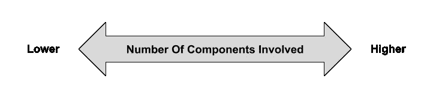

# 软件测试谱

> 原文：<https://blog.devgenius.io/the-software-testing-spectrum-d5268b3513cc?source=collection_archive---------4----------------------->

## 选择软件测试策略的更好指南

Jorge Salvador 在 [Unsplash](https://unsplash.com?utm_source=medium&utm_medium=referral) 上的照片

我反对的软件工程实践之一是**软件测试金字塔**。建议遵循“多做隔离测试，少做集成测试”的思路:

> 编写大量小而快速的单元测试。编写一些更粗粒度的测试和很少的高级测试来对你的应用程序进行端到端的测试。
> — [实战测试金字塔](https://martinfowler.com/articles/practical-test-pyramid.html) (2018)
> 
> 它(测试金字塔)的要点是，通过 GUI 运行的低级单元测试应该比高级单元测试[多得多。
> —](https://martinfowler.com/bliki/BroadStackTest.html) [测试金字塔](https://martinfowler.com/bliki/TestPyramid.html) (2012 年)

来自[leaddev.com](https://leaddev.com/agile-other-ways-working/demystifying-software-engineering-test-pyramid)的软件工程测试金字塔

这样的建议不应该在任何情况下都盲目适用。和其他事情一样，答案应该是“看情况”。在这篇文章中，我想阐明“视情况而定”的部分。

# 光谱

根据你看到的测试金字塔图，你会发现多种类型的测试:单元、集成、UI、端到端、手工、验收等等。它们很容易混淆，有时还会重叠(例如，UI 和端到端测试是一样的吗？).

**我发现更有助于思考测试的是将它们放在一个包含多少组件的光谱中**，其中组件被定义为最小的可测试单元(即功能)。

光谱

在最左边，测试中只涉及到一个组件。我们只是孤立地测试一个功能。这对应于测试金字塔的底部。

软件测试光谱——最左边

在最右边，被测系统中的所有组件都包含在内。在这里，我们正在对系统进行端到端的测试，即使已经为测试设置了第三方系统。这对应于测试金字塔的顶部。

软件测试光谱——最右边

在中间，我们测试系统的一个子集，它涉及到不止一个组件。这类测试的一个例子是 API 驱动的测试。这对应于测试金字塔的中间部分。

软件测试谱——中间

# 尺寸

沿着同一轴，我们可以添加更多描述测试特征趋势的维度:

*   **信心**:测试的通过如何确保特性“工作”。涉及的组件越多，我们对测试就越有信心，反之亦然。([必修单元 vs 综合测试笑话](https://gfycat.com/thoseunsungbeetle))
*   **测试流失**:当现有代码被修改时，现有测试被修改的可能性有多大。涉及的组件越多，就越不需要修改现有的测试。这是因为你将倾向于测试更高层次的流程。实现细节的改变无关紧要。相反，如果您为每个函数编写测试，您可能需要为每个重构修改现有的测试。
*   **运行成本**:运行测试所花费的成本。这里的成本可能是系统资源、时间，甚至是金钱。当涉及更多组件时，由于测试启动时间更长，需要分配更多 CPU/RAM/磁盘，成本往往会更高。
*   **案例变化设置**:设置覆盖所有不同案例的测试有多难。涉及的组件越少，建立各种案例就越容易(例如，使用模拟)。另一方面，涉及的组件越多，各种案例就越难成立。例如，如果测试用例是“当组件 A 抛出一个错误时应该返回 X”，那么可能很难重现组件 A 抛出一个错误的环境。
*   **查明问题**:查明导致测试失败的错误有多难。涉及的组件越多，就越难找到哪个组件(可能不止一个！)都是 bug。如果您只测试一个组件，那么您可以很容易地确定 bug 在哪里。

软件测试范围和维度

软件测试金字塔建议你应该有更多的测试落在光谱的左边而不是右边。然而，在软件测试谱中，你的测试落在谱中的哪个位置就不那么重要了。

重要的是找到一种测试策略，使**最大化测试可信度，同时最小化测试流失、运行成本、建立各种案例的难度以及查明问题的难度**。

# 例子

假设我们有一个电子商务应用程序。从架构上讲，客户机是一个 SPA，它通过 API 与后端对话。在它的众多特性中，让我们挑选两个，并决定哪种测试策略最适合它们。这两个功能是**用户注册**和**购物车定价**。

## 用户注册

用户注册功能通常很简单。用户用电子邮件和密码注册。如果电子邮件已被占用，我们拒绝注册。我们还进行输入验证，比如确保密码超过 8 个字符。否则，我们在系统中注册用户。

假设我们编写类级测试，即落在光谱左侧的测试。然后，让我们尝试为每个维度赋值。请注意，没有精确的科学来指定这些值。这取决于你的估计。就我而言，以下是我的估计:

用户注册测试策略:专门基于类的测试

我们有中等程度的信心，因为当我们孤立地测试每个类时，我们不会测试所有这些类之间的“管道”是否设置正确。由于类级测试很容易被重构破坏，所以测试变动很大。然而，其他维度是它们最理想的值。

我们能做得更好吗？如果我们改为进行 API 驱动的测试，维度会是什么样子？

用户注册测试策略:专门的 API 驱动测试

信心和测试流失率都明显向理想位置移动，而其他维度只是稍微差一点。例如，运行成本现在大约需要 5 秒，而不是 1.5 秒。考虑到特性的简单性，确定问题和设置各种测试用例也并不困难。

在这种情况下，我会跳过类级测试，只采用 API 驱动的测试。

## 购物车定价

与用户注册相比，购物车定价要复杂得多。许多业务关键案例需要测试。例如，促销计算、优惠券、商品可用性等。就实现而言，单个购物车定价函数可以由多个足够复杂的函数组成。

如果我们选择与用户注册特性相同的测试方法，维度将如下所示:

Cart 定价测试策略:专门的 API 驱动测试

虽然置信度和测试流失率维度很好，但是测试用例设置和问题定位维度最差。例如，如果测试失败是因为最终定价低了 0.2 美元，那么您知道错误在哪里有多容易呢？

更好的方法是将较低层次的测试和较高层次的测试结合起来。较低层次的测试测试所有不同的测试用例，因为在这个层次上设置它们更容易。此外，这将大大降低查明问题的难度。相比之下，更高级别的测试只使用很少的测试用例。这增强了该特性工作正常的信心，至少对于我们设置的几个测试用例来说是这样。

Cart 定价测试策略:基于类的测试和 API 驱动的测试相结合

最后，**这看起来和软件测试金字塔推荐的**一模一样:更多的隔离测试，更少的集成测试。

然而，我想强调的是，这样的建议并不总是在每种情况下都最适用。这对于这个特性是有意义的，但是对于用户注册特性就不那么有意义了。

# 结论

本文介绍了**软件测试谱**，作为**软件测试金字塔**的替代指南，用于选择正确的软件测试策略。虽然软件测试金字塔建议进行更多的隔离测试和更少的集成测试，但软件测试谱建议根据具体情况选择测试策略，考虑其对各个方面的影响。