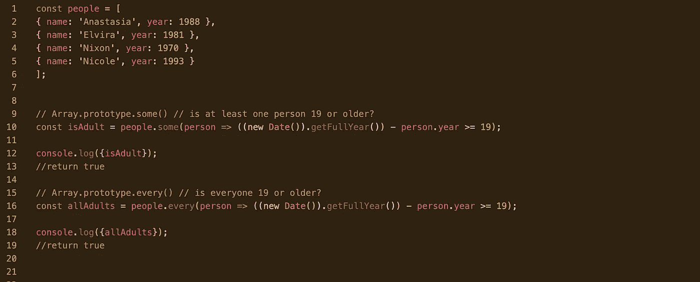

# JavaScript 中的 some()和 every()方法

> 原文：<https://blog.devgenius.io/the-some-and-every-methods-in-javascript-157b0229a033?source=collection_archive---------8----------------------->

有时候，在学习更复杂的概念时，我们往往会忘记一些基本的方法和途径。所以，本周我修改了 JavaScript 中一些最常用的数组方法。在这篇简短的博客中，我将向您展示一些经常相互混淆的()和 every()方法之间的区别。

[MDN 文档](https://developer.mozilla.org/en-US/docs/Web)称:

*   every()方法测试数组中的所有元素是否都通过了由提供的函数实现的给定条件。它返回一个布尔值—真或假。
*   some()方法测试数组中是否至少有一个元素通过了由提供的函数实现的给定条件。它返回一个布尔值。

为了将这些理论概念应用到生活中，让我们来看看这个小代码片段。

在第 1-6 行，我们有一组人；他们都有名字和出生年份。我们的任务是找出:

1.  有没有**至少有一个人** 19 岁或以上？
2.  **每个人都是 19 岁或以上吗？**

对于第一个任务，我们实现了 **some()** 方法(第 9–13 行)。使用 JS ES6 中的箭头函数使我们的代码看起来更整洁。对了， [getFullYear()](https://developer.mozilla.org/en-US/docs/Web/JavaScript/Reference/Global_Objects/Date/getFullYear) 方法真的是得心应手！它根据本地时间返回指定日期的年份。

当我们 console.log 变量时，它返回 true——这是正确的！

对于第二个任务，我们使用 **every()** 方法(第 15–19 行)。逻辑也差不多！你完全可以使用任何其他的 JS 语法。

这就是我对一些()和每一个()的快速回顾。希望你喜欢它！

**来源:**

1.  [MDN 网络文档:Array.prototype.some()](https://developer.mozilla.org/en-US/docs/Web/JavaScript/Reference/Global_Objects/Array/some)
2.  [MDN 网络文档:Array.prototype.every()](https://developer.mozilla.org/en-US/docs/Web/JavaScript/Reference/Global_Objects/Array/every)
3.  [Javascript30](https://javascript30.com/)