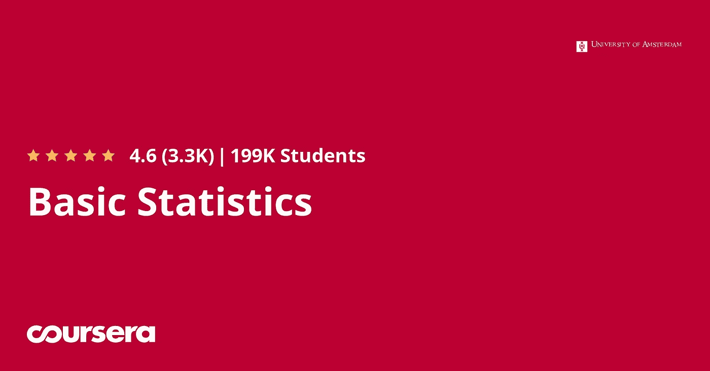

# 我最近在同一专业中选了两门课程时发现的专业

> 原文：<https://blog.devgenius.io/the-specialization-i-recently-discovered-while-i-took-two-courses-in-the-same-specialization-467c81cfc1c8?source=collection_archive---------4----------------------->

专业化第三课程

***让我惊讶的是，整个专业化是阿姆斯特丹大学创造的。以下是细节。***

当我决定选修统计学课程时，我以为只有两门不同的课程。但我错了；有 4 门课程和一个顶点项目，使我们能够应用我们在整个项目中学到的知识，获得阿姆斯特丹大学的证书。

## 那么，当我意识到课程是专业化的时候，我做了什么？

我立即选修了专业所需的所有课程，并决定从他们的方法论课程开始。但他们首先教授定量和定性方法，他们教授统计学课程，因为他们教授社会科学的统计学。当我开始学习定量方法时，我才意识到什么是科学方法，科学家们今天用什么在他们的领域做出发现，以及为什么社会科学不能普遍地制定一个数学模型。

## 那么，在我发现之后，我是如何决定继续我的统计工作的呢？

我决定暂停我的基础统计学课程，学习科学方法论，以进一步发展我对区块链和统计学的兴趣。更重要的是，我意识到我需要一套项目管理的方法。在区块链 R&D 大学，我意识到他们的专业非常适合我的职业和学术目标。

## 专业课结束后我要继续做什么？

因为我的职业领域完全包含在统计学中，我将终生使用它。但是我想让它适用于统计编程和 R 与 python 的数据科学的额外专业课程。更重要的是，在我完成了数据科学之后，我决定继续应用数据科学，并根据数学上所需的要求，参加其他统计课程，包括回归分析、时间序列分析、随机过程和贝叶斯统计。

*你是否曾经进入过一个专业领域，认为这门课程是一门简单的独立课程？如果你有，请在下面的评论区分享你的经历。*