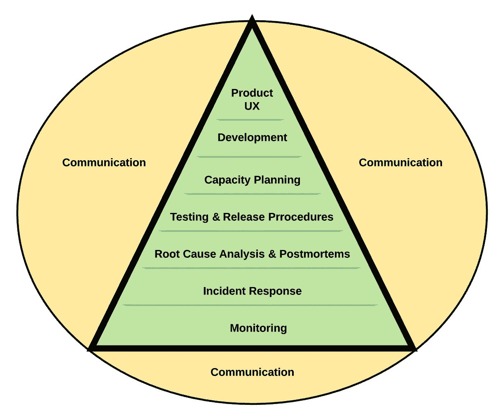

# SRE 实践

> 原文：<https://blog.devgenius.io/the-sre-practices-2dac003ff7db?source=collection_archive---------19----------------------->

可靠性等级

> *“理论上，理论和实践没有区别。但是，实际上是有的。”，* [本杰明·布鲁斯特](https://en.wikiquote.org/wiki/Benjamin_Brewster)或者[简·拉·范·德·斯奈普舍](https://en.wikiquote.org/wiki/Jan_L._A._van_de_Snepscheut)

可靠性不是魔术般出现的。只有当我们将 SRE 原则付诸实践时，我们雄心勃勃的 SLO 目标才能成为现实。但是，放松，我们不需要重新发明轮子。自从本杰明·斯洛斯的演讲之后，许多 SRE 的实践在社区中被广泛讨论和分享。

在本杰明·斯洛斯的演讲中，列举了 11 种实践:

1.  只雇佣编码员
2.  为您的服务制定 SLA
3.  根据 SLA 衡量和报告性能
4.  使用误差预算并对其进行门控启动
5.  为 SRE 和开发人员建立一个共同的人员库
6.  让过多的运营工作溢出到开发团队
7.  SRE 上限工作负荷为 50%
8.  与开发团队分担 5%的运营工作
9.  Oncall 团队应该在一个地点至少有八个人，或者在多个地点各有六个人
10.  目标是每个待命班次最多两个事件
11.  事后分析是无可指责的，它关注的是过程和技术，而不是人

当他们在谷歌成功实施的时候，他们描述了谷歌关于这个主题的学习以及他们是如何实施这些原则的**。**

**在 [*服务可靠性工程*](https://www.amazon.com/Site-Reliability-Engineering-Production-Systems/dp/149192912X) 一书中，我们发现了 SRE 以可靠性等级的形式列出的做法。金字塔的每一层都是通向最佳产品用户体验的实践。在真实的 SRE 的书中，Nat Welch 使用了同样的层次结构，但是强调了沟通对于他们成功的重要性。**

**可靠性等级是:**

1.  ****监控**:观察系统行为的实践。**
2.  ****事件响应:**准备对事件做出快速反应的实践。**
3.  ****RCA 和事后分析:**找出事件的根本原因并写出无可指责的事后分析的做法。**
4.  **测试和发布:将测试和发布工程包含到交付过程中的实践。**
5.  ****产能规划:**为装载峰值做好准备且不浪费资源的实践。**
6.  **开发:使用软件工程来自动化、构建工具和创建内部产品的实践，以改进过程和消除辛劳。**
7.  ****产品 UX:** 在顶端，我们有目标:最终的产品用户体验。最终，可靠性会给产品用户带来良好的体验。**

**在组织采用 SRE 的过程中，可靠性层级可用作框架。进行自我评估并了解贵公司在 SRE 实践方面的情况非常简单明了。每个组织都不一样。因此，SRE 实践并不期望在所有公司中以相同的方式实施。它们可以而且应该根据每个现实进行定制。**

**总而言之:**

*   **本杰明·斯洛斯分享了谷歌采用的 11 项 SRE 实践**
*   **SRE 实践背后的 SRE 原则是:拥抱风险，定义 SLO，消除辛劳，监控服务，尽可能自动化，设计发布过程，采用简单性。**
*   **我们可以使用可靠性层次结构作为框架，在任何公司实施 SRE**
*   **组织可以根据自己的实际情况自由调整 SRE 的实践**
*   **在任何 SRE 实践中，良好的沟通都是一个跨领域的问题**

**为了更多地了解 SRE，我推荐我的 Udemy 课程:【https://www.udemy.com/course/sre-the-big-picture/? referral code = fa 215 c 81 b 6 b 26 c 631 f 5f**