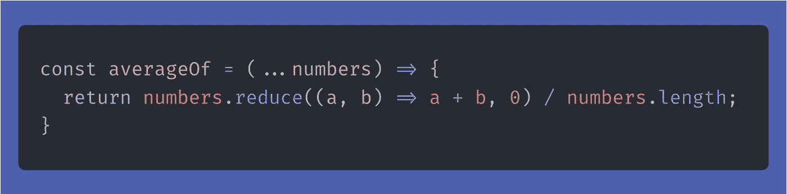
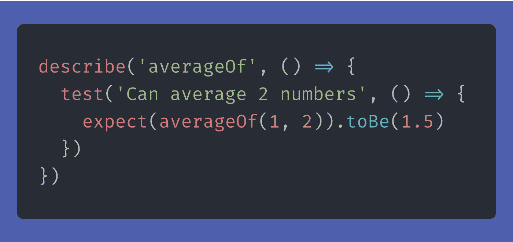
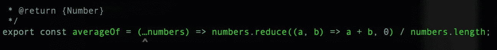
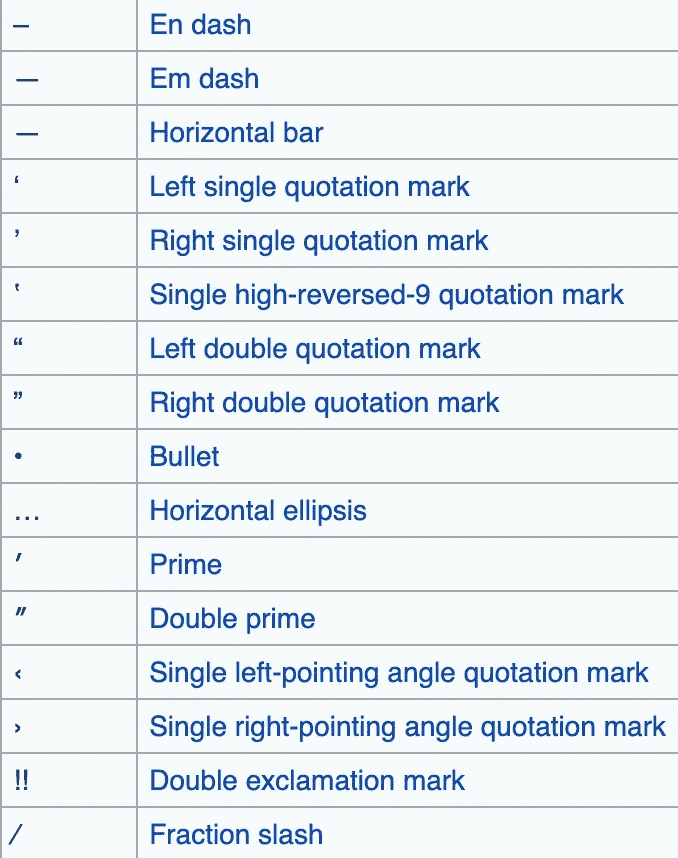

# 我最糟糕的 Javascript bug 的故事

> 原文：<https://blog.devgenius.io/the-story-of-my-worst-javascript-bug-39c441a70237?source=collection_archive---------3----------------------->

由[朱莉娅·乔皮恩](https://unsplash.com/@vitreous_macula?utm_source=medium&utm_medium=referral)在 [Unsplash](https://unsplash.com?utm_source=medium&utm_medium=referral) 上拍摄的照片

在深入研究代码之前，让我们先了解一下这个故事的背景。
我是 Daniel，一名瑞典 Javascript 开发人员，我的背包里有大约 6 年的开发经验。以下是我所经历的…

像以前很多次一样，我正在建立一个新的节点项目。这一次，我将对测试持务实态度。是啊，开始一个新项目时通常的心态。

我创建了一个 repo，做了一个 npm init 并安装了我的第一个开发依赖项。我去开玩笑和巴别塔-玩笑。我用`@babel/preset-env`配置了巴别塔。`@babel/preset-env`获取您指定的任何[目标环境](https://babeljs.io/docs/en/babel-preset-env#targets)并对照其映射检查它们，以编译插件列表并将其传递给 Babel。太好了！现代 Javascript 是飞翔的方式。

我创建了一个 index.js 文件，并向其中添加了一个简单的函数。我在网上找了个好玩的小功能。没找到好玩的。相反，我选择了这个。

现在我想确保 Jest 能够工作，所以我创建了一个 index.spec.js 并添加了第一个测试:

我没必要告诉你它不起作用。你知道为什么吗？

不，你不能，我也不能！

至少 Jest 给了我一个语法错误:

啊，好吧，那么可能有一个巴别塔错误？节点不理解 ES6 的扩展语法。估计得加巴别塔插件支持 spread 语法？

在接下来的两个小时里，我尝试了所有可能的配置巴别塔和 Jest 的方法。我试着用 Jest 样板甚至 Webpack 样板从 popular Node 添加东西，但是我总是遇到同样的错误。

在这一点上，我想尝试一个没有 spread 语法的函数，只是为了在放弃我的开发职业之前，在我的计算机上看到一些工作。

我去删除 3 个分散的点，非常困惑地看到，只需在我的退格键上用力一击，3 个点都消失了。我把删除的部分反过来仔细看看。这 3 个点似乎只在一个字符中，现在我的大脑点击。

特殊的 unicode 字符“水平省略号”花了我几个小时。

去你的“横向省略号”。

我深入研究了特殊的 unicode 字符，下面是一些来自地狱的 unicode 字符，它们可能会让你一整天都一团糟:

对我来说，问题是我在寻找巴别塔错误，而不是语法错误，我发现这个语法错误的唯一方法是 3 个点比平时小一点，紧一点。

我很高兴与你分享这些，这样你就不会有像我一样困惑的风险。

希望你喜欢阅读！

如果你也喜欢视频格式的代码内容，可以看看我的 youtube 频道:[https://www.youtube.com/c/barelycoding](https://www.youtube.com/c/barelycoding)