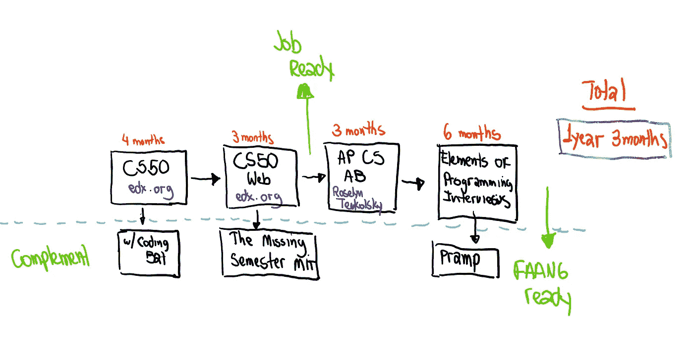

# 通往法昂的直路

> 原文：<https://blog.devgenius.io/the-straight-path-to-faang-63c6c981fdb5?source=collection_archive---------3----------------------->

这里有一些令人惊讶的事情:准备获得你的第一份程序员工作可能比你想象的要长(7 个月每周 8-10 小时的持续努力)，但是如果你遵循上面的路径，准备 FAANG 的面试可能比你和你的朋友预期的时间要少得多(1 年零 3 个月)。

事实是大多数人对成功的程序员有着不切实际的印象。当他们想象有人在谷歌或脸书工作时，他们想象的是一个 5 岁就开始编码，知道电脑所有细节的人。流行文化只是通过电影《社交网络》和电视剧《硅谷》来强化这种想法，这些电影和电视剧展示了睡眠不足的书呆子们为他们的下一个大型创业公司编码。

然而，现实远没有你想象的那么美好:编码面试主要由数据结构和算法问题组成，这是大多数大学二年级的计算机科学课程。不相信我？我强烈推荐 Hasseb Qureshi 的故事，这位前职业扑克玩家在开始学习如何编程约一年后，在 Airbnb 找到了一份工作，收入超过 20 万美元。

我并不是说这是一项简单的任务:你需要聪明，努力解决成百上千的问题，才能具有竞争力。但事实是，有了正确的课程顺序和正确的指导，让你在旅程中摆脱困境，1 年零 3 个月是为大型技术面试做准备的现实时间。考虑到这一点，现在让我们来看看[我们通往 FAANG 的直路]中的每个阶段。

**CS50 由哈佛(edx.org)——>3 到 4 个月**

我在[上一篇文章](https://medium.com/dev-genius/the-5-reasons-why-you-have-failed-to-learn-how-to-code-24aa7cf77ab2)中谈到了大多数人无法学习如何编码的主要原因:缺乏结构，课程太容易完成，课程太难，讲师太无聊，缺乏实际项目。所有这些问题都由互联网上最著名的课程之一来解决:[哈佛](https://www.edx.org/course/cs50s-introduction-to-computer-science)的 CS50。在最初的几周里，你将学习 CS 的最基本的概念(变量，循环，函数，条件等等。)最后，实用技能(SQL、HTML、CSS、Python、Flask)将帮助你构建一个相当复杂的最终项目，当你开始申请工作时，你可以在文件夹中使用它。

该课程还提供所有讲座、带自动化测试的习题集、幻灯片、源代码、虚拟开发环境(CS50 沙箱)，全部免费。这是一门令人惊叹的课程，但对于大多数初学者来说，学习曲线可能有点陡峭。

这就是为什么我喜欢在习题集之间给我的学生做编码练习，这样他们就可以在习题集中感到足够舒适，而不会因为其中一些问题的难度而失去动力。习题集仍然具有挑战性，但是一旦学生将基本概念内化，就容易处理得多了。

**CS50 网页开发- > 3 个月**

尽管 CS50 在建立基本技能方面做得很好，但我仍然认为它不足以让你做好工作准备。大多数学生在项目结束时只会完成一个大型项目，他们不会对其他重要技能感到足够舒适，如 Git、测试、调试、Django(而不是 Flask)、高级 HTML 和 CSS 功能、安全主题以及与其他程序员合作。

因此，我相信 [CS50 网站开发](https://www.edx.org/course/cs50s-web-programming-with-python-and-javascript)是 CS50 的一个惊人的序列，从 CS50 停止的地方开始。第一堂课从非常重要的 Git 开始，到第二周，你已经在构建一个相当大的项目了。这是你的投资组合构建课程，相当于你在大多数编码训练营中得到的东西。虽然课程没有要求，但我喜欢将我的学生结对，这样他们就可以习惯 Git 和协作中可能存在的陷阱。结束时，您将构建足够多的项目，为大多数入门级 Web 开发工作做好准备。

我认为 CS50 Web 比 CS50-Gaming 和 CS50-React 更好的原因是，它更好地与 CS50 连接，因为 CS50 React 需要大量的 Javascript 知识，而与 Web 相比，游戏在就业机会方面是一个小领域。

作为对 CS50 Web 的补充，我喜欢在每周的辅导课上给我的学生提供麻省理工学院课程[“CS 的缺失课程”](https://missing.csail.mit.edu/)中的练习，每周他们都会讨论一个大多数 CS 本科生跳过的主题，比如 vim 和 shell 脚本。

**AP 计算机科学 AB - > 3 个月**

AP 是 Advanced Placement 的缩写，是给美国高中生的考试，他们希望获得大学课程的学分。我喜欢这些考试备考书的原因是作者有一种务实的动机。许多教科书作者可能会啰嗦，因为他们有同样的动机去教学，因为他们必须给他们的学术同行留下深刻印象。对于 AP 作者来说，情况并非如此:如果出版商的竞争对手因为缺乏简洁性或清晰度而让更多的学生通过考试，那么作者就会被解雇。我们得到的是一个高质量的，学生驱动的文本。

虽然 AP 计算机科学在 2009 年由于参加考试的学生人数少而停学(很难！)，强烈推荐罗塞琳·特乌考斯基的《老歌》AP 电脑 AB。这本书涵盖了一年级计算机科学本科生的所有重要主题，并介绍了一些最常见的数据结构和算法。

每章提供了每个主题的简明摘要，随后是大约 30 个高质量的多项选择练习，并附有详细的解释。它还提供了 4 个模拟考试，我在课程中用它来衡量学生是否准备好了面试。总的来说，这是一个极好的资源！

**Python 编程面试要素— 5 个月**

当我开始学习计算机科学时，只有一本书，你可以看到每个人都带着它在系里走来走去:[破解编码面试](http://Cracking the Coding Interview)。然而，从我第一次开始使用它，我就意识到它不是一个好的资源。作者冗长地解释了解决方案，使用的语言是 Java(这是一种很好的语言，但不是在面试中，因为学生可能会陷入语法中)，问题的难度不够高。

当《编程采访的 T4 元素》出版后，这一切都改变了。当我第一次看到它时，我意识到我已经找到了编码面试准备中缺失的部分。这些问题属于中等难度(这是你在大多数面试中会发现的)，并且解释得非常清楚。此外，对问题的处理是极好的:你可以得到经典的算法，一步一步地解释。在我的课程中，我们逐一讲解，确保学生有足够的信心

作为课程的补充，我让我的学生每周做两次 Pramp 访谈。Pramp 是一个网站，在这里你可以和来自世界各地的其他学生进行模拟面试，这些学生也在为面试而学习。你们每个人都有一个问题，你们有 30 分钟的时间在同伴面前解决这个问题。本课程结束时，您将完成 40 多次模拟面试，并准备好应对 FAANG 面试流程。

**结论**

由于缺乏结构，大多数学生经常无法达到他们的目标:他们将从一个教程跳到另一个教程，而不理解每个课程如何适应他们的计算机科学教育的大画面。我在这里努力提供的是一个循序渐进的序列，它将带你从 0 编程知识到 FAANG 就绪。

然而，即使你遵循它，缺乏一对一的辅导和你可以学习的同龄人的环境是阻碍你实现目标和进入一个扩展和有利可图的职业生涯的原因。清华大学最近的一项研究得出结论，不到 5%的 MOOCs 学生真正完成了他们报名的课程，更不用说我在这里提出的连续 4 门课程了。

这就是为什么我创建了 Dor 的在线编码学校，在这个学校里，我们使用最好的在线材料，一对一和基于同伴的学习，将带你从零知识到 FAANG 就绪。

如果您想与我们一起安排一个 30 分钟的免费辅导会议，我们将为您创建一个个性化的计划，告诉您如何学习如何作为一名自学成才的开发人员进行编码和营销，请查看下面的链接:

https://www.dorscodingschool.com/schedulemeeting