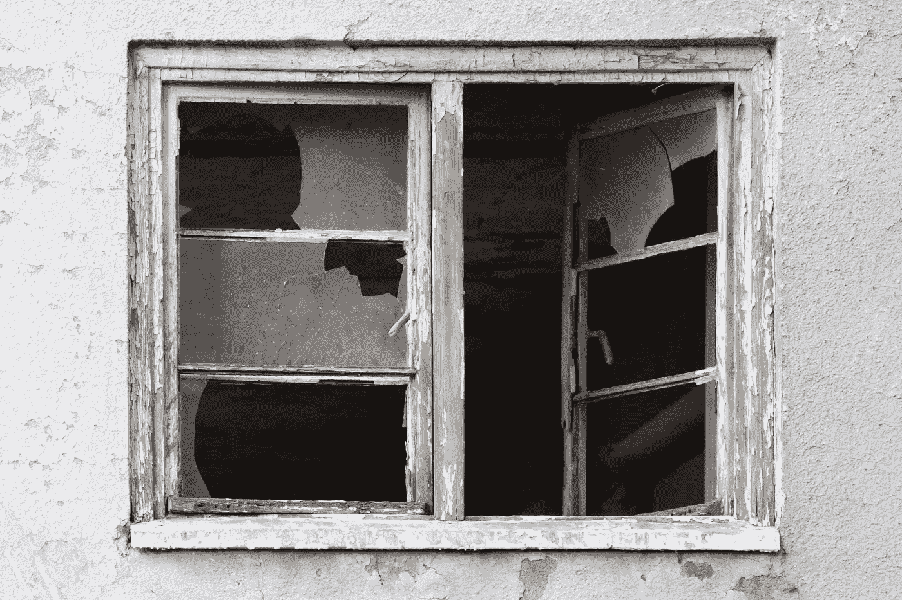

# 糟糕代码的微妙影响

> 原文：<https://blog.devgenius.io/the-subtle-effects-of-bad-code-eca1bf56b9b4?source=collection_archive---------9----------------------->

## 即使在软件编程中，好的实践也能产生社会影响

地点和环境影响我们的心情、方法和对世界的看法。

由代码行、缩进列、彩色关键词、错误信息或成功编译的狂喜组成的虚拟空间以同样的方式影响着我们的行为。

所有的程序员都会受到他们工作的虚拟环境的影响:也许有些人不喜欢 IDE，有些人讨厌构建过程或代码审查阶段，或者在某些严重混乱的情况下，有些程序员喜欢用 visual basic 编写。

然而，这个虚拟环境还有更有意义的方面我们应该考虑。

一个程序员产生的代码量是一个非常复杂的线的集合体，必须与其他程序员的其他集合体融合在一起。

这组特殊的单词、数字和标点符号常常冒着变得极其复杂的风险，没有任何形式或结构感。

混乱无序的代码库会对开发人员产生负面影响。

> 我在那次经历中看到的所有 PHP 代码都是混乱的、不可维护的垃圾。用意大利面条包装的 SQL，用意大利面条包装的 PHP，在许多地方以稍微不同的形式复制。—蒂姆·布雷

所以，总的来说，开发人员坚持规则，遵守实践，保护他们工作的优雅状态；直到一些事情让他们放弃，质量差的代码开始到处出现。

paweczerwi ski 在 [Unsplash](https://unsplash.com/s/photos/broken-window?utm_source=unsplash&utm_medium=referral&utm_content=creditCopyText) 上的照片

所谓的“**破窗理论**”指出，未修复的缺陷往往会产生其他缺陷。

例如，如果建筑物的一扇窗户被打破，那么另一扇窗户被打破的几率就更高；如果有两个破碎的窗户，新的破碎窗户的可能性增加得更多。

换句话说，人们倾向于顺应他们生活的环境，因此一个有缺陷的环境会增加破坏性或粗心的本能，反之亦然，一个组织良好和完整的环境会激发对环境保护的关心和注意。

在软件中，我们看到同样的事情，当程序员处理写得很好、组织得很好的代码时，他们会感到有动力去保持那种质量水平。

当一些代码不符合质量标准时，例如，因为它没有坚持所选择的约定，或者没有被记录，或者没有被任何测试用例覆盖，或者任何其他暗示标准质量降低的情况:这就是窗户破裂的时候。

一旦标准降低，程序员察觉到这一点，他们就更容易对自己编写的代码视而不见。

为了避免这种情况，尽快修复缺陷并保持代码质量是非常重要的。

正如一个童子军的格言所说:

> "永远要让露营地比你发现时干净"。

因此，每当你进入一个写得很差的代码时，你可以尝试改进它，或者你可以将它添加到待办事项列表中，以便以后修复它，有时你可以与你的团队分享特定的代码片段，以分析它并讨论该做什么。

最后，讨论不能被简化为简单的礼貌或职业精神，但这个问题有着比我们想象的更广泛和更复杂的影响。