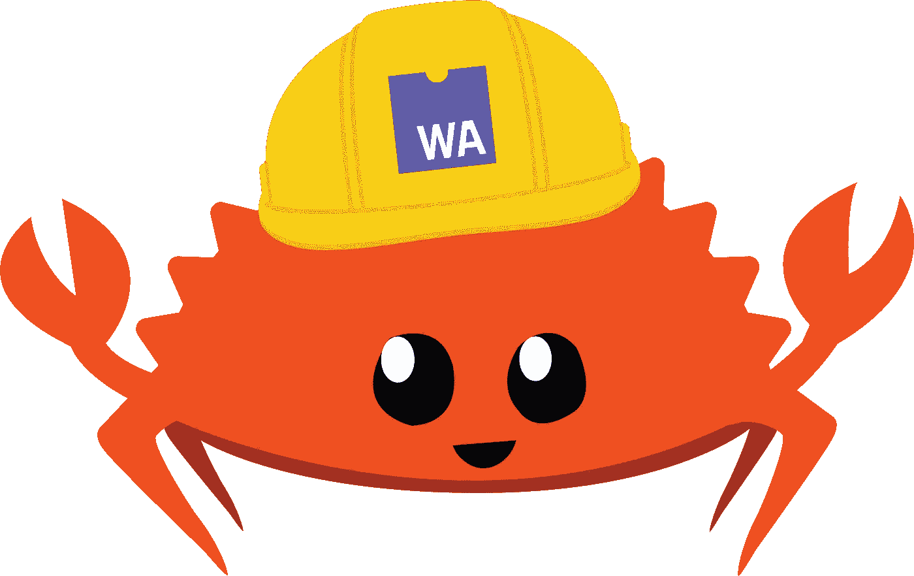

# Wasm & Rust 的甜味

> 原文：<https://blog.devgenius.io/the-sweet-taste-of-wasm-rust-42e08fc7a99b?source=collection_archive---------13----------------------->

https://www.rust-lang.org/static/images/wasm-ferris.png

读者你好！在这篇文章中，我打算通过解释一点为什么，一点如何，一点由谁来做，来分享我在 Wasm + Rust 的指导经验。

我将回顾一些历史(不是编码本身的历史)、一些技术细节和一些数学知识，并将想象康威的人生游戏。如果到目前为止还没有那么多有趣的，那么，这就是为什么 TL；博士在这里吧:)

## **</>**

我会利用这个前奏，对一些可能的好奇问题做一些不经意的回答。这些答案将主要映射到`why`和`by whom`的问题，而帖子的其余部分将详细讨论`how`。

我认为已经有足够的时间和经验把我自己算在开发者部落里了。从一开始，坚持单一的技术并掌握它并不符合我的风格。我尊重这样做的人，也尊重不这样做的人。但我更像一只好奇的猫，如果我可以说的话。

我热爱数学，我热爱系统级编程，至少是看 conf 演讲和阅读相关内容。我也主要花时间在网站开发上。嗯，碰巧我也想学 Rust(❤).我认为最好的方法是把我喜欢的东西堆叠在一起，提出一个融合项目。因此，这就是《康威的生命游戏》吸引我的原因。

正如下面将要详细解释的那样，我使用 web assembly 来完成这个任务，是因为，或者应该说是因为，能够集成 Rust。除了我的好奇心，我选择铁锈还有其他原因。

我本可以用 C 或 C++很好地编写相同的应用程序，但我没有。我喜欢 Rust 中独特的味道，它位于 OOP 和 FP 之间的独立领域。我喜欢 Rust 语法中复杂的优雅，我不想为内存问题而烦恼，:D，重点是我想学得更好，记得吗？

## **<【Rust+JS 演唱会/ >**

[动作推进](https://unsplash.com/@actionvance?utm_source=medium&utm_medium=referral)对[去飞溅](https://unsplash.com?utm_source=medium&utm_medium=referral)拍照

嗯，不是那场音乐会，而是那场意味着`harmony.`我不会深究很多技术细节，因为它们现在无处不在。但是为了保持头脑清醒，真正展现 wasm 的魅力，我需要做一个简短的汇报。

我们所说的 WebAssembly 其实就是一个底层的字节码。当开发人员编写临时的 JS 代码时，它要经过很多很多的过程才能转换成字节码，这会导致效率问题。此外，不能手工处理细微的修补(比如，要分配的数据大小)会导致另一层效率缺陷。把垃圾收集放在上面，你就跟 CPU 过不去了。而使用低级语言，用户可以直接构建 wasm 并注入到流程的尾部，这意味着绕过所有(或许多)这些令人头疼的问题。

WebAssembly 和 JS 使用内存完全不同。JS 使用堆，wasm 使用一个非常基本的字节平面数组，Rust 值存放在其中。Javascript 可以直接涉及 Wasm 的线性内存。

怎么，那这两个会说话？

接得好！我们使用`wasm-bindgen`作为一种在两者之间建立通信的 API。Rust 的所有代码都使用 wasm-bindgen 进行包装和装箱，以将功能暴露给 JS 代码，JS 可以直接导入 wasm 函数并从中进行调用。剩下的是使用 JS 的老式 web 开发，但是包含了许多金属(双关语)肌肉。

在实践中，一旦 rust 应用程序使用 wasm-pack 初始化，所有的暴露就完成了，预期的代码正等待导出并在其他地方使用(通常是:D 的一两个文件夹)，我们需要将它介绍给将接收它的 web 应用程序。仔细观察构建包会发现，文件夹结构实际上非常类似于 node_module。向这双眼睛致敬！因为我们将使用这个包作为节点模块，所以将它作为一个依赖项添加，并开始与它交互。

## <what to="" build=""></what>

由[本·格里菲斯](https://unsplash.com/@benofthenorth?utm_source=medium&utm_medium=referral)在 [Unsplash](https://unsplash.com?utm_source=medium&utm_medium=referral) 上拍摄

我们将从零开始，建造古老的俄罗斯方块！不，我只是在开玩笑。我相信即将到来的至少像俄罗斯方块一样酷。

我们将建立并激活`Conway's Game of Life.`简单地说，有一个 2D 网格，它包含两种细胞:死的或活的。细胞是死是活不是硬编码，也不是随机的。它遵循逻辑，是动态的。网格中的每个细胞都可以和它的八个邻居(X 轴、Y 轴和对角线)相互作用。有一些基本的规则可以决定一个细胞在给定的时间内是死是活`t`

a)单元是活的，并且活邻居少于 2 个= >单元死亡

b)单元是活的，并且有 2 或 3 个活邻居= >单元寿命。

c)单元是活的，并且有 3 个以上的活邻居= >单元死亡

d)单元已死亡，有 3 个活着的邻居= >单元复活。

最初，我们通过播种同时播种网格，上面的规则是活跃的，新的出生和死亡发生，这也触发另一个。

`我不能分享整个代码，但是你可以在我的 [GitHub](https://github.com/MYavuzYAGIS/wasmrust) 上找到它，也可以在网上找到用许多其他语言实现的代码。`

``

`看到细胞必然要服从死的或活的枚举。它是一个公共枚举，wasm_bindgen 正在包装它。这同样适用于 Universe 结构，其中宽度、高度和单元格是类型定义的，并且单元格被设置为一个向量。在 Rust 中，数组是固定大小和不可变的，而向量可以动态增长，并且有许多有用的方法。`

`让我们执行规则:`

``

`死/活逻辑的实现如上所述。代码完成后，我们构建它并转到`index.js`文件。`

``

`简单地从我们刚刚构建的包中导入 Universe，在我的例子中它的名字是 wasmrust。当然，不要忘记`npm install`将包实际包含到 node_modules 中。剩下的只是普通的 javascript，选择 dom 元素，构建应用程序，渲染它并让它循环。`

`哦，顺便说一下，在我们的应用程序中，这实际上是整个***JavaScript 代码。***`

## `瞧啊。简直惊艳！`

`注:如果它不能在您的移动设备上自动播放，请查看[gfycat.com](https://gfycat.com/fonddifficulthylaeosaurus)上的内容`

`接下来是使它变得强大，添加 TypeScript，编写测试，以及一堆其他的调整和添加。`

`这个项目让我非常开心。它为我打开了新的大门，让我更接近铁锈，让我获得了从未接触过的体验。这就是我热爱编码的原因，希望我会永远热爱它！`

`注:为这些人鼓掌,“https://rustwasm.github.io/”让学习变得更加顺利，并且很好地解释了许多难以理解的东西。`

`一如既往，感谢您的阅读！请随时在 [LinkedIn](https://www.linkedin.com/in/myavuzyagis/) 或通过[电子邮件](mailto:mehmetyavuzyagis@gmail.com)联系我。`