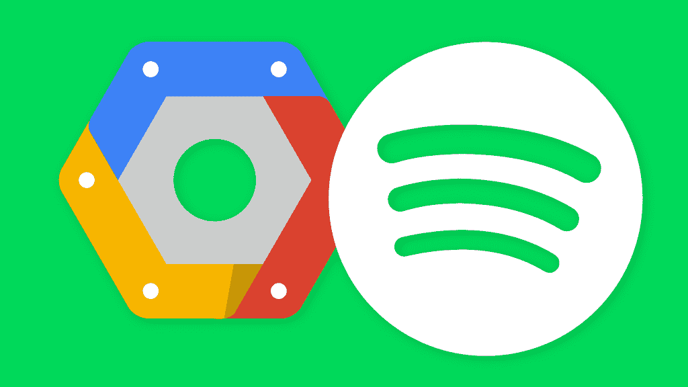

# Spotify 打包功能背后的技术

> 原文：<https://blog.devgenius.io/the-technology-behind-spotify-wrapped-2019-dce9e129265f?source=collection_archive---------3----------------------->

听音乐已经成为我们生活中不可或缺的一部分，在过去的几十年里，听音乐已经有了长足的进步。你不得不购买黑胶唱片、卡带和 CD(我过去收集了很多)，你们中的一些人甚至购买数字下载(Eminem、Green Day 和其他当时流行的音乐)的日子已经一去不复返了，现在你所要做的就是下载一个可以在一天中任何时候播放的应用程序，同时将设备放在口袋中。这种应用程序只不过是音乐流媒体服务，让你通过支付会员费来获得数百万首歌曲，会员费按月或按年开具发票，因此你不必购买单首歌曲或专辑。

雷切尔·勒奈特·弗伦奇在 [Unsplash](https://unsplash.com/s/photos/concert?utm_source=unsplash&utm_medium=referral&utm_content=creditCopyText) 上拍摄的照片

[**Spotify**](https://www.spotify.com/uk/) 可能是目前最好的音乐流媒体服务(至少对大多数人来说*)。嗯，还有其他大玩家，如[**Apple Music**](https://www.apple.com/music/)**[**Amazon Music Unlimited**](https://www.amazon.com/music/unlimited)**和 [**YouTube Music**](https://www.youtube.com/musicpremium) 但 Spotify 的票价比竞争对手好，至少根据这篇[文章](https://www.cnet.com/how-to/best-music-streaming-service-for-2020-spotify-apple-music-amazon-tidal-and-youtube/)。*****

**********

*****照片由[法比奥·阿尔维斯](https://unsplash.com/@barncreative?utm_source=unsplash&utm_medium=referral&utm_content=creditCopyText)在 [Unsplash](https://unsplash.com/s/photos/spotify?utm_source=unsplash&utm_medium=referral&utm_content=creditCopyText) 上拍摄*****

*****众所周知， **Spotify 自 2016 年 2 月以来一直是** [**谷歌云平台**](https://cloud.google.com/) 的 **最大客户之一，而在 2018 年，Spotify 披露将在未来三年内为其谷歌云基础设施投资至少 4.5 亿美元。这是当时一家音乐流媒体服务公司的巨额投资。*******

*****Spotify 从内部到云的旅程*****

******2019 年 12 月，Spotify 放弃了* [*包装*](http://spotify.com/wrapped) *功能，作为给其用户的提前圣诞礼物。这个功能可以让用户回顾他们的收听习惯。还有一个新的[十年包装](https://newsroom.spotify.com/2019-12-03/the-top-songs-artists-playlists-and-podcasts-of-2019-and-the-last-decade/)功能，展示过去 10 年人们收听的歌曲、专辑、艺术家和播客。******

> ******“从 2010 年到 2019 年，你可能会发现新的音乐和播客，重新爱上旧的最爱，甚至可能会喜欢上一两种新的风格。这就是为什么今年，我们不仅带回了你的年度个性化* ***Spotify 包装*** *，而且我们还展示了我们的用户在过去十年中的收听情况。”— Spotify******

*******2019 年，Spotify 运行了有史以来最大的** [**谷歌云数据流**](https://thedeveloperstory.com/2020/07/24/cloud-dataflow-a-unified-model-for-batch-and-streaming-data-processing/) **管道作业。**这使他们能够以更少的运营开销实现大规模扩展。Google 在 2015 年初发布了 [Cloud Dataflow](http://www.vldb.org/pvldb/vol8/p1792-Akidau.pdf) ，作为基于 Google 内部两个系统的云产品，用于批处理和流数据处理。Dataflow 为批处理和流式传输引入了一个统一的模型，它整合了来自这些先前系统的想法，Google 后来将该模型和 [SDK 代码](https://beam.apache.org/documentation/sdks/)作为 [Apache Beam](https://beam.apache.org/) 捐赠给了 Apache Software Foundation。*****

**********

*****谷歌云中的 Spotify。图片来源:Pinterest*****

******Spotify 已经为****Apache Beam****和****Google Cloud data****构建并开源了一个大数据处理 Scala API，名为*[***Scio***](https://github.com/spotify/scio)***。Spotify Wrapped 2019 包括年度和十年的列表，Spotify 表示，他们与谷歌云的工程团队和专家密切合作，并从他们以前的错误中吸取教训，这有助于他们完成他们有史以来最复杂的工作之一。********

******除了数据流之外，Spotify 还使用了一种技术，其中使用了*[***Bigtable***](https://cloud.google.com/bigtable/docs/overview)*，这是以非常低的延迟存储大量单键数据的理想选择。*这导致了显著的成本节约，该团队开发了许多工具，这些工具至今仍在使用。这些工具使他们能够并行处理大量数据，从而节省了资金。*****

# *****更多参考*****

## *****谷歌的内部应用被数据流取代*****

1.  *******FlumeJava** :*****

***** [## 简单高效的数据并行管道

### MapReduce 和类似的系统大大简化了编写数据并行代码的任务。然而，许多现实世界…

谷歌研究](https://research.google/pubs/pub35650/) 

**2。砂轮**:

 [## MillWheel:互联网规模的容错流处理-谷歌研究

### MillWheel 是一个用于构建低延迟数据处理应用程序的框架，在谷歌得到了广泛应用。用户…

谷歌研究](https://research.google/pubs/pub41378/) 

## Spotify 的大数据处理之旅

 [## Spotify 的大数据处理:通往 Scio 之路(上)

### 这是 2 部分博客系列的第一部分。在这个系列中，我们将讨论 Scio，一个用于 Apache Beam 和…

engineering.atspotify.com](https://engineering.atspotify.com/2017/10/16/big-data-processing-at-spotify-the-road-to-scio-part-1/) 

# Spotify 是 2019 年和过去十年的顶级歌曲、艺术家、播放列表和播客

[https://news room . Spotify . com/2019-12-03/the-top-songs-artists-playlists-and-podcast-of-2019 and-the-last-decade](https://newsroom.spotify.com/2019-12-03/the-top-songs-artists-playlists-and-podcasts-of-2019-and-the-last-decade/)*****