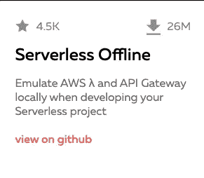
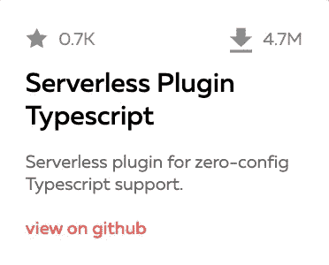
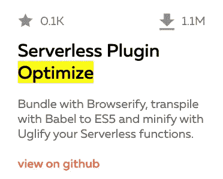
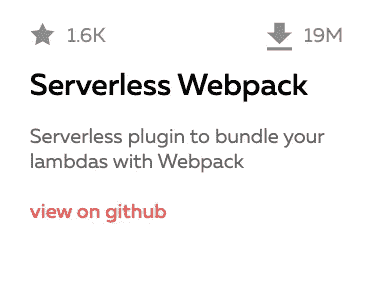
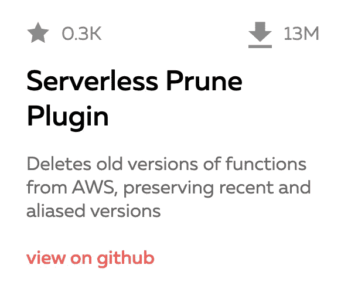

# 前 5 名无服务器框架插件

> 原文：<https://blog.devgenius.io/the-top-5-serverless-framework-plugins-e147a6689c76?source=collection_archive---------4----------------------->

## 插件让你的生活更简单


由[谷仓图片](https://unsplash.com/@barnimages?utm_source=medium&utm_medium=referral)在 [Unsplash](https://unsplash.com?utm_source=medium&utm_medium=referral) 上拍摄

无服务器框架在配置和部署您的[无服务器项目](https://serverlesscorner.com/your-first-serverless-project-cbf1deee29f7)方面是一个巨大的帮助。但是与无服务器领域的其他框架相比，这个框架的好处是有一个[丰富的插件社区](https://www.serverless.com/plugins)您可以将它用作您的无服务器项目的一些额外工具。在这里，我想向你展示我在无服务器冒险中经常使用的插件。

# 无服务器脱机

这个[流行插件](https://www.serverless.com/plugins/serverless-offline)在为 REST APIs 开发无服务器项目时，在本地模拟 AWS Lambda 和 API Gateway。



无服务器离线插件统计

使用这个插件，你可以用 Postman 之类的工具在本地测试你的无服务器 REST API，允许对你的编码进行快速反馈循环。

关于一个[的例子](https://serverlesscorner.com/your-first-serverless-project-cbf1deee29f7)，请看早先的帖子。

# 无服务器插件类型脚本

这个[插件](https://www.serverless.com/plugins/serverless-plugin-typescript)允许你的无服务器项目使用零配置类型脚本。在项目中使用 Typescript 可以提高效率，因为代码是在编译时检查的。这在开发无服务器时特别方便，因为与其他设置相比，调试有点困难。



无服务器插件类型脚本统计

无服务器插件 Typescript 可以很好地与无服务器脱机版配合使用，并在您使用无服务器 CLI 部署项目时自动编译您的 Typescript 项目。

# 无服务器优化插件

这个[插件](https://www.serverless.com/plugins/serverless-plugin-optimize)给了你从你的项目中排除文件的灵活性，比如 README，。gitignore 等。此外，它减少了您对无服务器 CLI 部署的依赖性。



无服务器插件优化统计数据

这个插件允许你让你的项目尽可能小的运行在云中，非常方便，因为我们知道[大小很重要](https://serverlesscorner.com/5-ways-to-deal-with-cold-starts-dcbb8967edf9)。

# 无服务器 Webpack

无服务器 Webpack 插件是我设置 AWS Lambda 项目的首选插件，它具有异步触发器，如 SQS 消息、 [Cloudwatch 事件](https://betterprogramming.pub/how-to-let-slack-notify-you-on-cloudwatch-errors-with-aws-lambda-c98f1193ce59)等。它是完全可定制的，并支持 Webpacks 功能来使用定制的资源加载器。



无服务器 Webpack 插件统计

它可以很好地与无服务器离线插件配合使用，并且 webpack.config 文件可以配置为在构建时使用以下语句自动确定正确的处理程序入口点。

```
// webpack.config.js
const slsw = require(‘serverless-webpack’);module.exports = {
 …
 entry: slsw.lib.entries,
 …
};
```

# 无服务器清理插件

开发周期可能如此之快，以至于一年后，你的 AWS Lambda 函数就超过了代码存储的[限制](https://docs.aws.amazon.com/lambda/latest/dg/gettingstarted-limits.html)。您可能会在日志中看到如下神秘错误:

> ***(服务:AWSLambda 状态码:400；错误代码:CodeStorageExceededException 申请编号:05d 3a e68-e7f 6–11e 8–948 e-41c 27396380 e)***

这个[插件](https://www.serverless.com/plugins/serverless-prune-plugin)让您配置想要存储的版本数量，并删除 AWS Lambda 函数的旧版本。



无服务器清理插件统计

通过自动处理，手动删除旧版本可以节省您的时间。您的 serverless.yml 文件中的配置非常简单:

```
...
custom:
 prune:
 automatic: true
 number: 3
```

这就是我的 5 大无服务器框架插件。希望你受到启发，看看无服务器框架的插件。请分享你最喜欢使用的插件，以及你使用它们的用途。

祝编码愉快！

# 海科·范德沙夫

*   ***如果你喜欢这个，请*** [***跟随 Serverlesscorner.com 上中***](https://serverlesscorner.com/about) ***。***
*   ***爱情*** ❤️ ***阅读*** ***我的故事和其他关于媒？*** [***如果你还没有成为会员的话***](https://serverlesscorner.com/membership) ***。***
*   ***想阅读更多无服务器？报名我的*** [***月报***](https://serverlessconsulting.org/newsletter) ***📬关于无服务器技术和使用案例的启发性和深刻的故事。***