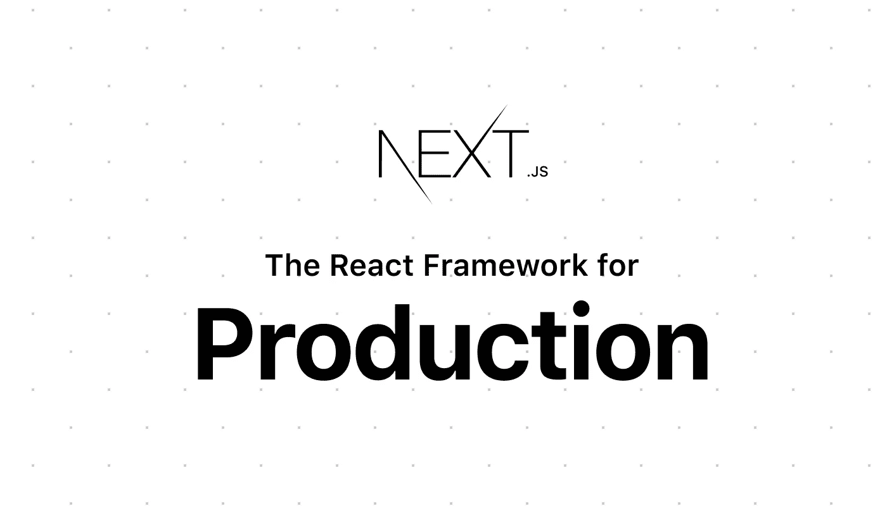

# 2020 年前 6 大 JavaScript 框架

> 原文：<https://blog.devgenius.io/the-top-6-javascript-frameworks-for-2020-9ee02f42d878?source=collection_archive---------1----------------------->

## 让我们看看 2020 年的顶级 JS 框架

在 Javascript 世界中(图片来源和鸣谢:JS 提示)

# 1.vue . j

Vue.js(图片来源和鸣谢:Vue.js 网站)

Vue。Js 是一个开源框架。它建立在——角度和反应上。Vue。Js 提供了许多有用的特性，并且已经成为许多跨平台应用程序的简单而有效的解决方案。使用 Vue.js 构建的顶级网站:

[**行为**](https://www.behance.net/)

*游客数量:4929 万人次*

行为

Behance-这个网站被平面设计师用来展示他们在世界各地的才华。他们使用了 Vue。JS 作为前端编程语言。

## [Gitlab](https://about.gitlab.com/)

*参观人数:*22.11 米*参观人数*

GitLab

Gitlab 是一个基于网络的源代码版本控制库，有几个成员选项。它是在前端开发上使用 Vue 开发的。

***从哪里入手？从这里开始*** *:*

[https://vuejs.org/v2/guide/](https://vuejs.org/v2/guide/)

# 2.蛹

Aurelia 是一个前端 JavaScript 框架。它是—

1.  现代最干净的框架之一
2.  它是下一代框架，因为它有能力创建强大、简单和完美的网站。

奥雷利亚(图片来源:互联网)

***从哪里入手？从这里开始:***

[*https://aurelia.io/docs/tutorials/creating-a-todo-app*](https://aurelia.io/docs/tutorials/creating-a-todo-app)

 [## 奥雷利亚项目

### GitHub 是 4000 多万开发者共同工作的家园。加入他们，发展您自己的开发团队，管理…

github.com](https://github.com/aurelia-project) 

# 3.下一个。射流研究…

下一个。Js 是一个开源框架写的 JavaScript。它是—

1.专为开发高度可定制的基于 web 的应用程序而构建。

2.这是一个面向 React 应用的零配置、单命令工具链。

Next.js(图片来源和鸣谢:Next.js 网站)

**它的一些最佳特性:**

1.  自动代码分割、基于文件系统的路由、热代码重载和通用呈现

***从哪里入手？从这里开始:***

 [## 学习| Next.js

### 生产级反应可扩展的应用。世界领先的公司使用 Next.js 构建服务器渲染的…

nextjs.org](https://nextjs.org/learn/basics/getting-started) 

# 4.暴动。射流研究…

暴动。Js 专注于为用户提供 JS 世界中最有效、最简单的架构。类似于 polymer 和 react.js。

Riot.js(图片来源和鸣谢:Riot.js 网站)

它的一些特性:

1.Js 允许用户在所有页面和 web 应用程序中应用定制的 HTML 标签。您也可以重复使用这些标签。

2.它高度关注微功能，允许您一次单独使用不同的应用程序。

从哪里开始？从这里开始:

 [## 文档 Riot.js

### 逐步入门指南

riot.js.org](https://riot.js.org/documentation/) 

# 5.WebRx

WebRx 是一个基于浏览器的模型-视图-视图-模型 JavaScript 框架。它带来了—

1.  编程的响应性和功能性。
2.  漂亮而强大的 UI 环境。

WebRx(图片来源和鸣谢:WebRx 网站)

它的一些最佳特性:

1.它提供了一种有效的收集处理，带有过滤投影、分页等功能。

3.它提供了由不同消息总线提供的强大的组件间通信。

从哪里开始？从这里开始:

[https://github.com/WebRxJS/WebRx](https://github.com/WebRxJS/WebRx)

***倒数第二个最有希望的(时刻准备战斗的)……***

# 6.有角的

Angular 是一个成熟的框架，而不是像 React 那样灵活的框架。它内置了所有的东西。它是—

1.  一个强大的 JavaScript 框架将无缝地组织你的项目。
2.  它提供了难以置信的速度和多功能性。

从哪里开始？从这里开始:

 [## 角度/角度

### 一个框架。移动和桌面。在 GitHub 上创建一个帐户，为 angle/angle 开发做贡献。

github.com](https://github.com/angular/angular) 

# 想看程序员幽默？

 [## 编程幽默第 2 部分

### 继续笑，因为太搞笑了…

medium.com](https://medium.com/datadriveninvestor/programming-humor-part-2-f92cf5a26f2b)  [## 史上最搞笑的代码注释

### 程序员幽默:是的，实际上是程序员写的！

medium.com](https://medium.com/datadriveninvestor/the-most-hilarious-code-comments-ever-bae3cb1030b5)  [## 编码原罪:令人捧腹的开发者自白

### “白板”是如何被嘲笑的

medium.com](https://medium.com/datadriveninvestor/coding-sins-hilarious-developer-confessions-f55eb342454e)  [## 10 个让你着迷的诙谐编程笑话

### 这些太搞笑了…

medium.com](https://medium.com/datadriveninvestor/10-witty-programming-jokes-that-will-make-you-go-rofl-a53fbfb91943) 

# 推荐文章-

 [## Python 迭代器、生成器和装饰器变得简单

### 快速实施指南

medium.com](https://medium.com/python-in-plain-english/python-iterators-generators-and-decorators-made-easy-659cae26054f)  [## 你应该知道的 23 种数据科学技术！

### 使用这些技巧来节省你的宝贵时间

medium.com](https://medium.com/ai-in-plain-english/23-data-science-techniques-you-should-know-61bc2c9d1b3a)  [## 编码原罪:令人捧腹的开发者自白

### “白板”是如何被嘲笑的

medium.com](https://medium.com/datadriveninvestor/coding-sins-hilarious-developer-confessions-f55eb342454e)  [## 面向数据科学家的 5 项酷炫先进熊猫技术

### 使用这些技巧…

medium.com](https://medium.com/datadriveninvestor/5-cool-advanced-pandas-techniques-for-data-scientists-c5a59ae0625d)  [## Stack Overflow 分析了来自 60，000 多名软件开发人员的数据，包括他们的工作时间、语言…

### 以下是他们的发现…

medium.com](https://medium.com/datadriveninvestor/stack-overflow-analyzed-data-from-60-000-software-developers-hours-they-work-languages-they-476ac6ca0197)  [## 高级 Python 变得简单—第 4 部分

### 使用这些技巧和技术…

medium.com](https://medium.com/datadriveninvestor/advanced-python-made-easy-part-4-a4996ba9fe19)  [## 高级 Python 变得简单—第 1 部分

### 使用这些技巧和技术…

medium.com](https://medium.com/datadriveninvestor/advanced-python-made-easy-part-1-ce1e2f17431e)