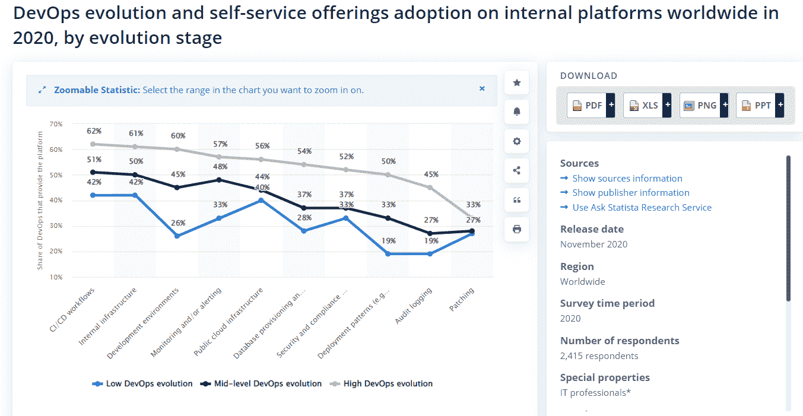
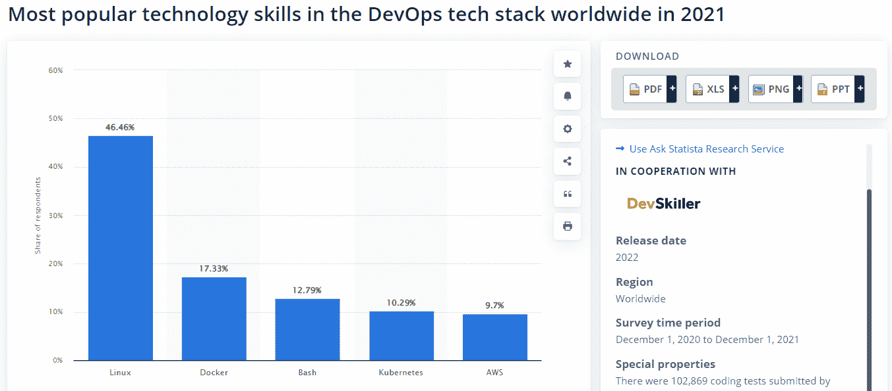
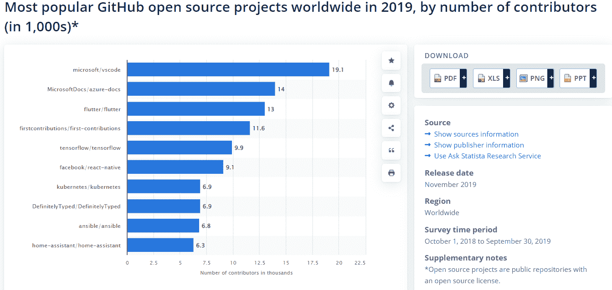

# 发展业务所需的 7 大 DevOps 工具

> 原文：<https://blog.devgenius.io/the-top-7-devops-tools-you-need-to-grow-your-business-2a6189c8c7ec?source=collection_archive---------9----------------------->

约翰·施诺布里奇在 [Unsplash](https://unsplash.com?utm_source=medium&utm_medium=referral) 上的照片

如果你想发展你的业务，采用正确的 DevOps 工具对于最大化你的生产力和最小化公司发展的压力是必不可少的。DevOps 运动旨在让组织中的每个人一起工作。

根据 Statista，CI/CD 工作流、内部基础设施和开发环境的高级 deOps 采用率超过约 60%。

下面的信息图提供了对全球采用 DevOps 的见解。

来源: [Statista —垂直行业采用 DevOps】](https://www.statista.com/statistics/1229785/devops-evolution-self-service-adoption/)

以下 DevOps 工具列表可以帮助您顺利运行产品和服务的同时实现业务目标。

# **1)硒**

Selenium 是测试 web 应用程序的优秀 devOps 自动化工具。它是开源的，拥有强大的社区支持，并且易于使用。此外，它还可以与 Jenkins 和 Gradle 等其他工具很好地集成。如果您正在寻找一个工具来帮助您自动化 web 测试，Selenium 是一个很好的选择。在 DevOps 过程中使用 Selenium 围绕着自动化测试过程。

一旦测试实现了自动化，它们就可以按一定的时间间隔或根据需要按顺序运行，这样就没有人工的监督了。硒不应该用于任何开发任务。它被认为是跨功能的测试，这超出了它的范围。

**主要特性:**

*   多浏览器
*   多语言支持
*   易于识别
*   动态 Web 元素
*   开放源码
*   轻便

# **2) Docker**

来源:[Statista—devo PS 技术堆栈中最受欢迎的技术技能](https://www.statista.com/statistics/1292382/popular-technologies-in-the-devops-tech-stack/)

Docker 是顶级 DevOps 工具之一，可以帮助您简化应用程序开发和部署流程。将您的应用程序打包到 Docker 容器中，可以让您在不同的环境之间快速移动它，而不用担心依赖性或配置。

Docker 使与其他人共享您的容器变得容易，这样您就可以更有效地在项目上协作。它允许路由网状网络，这被证明有助于随着跨许多服务器的流量增加而扩展 web 应用。例如，假设您想要在集群中启动一个新节点，并将其连接到一个现有的组。

首先使用 docker service create 命令告诉系统在创建这个新节点时启动什么映像。一旦命令运行完毕，使用 Docker service scale 命令告诉 Kubernetes 在任何给定时间应该运行多少个相同服务的副本。

**主要特性:**

*   更快的配置
*   应用隔离
*   高生产率
*   路由网格
*   安全管理
*   快速缩放

# **3)库伯内特斯**

Kubernetes 是一个著名的开源系统，用于管理跨多个主机的容器化应用程序，提供从映像构建的应用程序的自动化部署、扩展和操作。它将构成应用程序的容器分组为逻辑单元，从而简化管理和发现。

该平台依靠标准 API 进行图像拉取和推送，而不是图像管理，从而提供了跨所有平台的灵活性和可移植性。 [**印度 Devops 服务公司**](https://www.pixelcrayons.com/devops-solutions?utm_source=GP%2F+devops+tools&utm_medium=DevOps+Services+Company%2FSR-AR&utm_campaign=SR-AR) 一起部署 Docker 和 Kubernetes。

当 Docker 为您创建服务副本时，Kubernetes 会确保它们自动分布在集群中的所有节点上(包括尚未安排 pods 的节点)。如果任何节点出现故障，或者我们在集合中的其他地方需要更多的容量，Kubernetes 会根据需要自动移动副本。

**主要特性:**

*   自动装箱
*   服务发现
*   负载平衡
*   存储编排
*   结构管理
*   水平缩放

# **4)木偶**

随着您业务的增长，自动化需求也在增长。Puppet 是一个用于自动化任务的优秀开源 DevOps 工具，对于小型团队是免费的。另外，它很容易学习和使用。如果你不熟悉 Puppet，可以看看他们的网站或者阅读他们的用户指南。您可以将跨服务器的配置管理委托给 Puppet。它被认为是最好的 DevOps 监控工具之一。

它有助于确保应该发生的事情，确保全面的可靠性和一致性。它还包括强大的报告功能，可帮助您准确了解已经完成的工作以及下次需要完成的工作。有了这种对系统中所做更改的详细了解，理解什么时候出了问题就变得容易多了！

**主要特性:**

*   幂等性
*   跨平台
*   高资源
*   高级模块
*   多个模板
*   静态文件

# 厨师

Chef 是一款著名的配置管理工具，可以帮助您自动配置和维护基础架构。使用 Chef，您可以编写配方来描述应该如何配置您的基础架构，然后使用这些配方来自动管理和维护您的服务器。它还具有高度的可扩展性，因此可以轻松处理数百甚至数千台服务器。

此外，Chef 还集成了其他几个工具(如 Puppet 和 Ansible ),以提供更大的功能和灵活性。如果您正在寻找一个 DevOps 工具来帮助您自动化基础架构的管理，那么 Chef 值得一试。

**主要特性:**

*   基础设施供应
*   简化配置任务
*   自动化管理
*   高度可扩展
*   与 Puppet 和 Ansible 兼容
*   强大的配置管理

# 可回答的

随着业务的增长，您需要能够管理数量不断增加的服务器。Ansible 是管理服务器部署的优秀工具，因为它可以自动化许多原本需要手动完成的任务。另外，它是免费和开源的，所以你不用花钱就可以开始使用。

作为一个可靠的 DevOps 工具，Ansible 允许您在现有工作的基础上进行构建，使得跨不同环境扩展流程变得容易。虽然 Ansible 以其 IT 管理和应用程序部署工具而闻名，但它在网络管理、web 开发和系统监控方面有很多选择。

**主要特点:**

*   部署多层应用
*   管弦乐编曲
*   高度安全
*   云供应
*   高级模块
*   多个插件

# **7) GitHub**

来源: [Statista — GitHub 最受欢迎的开源项目](https://www.statista.com/statistics/824812/worldwide-github-popular-open-source-projects/)

GitHub 是全球知名的版本控制和协作代码托管平台。它允许用户跟踪文件更改，恢复到以前的版本，并在项目上与其他人协作。GitHub 也是一个社交平台，允许开发人员关注其他开发人员和组织，并查看他们参与或参与了哪些存储库。

GitHub 为企业提供企业计划，具有私有存储库和高级安全性等功能。作为一个 DevOps 工具，GitHub 拥有强大的社区支持和丰富的文档，是小型团队的理想选择。此外，GitHub 与 AWS 和 Azure 等主要云提供商集成，因此您可以从一开始就构建自己喜欢的环境。

**主要特性:**

*   自动环境设置
*   自动化
*   CI/CD
*   高度安全
*   平稳的项目管理
*   团队管理

# **包装**

有多种强大的 DevOps 工具可供选择，找到合适的工具是非常困难的，尤其是如果您缺乏技术经验的话。在使用工具之前，将关键特性与项目需求进行比较是非常重要的。

毕竟，一个工具不需要具备你的业务所需要的所有特性，而是找到一个适合你的需求并提供最大利益的。