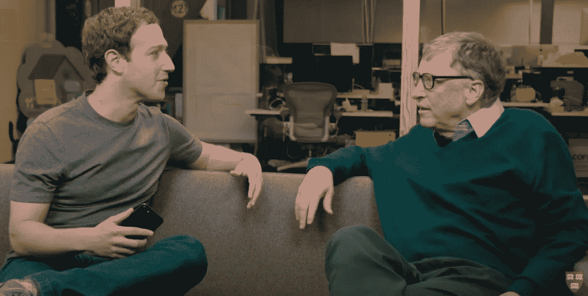

# CS 辍学背后的真相(CS 对 SE，理论对实践)

> 原文：<https://blog.devgenius.io/the-truth-behind-cs-dropouts-cs-vs-se-theory-vs-practice-e58e48ef5bd6?source=collection_archive---------5----------------------->

来源:[哈佛大学](https://www.youtube.com/watch?v=yqr6yLyuHQA)

生病的盖茨和马克·扎克伯格。你知道他们是谁，他们做了什么，他们建造了什么。他们为什么从哈佛退学？在南加州大学呆了两年，现在是一名计算机系的大四学生，离获得硕士学位还有一年时间，我非常赞同退学的行为。原因如下。

> 提示:这主要是理论上的**和实践上的**的区别。

# 期望与现实。

来源:夏日 500 天

划起来，你有没有看到一些很酷的东西，然后想，如果有一天我也能这样做，那该多好？我出生在技术大飞跃的时代，2009 年当我父亲带回家一部 iPhone 3GS 时，我就是这么想的。当每个人都还在使用诺基亚手机的时候，iPhone 的光芒无与伦比。我被它惊呆了，我花了整整一个下午摆弄地图应用程序，查看我们过去在印第安纳州科科莫的住所。我忍不住想，

> 伙计，我希望我能开发一个应用程序，能像我一样让人们刮目相看。

这就是我想学的，也是我希望在进入计算机科学专业时被教授的——如何构建能够以这样或那样的方式直接让用户受益的酷而不平凡的软件。我想为普通人解决日常问题，并对人们的生活产生直接影响。我写的软件必须有以下 DNA:

*   看起来不错
*   使用方便
*   立即解决一个重要的问题
*   人们会真的想要使用它

***如果这是你，那么你更多的是和我一样的软件工程师(SE)。***

然而，我不感兴趣:

*   优化寻路算法
*   想出比 RSA 更好的加密算法
*   试图解决哥德巴赫猜想
*   试图证明 P = NP

***如果上面的题目让你感兴趣，那么你更多的是计算机科学家(cs)，甚至是数学家。你根本不需要退学——事实上，你会爱上南加州大学的计算机科学课程。***

# 分解我作为软件工程师的 CS 之旅

在南加州大学期间，我参加了以下 CS/EE 课程(按顺序排列):

*   CSCI-104:数据结构和面向对象设计(C++)
*   CSCI-109:计算机科学导论
*   CSCI-170:计算机科学中的离散方法
*   EE-109:嵌入式系统简介(C)
*   CSCI-201:软件开发原理(Java)
*   CSCI-270:算法和计算理论导论
*   CSCI 310:软件工程(学分转换)
*   CSCI-356:计算机系统导论(C，汇编)
*   CSCI-360:人工智能介绍(C++)
*   CSCI-401:顶点:大型软件系统的设计和构建
*   EE-364:电气工程和计算机科学的概率统计介绍
*   CSCI-350:操作系统简介

以下是我作为一名具有相当企业家思维的软件工程师，从完全实用的角度对他们每个人的看法(例如，创建初创公司而不是在大公司工作，编写 web 或移动应用程序等高级软件而不是自动驾驶仪或操作系统内核等低级软件)。

## CSCI-104:数据结构和面向对象设计

CSCI-104 是用 C++教授的。这是一个典型的数据结构课程，人为地增加了难度，既要夯实编程的基础，又要剔除那些承受不了压力的人。

虽然了解你的数据结构是非常重要的，但是我想总结一下，在用 C++编写日常的*软件方面，这里没有什么实用的东西——没有一个人或者一个中小型团队会费心用 C++编写一个好看的 GUI 应用程序*。* 相比 C#和 Java 之类的替代品，简直太复杂了。的确，C++应用程序可以快得令人难以置信:Windows 操作系统的很大一部分是用 C++编写的，这是有原因的。但是说到你正在尝试编写的软件，C++的性能优势真的值得这么麻烦吗？尤其是在今天这个时代，计算机发展如此之快，以至于对于大多数用例来说，这种性能优势正在减弱。客观地说，大多数 ide 都是由 JetBrains (IntelliJ IDEA，Android Studio，CLion，PyCharm 等)开发的。)是用 Java 编写的，我从来没有感觉到因为优化不佳而导致速度变慢。诚然，C++是一种强大的语言，但是自己编写一些继承我前面提到的软件 DNA 的东西 ***作为辅助程序*** 太麻烦了。控制台应用程序，如数据库引擎，当然！普通人的桌面或移动应用，我不这么认为。*

*话虽如此，我必须强调，如果你想为以性能为导向或低级软件解决方案的大公司工作，了解 C++是必要的。例如，特斯拉的Autopilot 最初是用 Python 编写的，用于快速迭代，但后来移植到 C++和 C，用于性能和直接硬件访问。*

*另外，如果你在 CSCI 没有达到理想的 104 分，也不要给自己太大压力。在工作中，很少有人要求你从头开始实现一个 AVL 树。然而，重要的是要对它们如何工作有一个好的概念，并且能够应用它的概念。熟知 104 在技术面试中有很大的帮助。*

## *CSCI-109:计算机科学导论*

*这门课是计算机科学历史的概述。它的目标是那些对计算机了解不多的人，并试图简要地涵盖所有相关的主题，而不会在任何一个主题上融化你的大脑。相对轻松的课程，但有些人认为这是浪费时间。不过有一点是肯定的:这个类不会帮助你构建任何实际的产品。*

## *CSCI-170:计算机科学中的离散方法*

*CSCI-170 教你所有算法的基础知识。你会听到欧几里得之类的名字，会对图论感到厌恶。我不太喜欢这门课，因为我对研究或编写编译器之类的低级东西毫无兴趣，但我认识到这些基础知识的重要性。如果您计划编写高级软件，比如移动应用程序，那么您几乎不需要这个类。如果你打算写低级软件或者从事研究，那么这门课是至关重要的。这门课也与技术面试密切相关。*

*你在这门课上学到的逻辑、排列和组合的概念对概率领域非常重要，如果你想深入 AI/ML，你肯定需要掌握这些概念。*

## *EE-109:嵌入式系统简介*

*这门必修的入门课非常有趣。你可以摆弄 Arduino 板，用 c 编写超低级(位操作)代码。最酷的事情是你可以看到你的代码以物理方式显示，让它成为你连接的 led 或 LCD 屏幕。我的最终项目是一个带有显示器的温度计，如果温度超出范围，它会点亮两个 led 中的一个。*

*这门课不会在编写软件方面帮助你，除非你打算进入机器人领域，或者出于任何原因试图重新实现 malloc…你猜怎么着？你将不得不在以后的另一节课中这样做！*

*EE-109 绝对是不同的东西，对我来说是一个很好的分散注意力的东西，尽管我的一些朋友并不这样认为。逻辑和位操作主题为后面的计算机体系结构课程做准备。还有，雷德科普好。*

## *CSCI 201:软件开发原理*

*啊，是的，这是我的地盘。在我看来，CSCI-201 是在帮助你最终编写自己的软件方面最有用的一类。不仅仅是因为我是 201 的*首席 CP* 并且我喜欢在线上和线下向学生传授知识，还因为在这门课上你将学会:*

*   *写 Java，和 Kotlin 很像，都是用于 Android 开发的。除了移动开发，它也是使用最广泛的企业语言之一，尽管你所有的时尚朋友都崇拜 Python 和 C++。*
*   *写 HTML/CSS/JS。虽然你只是在非常基础的水平上了解它们，但你是被迫被介绍的，谁知道呢，也许你一直都有 web 开发的天赋？*
*   *用 Java 编写一个真正的服务器，它将为网站提供动力，或者作为一个 API 端点。*
*   *了解 MySQL 和您的数据库之路。*
*   *写一个简化的软件需求规格说明书，对于软件工程来说是难以置信的实用。*
*   *与小组成员一起做一个项目，学习在专业环境中与人打交道。你要么支持别人，要么被别人支持，但是学会合作和应对冲突需要练习。201 是一个非常好的练习时间，因为除了你的成绩之外没有任何利害关系。*
*   *明智地管理你的时间。我们给学生充足的时间来完成 201 作业和项目，但这取决于他们如何管理时间。拖延症从来没有好的结局，我们积极地告诉学生们早点开始。所以，如果你也是这些人中的一员，并且正在阅读这篇文章，请不要再问我是否能在作业到期前两天帮你开始(并传播消息！).*
*   *以一种相当实用的方式应用多线程、调度、网络和 I/O 等概念。我的同事 Emily 和我试图设计模仿真实世界产品的作业，这样学生就不会在完全琐碎的项目上浪费时间。这是我喜欢告诉我的学生的话: ***我不管你怎么做(虽然没有作弊)，只要把它完成。*** 作为一个利益相关者，我不关心你是如何实现这个组件的，我只希望我的产品工作良好并满足需求。*
*   *通过谷歌自学。说真的，知道如何使用谷歌是一个人可以学到的最好的东西之一，在我看来，这是一个软件工程师必须具备的最基本的资格。知道如何谷歌节省你的时间。不知道如何谷歌和生气我告诉你谷歌只是幼稚。我不会给出这些答案，除非我非常肯定你能在谷歌上找到你需要的信息。*
*   *浏览在线论坛。在你发表自己的帖子之前，你要学会阅读别人的帖子，以防你的问题已经有人问过并回答了。实际上，你早在 104 年就开始学习这项技能了。然而，即使经过 2 个学期的训练，也不是每个人都能掌握这项技能完成 201。*

*所以是的。*

## *CSCI-270:算法和计算理论导论*

*CSCI-270 基本上是 CSCI-170 的更高水平。我实际上更喜欢 270 到 170，因为它的内容更实用。您将学习动态编程(智能递归)、分治算法、更多的图论和复杂性。这个课程中的想法在设计软件时会派上用场。它们对于技术面试也非常重要。上课注意听讲！*

*还有，辛德勒好。*

## *CSCI 310:软件工程*

*我没有亲自上过这门课。在我转到南加州大学之前，我在查普曼大学选修了另外两门软件工程课程，所以我放弃了这门课程:*

*   *软件要求和测试*
*   *软件设计*

*《软件需求和测试》教你如何与不懂软件的客户交流，并把他/她的“用户故事”转化为各种需求，最终形成正式的软件需求规格。这门课还涵盖了不同类型的测试以及如何编写好的测试用例。*

*软件设计教你构建软件时不同的设计模式。这对我来说是最重要的课程之一。想知道你能从这门课中学到什么，请看这里:[https://sourcemaking.com/design_patterns](https://sourcemaking.com/design_patterns)*

*我无法告诉你这些课程对我有多重要和有益。我两年多前服用了它们，直到今天，作为一名软件工程师，它们仍然让我直接受益。*

## *CSCI-356:计算机系统导论*

*在这门课中，你基本上会学到程序是如何在一个非常低的层次上工作的(汇编代码)。这非常令人沮丧，但也很有见地。对我来说不是有趣的课。从头重新实现 malloc 几乎使这个类比 104 更糟糕。不过，保利里博士让这门课变得很容易忍受！*

## *CSCI-360:人工智能导论*

*斯文·柯尼希教授强加的荒谬难题不是开玩笑的。我们在本科班学习研究生水平的材料，所有代码都是用 C++编写的。我学到了很多吗？当然可以。我是从教授那里学来的吗？不完全是。几个小时的 YouTube 让我免于失败。然而，你最终会完成一些令人印象深刻的家庭作业，比如机器人的多智能体寻路和手写数字识别。如果你不打算进入 AI/ML 领域，这个班就没什么用了。*

## *CSCI-401:顶点:大型软件系统的设计和构建*

*401 感觉像是 201 的期末专题，但是有真正的利益相关者，不平凡的专题，而且延伸到整个学期。在这门课中，你将花整个学期的时间和你的团队一起努力为外部利益相关者交付产品。非常实用，对有抱负的软件工程师非常重要。我和我的团队为 Fidelity Investments 开发了一个 iOS 应用程序，这是一次很好的学习和工作经历。然而，不利的一面是，你基本上是一个没有报酬的实习生。我非常喜欢 401。*

## *EE-364:电气工程和计算机科学的概率统计介绍*

*这是所有电子工程/计算机科学专业的必修课，但实际上应该是选修课。我们学习了离散和连续分布，但是我个人看不出它与 AI/ML 之外的任何东西有什么联系。事实上，当我私下问教授时，他说统计概念是机器学习的基础。然而，我质疑，如果我看不到自己进入机器学习领域，这一切有什么用处。我还问为什么 USC 不开始把计算机科学和软件工程当作两个不同的专业，就像它们在现实生活中是两个不同的领域一样。教授回应道(转述自不久前):*

> *“在南加州大学，我们不会教你如何找工作，你可以去网上学校学习。我们试着教你事物运作的基本原理，这样你就可以用这些积木来解决这些领域的问题。如果我们只是教你如何找到工作，那么南加州大学和一些在线学校会有什么不同？”*

*这个回答让我很不安。也许这只是一个不经意的陈述，并不意味着要去理解它，但是把软件工程作为“找工作的一种方式”的说法并不适合我。在学术研究人员的眼里，软件开发可能看起来是生活中相当琐碎的追求，但反过来，学术研究的生活对我来说也是没有回报和无聊的。然而，我从未怀疑或低估研究人员的重要性。*

*哦还有 USC 和网校(或者 Youtube 视频或者极客 forgeeks)的区别？*

*   *更多学费*
*   *有时不太容易理解*
*   *一个能让我找到工作的学位*

*总之，我不认为成为一名优秀的软件工程师需要概率论。但是就像所有其他的课程一样，粗略地记住这些概念是有好处的。*

## *CSCI-350:操作系统简介*

*我还没有采取它，但我认为它会有点类似于 CSCI-356，但我更感兴趣。如果你打算为各种操作系统开发内核，我想这门课会很有帮助。但是对高级移动、web 或区块链开发没有帮助。*

# *包扎*

*回顾我参加过的计算机科学课程，只有 5 门对我作为软件工程师的成长有益:*

*   *CSCI-104:数据结构和面向对象的设计(编程基础+面试技巧)*
*   *CSCI-201:软件开发原理(编程实践+人际技能)*
*   *CSCI-270:算法和计算理论介绍(算法+面试技巧)*
*   *CSCI 310:软件工程(基本软件工程技能)*
*   *CSCI-401:顶点课程:大型软件系统的设计和构建(真实世界的实践+真实世界的技能，可以参加，但可选)*

*很清楚为什么比尔和马克在大二后决定从哈佛退学，全职从事他们的项目，微软和脸书。他们是软件工程师，不是计算机科学家。他们想制造一个工作产品，而不是作为研究科学家度过一生(并不是说研究有什么错)。尤其是当他们手上已经有很有潜力的项目时，诱惑太大了。*

*我真的希望学校开始将计算机科学和软件工程分开，因为对于成为一名软件工程师来说，有太多重要的实践主题，而计算机专业的学生却没有接触过。像需求引出、测试、设计模式、生命周期、适当的文档等等。在这一点上，我不得不称赞我以前的大学，查普曼大学。他们把 CS 和 SE 作为自己的专业，并且做得非常出色。*我转学前上的两门 SE 课至今仍让我受益匪浅。**

*如果我对此有如此强烈的感觉，为什么我不退出呢？嗯，如果我退出，我就不能再当*首席 CP* 了。哦，还因为我不像比尔和马克那么聪明，所以**我真的需要我的学位**，但是我们不要在细节上纠缠不清。*

> *但这只是我的观点。你可能完全不同意我的观点，这完全没关系。这里的外卖？对你想做的事情和你的激情所在有一个愿景，然后朝着它努力。不要让你上的课定义你是什么。选择自己的命运。*