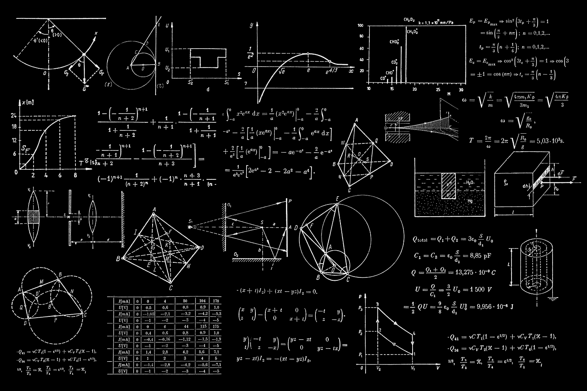
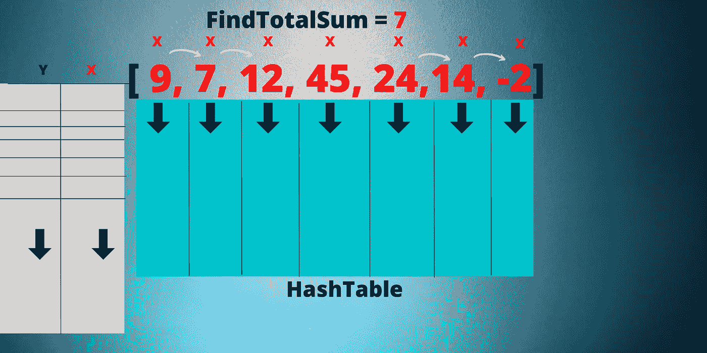
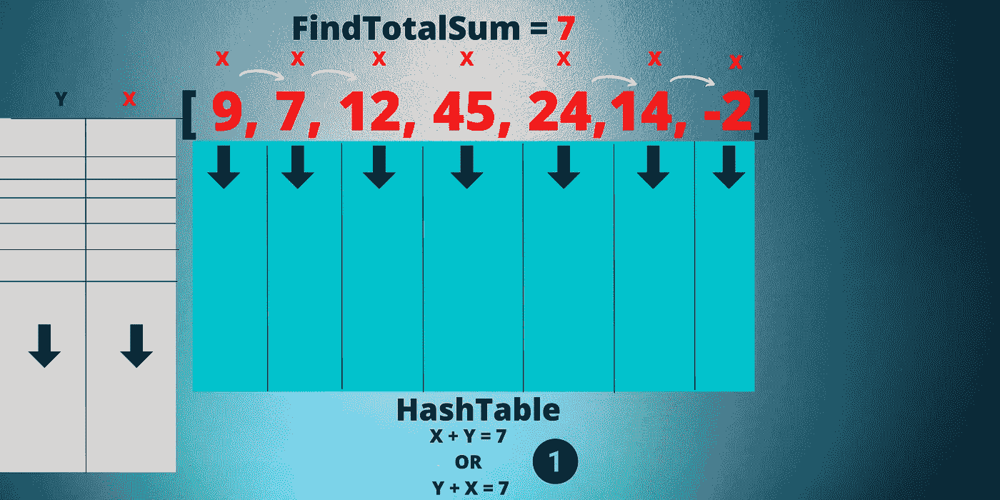
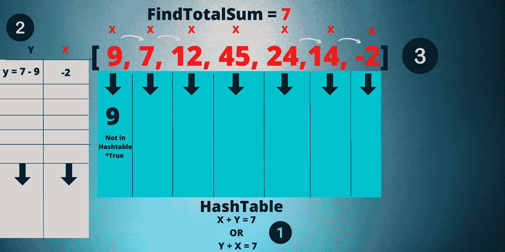
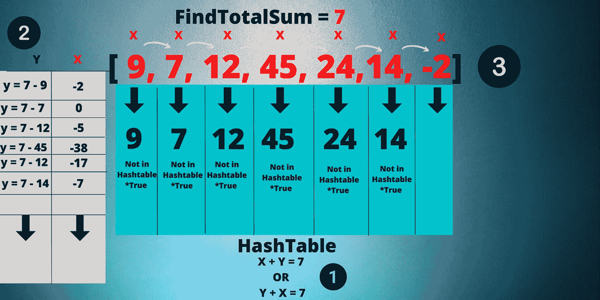
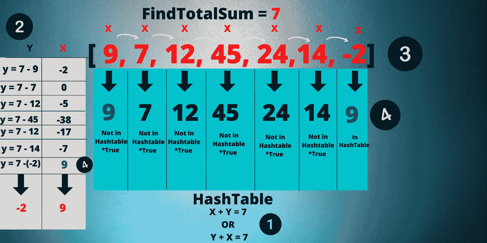
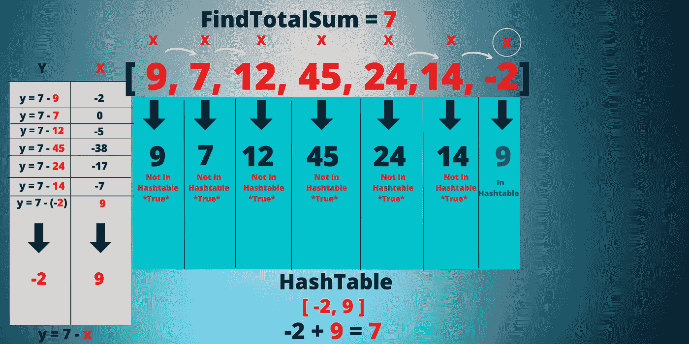

# Swift 编程语言中的两个数和算法

> 原文：<https://blog.devgenius.io/the-two-number-sum-algorithm-in-swift-programming-language-d5ba159a9ad3?source=collection_archive---------6----------------------->

> 计算机科学中的 Swift 算法和数据结构

# 散列表

哈希表与编程中的数组非常相似，但是哈希表和数组之间有区别。哈希表是保存相关组值的结构，使用键和值映射来检索值。swift 编程语言中的 Dictionary 利用相同的概念，通过键和值对来管理元素集合。Hashtable 在最坏的情况下保持 O(n)和 O(1)的时间复杂度。

# O(n)和 O(1)时间复杂度

算法是计算机科学和编程中美丽的艺术，经常被用来构建复杂的程序。 **O(n)** 可以通过迭代元素数组的算法来引用；当遍历不断增长的列表元素或输入时，这种线性运行时间复杂度需要长得多的时间。 **O(1)** 算法时间复杂度是在无限的运行时间复杂度中，计算输入大小而不考虑集合或输入大小的常数时间。

大 O 符号图显示 O(n)和 O(1)

> **索引**:这通常用于定位哈希表或字典中元素的计算序列。
> 
> **值:**存储在桶中，使用哈希函数计算位置。

# 两个数和算法

两个数和算法是一个经典的算法，它测试一个人的知识和基础，理解数组和哈希表的逻辑运算。要知道算法是如何工作的，我们需要理解算法在 swift 编程中如何运行和操作背后的数学逻辑。让我们看看下面的例子，并分解这个算法，以了解其功能背后的逻辑和理论。

下面列出了我们的数组或数字集合，我们将通过迭代来找到这个问题的总和。下面是一些数字的集合；我们有一个哈希表，将用于存储我们的整数总和，以找到总和。左上角将进行我们的计算，以找到总和。

***X:*** *这将表示我们试图在哈希表中查找的数字，该哈希表计算“查找总和”。这个值理论上是我们哈希表中的哈希值，它等同于我们表中的一个哈希值。*

***Y:*** *将表示“FindTotalSum”的值为 7。我们将求解 Y。*

当我们分解这个算法时，请参考上面的图表。

# 等式

当在我们的算法中寻找总和时，我们的等式如下。你有 X 和 Y；不管顺序如何，理论上我们都会得到相同的结果，并得到值“7 ”,如下所示。

> Y + X =7
> 
> X + Y= 7

我们将在上面的图表中注释我们的方程，我们将利用它来解决这个算法。

一旦我们得到了方程，我们需要开始遍历数组并将值存储到哈希表中。下面列出了我们将用来求解“FindTotalSum”的等式。每次我们遍历集合时，值都会存储在哈希表中。这个算法的目标是在哈希表中找到 X 值。当 X 值位于哈希表中时，这是我们遍历集合并找到一个与“FindTotalSum”值相等的哈希值的方法。

> *Y = 7 - X*

如果在哈希表中找不到减去 y = 7 - x 的总和，我们将把 x 存储在哈希表中。

每当我们求解 x 并且值不存在时，我们将继续在哈希表中存储 x 值。

当求解 x 时，减去 y = 7 -(-2)，我们最终得到总数 9。如图所示，我们现在可以看到相关性，哈希值 9 已经存储在我们的哈希表中。我们现在已经在算法中解出了 x。

> y = 7-(-2) = 9

“9”是在我们的哈希表中找到的，我们完全遍历了我们的集合。

如下图所示，我们收到[-2，9]的最终结果，这将等于我们在算法中的总数 7。下面列出，我们将利用我们的最终方程来验证两个数字都等于 7。

上面列出的是计算机科学中两和算法的功能和结果。

# Swift 算法

下面列出的是 Swift 代码中的算法。我们刚刚解决的理论在下面的算法中实际上是相同的，并且遵循相同的概念。该算法对于理解和利用编程中的大量逻辑思维和功能非常有用。

# 结论

今天我们讨论了 Swift 编程和计算机科学中的两和算法。对于一个新的程序员和开发人员来说，在构建应用程序或网站之前，理解数据结构和算法在编程中是如何工作的是很重要的。编程的基础是建立在数学逻辑和问题解决之上的。编码快乐！

 [## 迈克尔巴尔萨-技术作家-开发天才| LinkedIn

### 经验丰富的数据专家，负责监督维护美国的飞机数据和信息管理…

www.linkedin.com](https://www.linkedin.com/in/michael-balsa-9474431b0/)