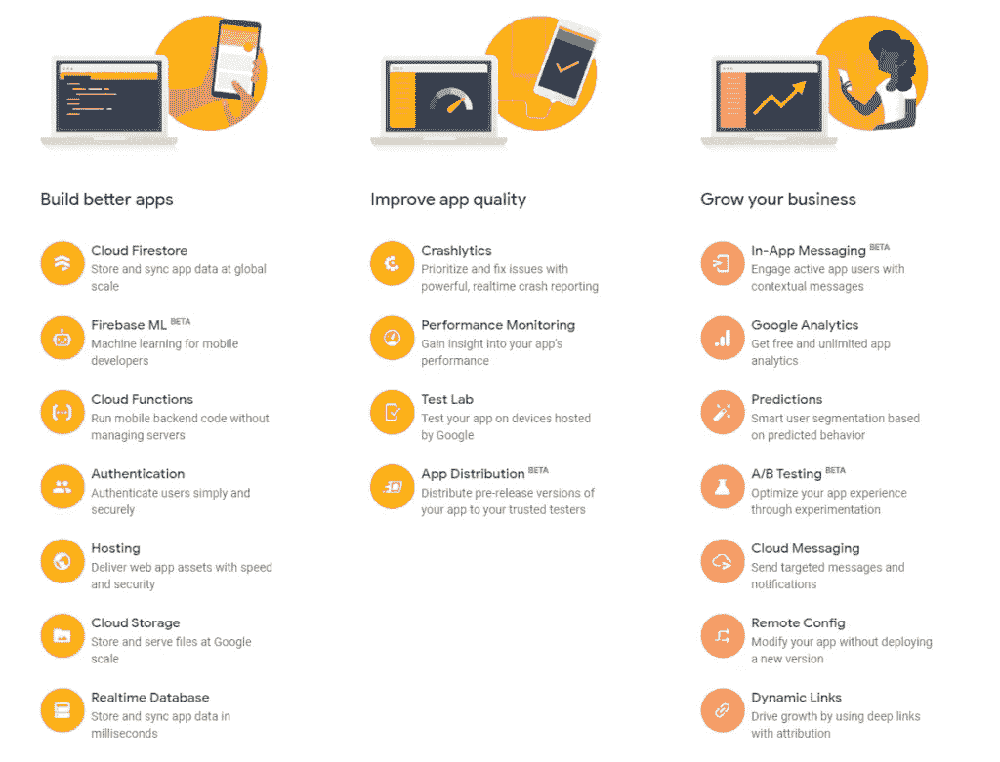
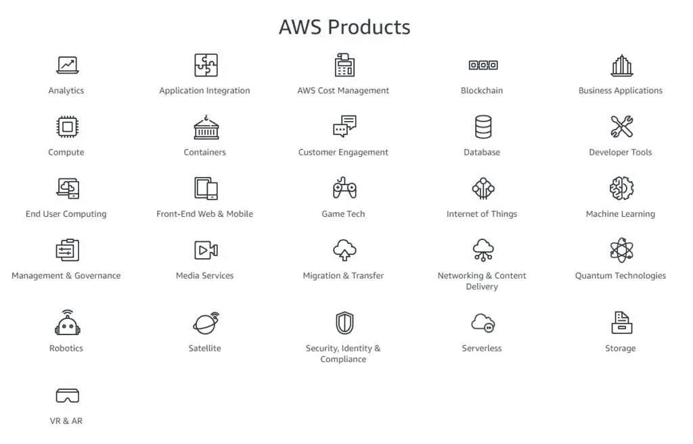
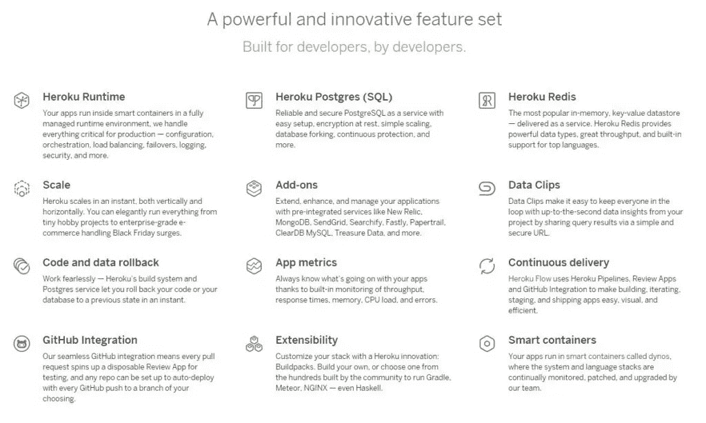
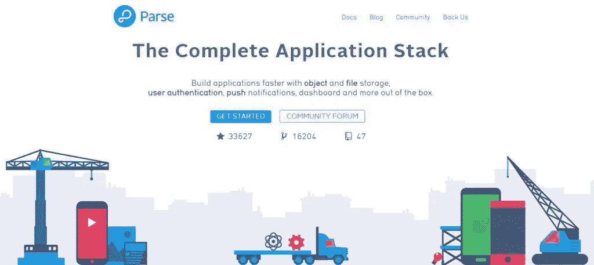
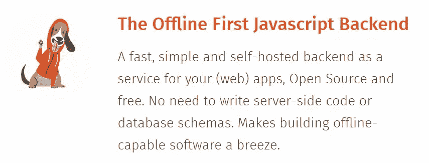
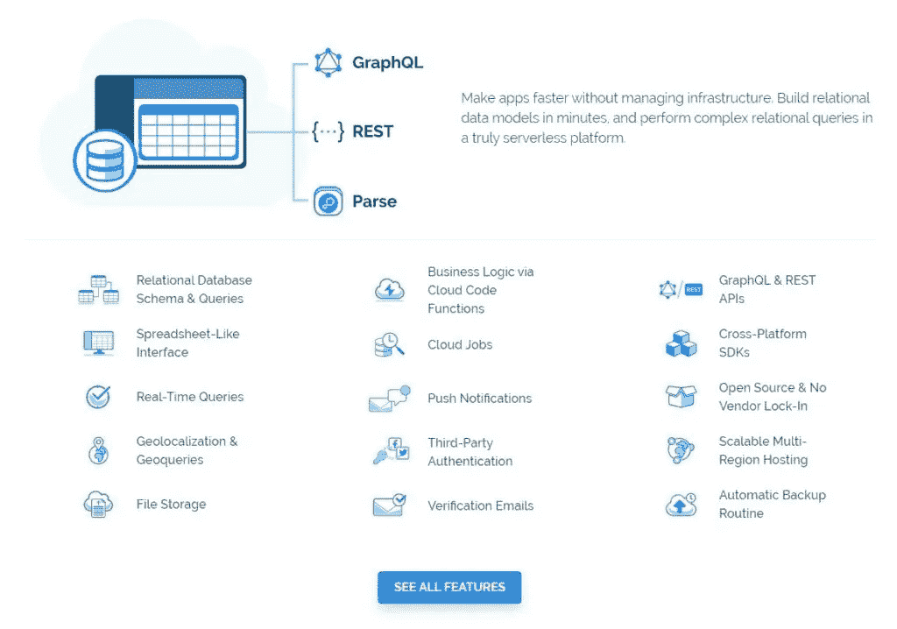
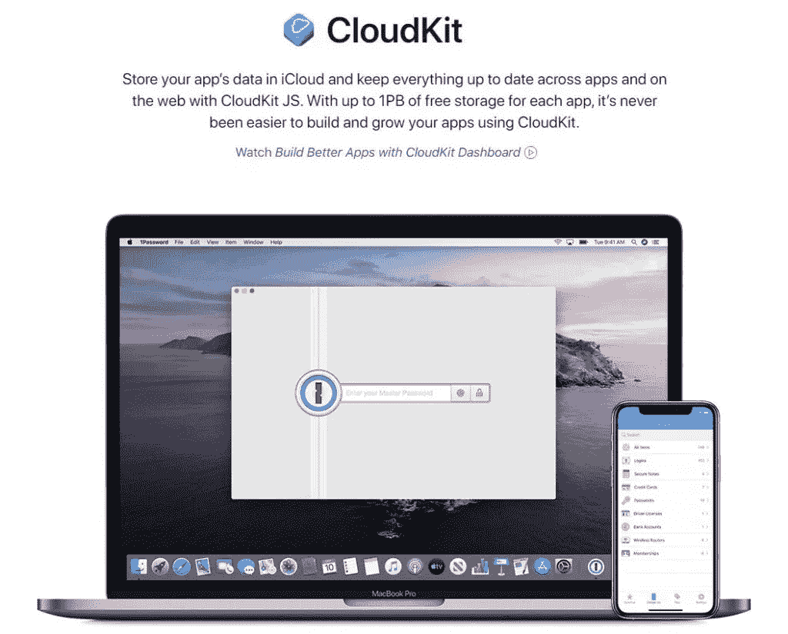

# 终极对比:Firebase 与其他平台

> 原文：<https://blog.devgenius.io/the-ultimate-comparison-firebase-vs-other-platforms-19fb758c8931?source=collection_archive---------6----------------------->

在本文中，我们将 Firebase 与其他 8 个应用程序开发平台进行了比较。在这里，您可以找到对比图表，帮助您了解每个平台的差异和优缺点。

# Firebase 是做什么用的？

Firebase 为您提供分析、数据库、通信、崩溃通知等功能。它允许你移动并专注于你的客户。Firebase 是基于谷歌资源设计和扩展的，即使是最大的应用。Firebase 产品在 Android 和 iOS 上运行良好。Firebase 交换信息和见解。所以，他们更适合在一起。

# Firebase 的利弊

## 赞成的意见

*   可以通过电子邮件和密码、脸书等方式进行身份验证
*   Firebase 提供实时数据
*   API 是现成的
*   安全性内置于节点中
*   文件备份由谷歌云完成
*   Firebase 文件托管是静态的
*   数据被视为流
*   使用 Firebase，您可以构建高度可伸缩的应用程序
*   不要考虑基础设施！

## 骗局

*   传统的关系数据模型不适用于 NoSQL
*   只有在本地机器上进行仿真时，才能进行机载安装
*   Firebase 使得大型数据库无法查询

# Firebase 的替代品是什么？

以下是可点击的备选数据库列表:

# Firebase 与其他平台的比较

# AWS vs Firebase

Firebase 和 [AWS](https://aws.amazon.com/) 是无服务器技术。不需要服务器管理。这项技术限制了管理和服务处理的负担。无论您使用 Firebase 还是 AWS，当您触发请求时，两者都会运行您的代码。这样，您可以轻松地扩展您的应用程序。而且，你只需要为它的运行时间付费。

# Heroku vs Firebase

Firebase 和 [Heroku](https://www.heroku.com/home) 服务定制域、后端处理、SSL 和许多其他伟大的特性改进了应用程序开发。Firebase 帮助开发人员轻松设置后端。它与高度灵活的后端工作。Heroku 允许你在系统中添加不同的数据库，比如 MongoDB 和 MySQL。

# Azure vs Firebase

[Azure](https://azure.microsoft.com/) 和 Firebase 没有类似的类别。Azure 被归类为云平台即服务(PaaS)，使用与 SQL server 兼容的关系型 DBMS。相比之下，Firebase 是一个由数据存储支持的 Baas。

# 解析 vs Firebase

[解析](https://parseplatform.org/)服务器允许其用户自托管。它是由开源开发者支持的开源服务。Firebase 提供集中的数据管理，而解析服务器使用不同的数据库来存储不同种类的数据库。例如，MongoDB 用于数据存储，Amazon s3 bucket 用于文件存储。

# 帽衫大战火焰基地

[帽衫](http://hood.ie/)是一项开源服务。除了数据存储之外，它还提供许多其他服务，如后端任务。Firebase 不是开源的，这也是其伸缩不灵活的主要原因。

# Back4app vs Firebase

[Back4app](https://www.back4app.com/) 是软件即服务(SaaS)领先的解析服务。它有多个类似于解析服务器的特性，如附加组件、性能监控和基础设施*。*

# CloudKit vs Firebase

CloudKit 是一个框架，用于将您的数据从设备交换到 iCloud。它提供完整的数据同步。这意味着您可以从任何连接的设备获取这些数据。储存您的数据需要您拥有的 Apple 帐户。维护您的帐户非常容易。

# 结论

Google Firebase 是一个高效的后端平台。然而，这并不是世界上唯一的选择。在本文中，我们讨论了 Google Firebase 的七种替代方案。所有这些平台互为补充。他们都有惊人的特点和好处。是的，也有缺点。我们已经讨论了它们与 Firebase 的比较。现在你必须选择最适合你的方案。建议采用更具成本效益、可伸缩性和灵活性的解决方案。

*原载于 2020 年 11 月 16 日 https://os-system.com**的* [*。*](https://os-system.com/blog/comparison-firebase-with-other-platforms/)