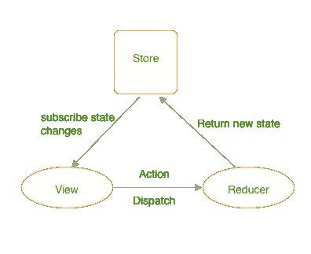
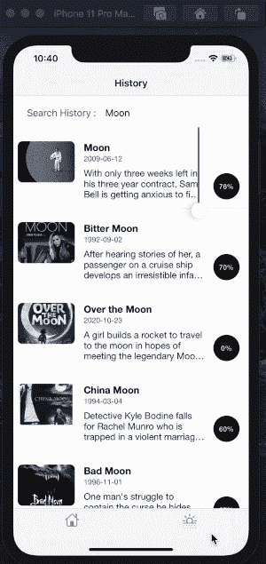

# iOS 中状态的单向数据流和时间旅行

> 原文：<https://blog.devgenius.io/the-unidirectional-data-flow-and-time-traveling-of-states-in-ios-24698d5d4a55?source=collection_archive---------6----------------------->


这些天来，我一直在开发一个功能，比如实现注册表单详细信息页面，在流程完成之前，我不想将它写入数据库。然而我在我的项目中使用了 MVVM 模式，这当然是一个非常简单和干净的架构，像这样积累中间状态会导致单例滥用和其他问题。

这些来自状态的多个副本，如果您允许您的应用程序来回导航，那么您必须确保最新视图控制器中的最新状态在其他视图控制器中也是可用的。维护通过委托或回调涉及的所有控制器的状态变得很麻烦。我想这种问题在 iOS 开发者中很常见。


在这种情况下，我选择在我的实现中集成单向数据流(Redux)方法和 MVVM。在这篇文章中，我试图解释单向数据流的**工作流程**流程(redux)和**我们如何在我们的应用程序中使用它进行状态的时间旅行。**吼吼！让我们开始…

> ***单向数据流*** 是使用基于 web 的应用程序的一个基本特性。

数据自上而下流动的原因是，从根组件开始，每次都要对每个组件自上而下地执行变更检测策略。这太棒了，因为单向数据流比周期更容易预测。

# 那么 Redux 是什么，它是如何工作的？

Redux 是脸书开发的 [flux 框架](https://github.com/facebook/flux)的替代或变体，脸书现在将其用于大多数 web 应用程序。主要思想是**信息总是只向一个方向流动。**



redux 的单向数据流

让我们来分解一下每个组件在我们的实施中的作用，好吗…

*   **视图**:订阅**存储**变更并在屏幕上显示。观点派**行动派**。
*   **动作**:动作不包含任何代码，是描述状态变化的小段数据。一个动作由**减速器**操纵。
*   **还原器**:提供基于当前动作和当前 app 状态的纯函数，返回新的 app 状态。
*   **存储**:存储应用状态的当前值。其他模块如**视图**可以订阅并对其变化做出反应。

在本文中，我将使用 Reswift 实现单向数据流。Reswift 是一个框架，帮助您在 swift 中创建类似 Redux 的架构。

*我们将创建一个应用程序，从网络 api 获取热门电影列表，并包括像搜索电影的功能。然后我们将从 redux store 中获取搜索历史。*

> 1.首先，我们需要从创建状态开始设置 ReSwift 的连接。

状态实际上是一个数据结构，包含子状态，如 navigationState *(例如，哪个视图当前是活动的)*，通常应用程序的每个视图都有一个子状态。在本例中，只有一个 AppState 包含两个视图的两个子状态。

> 2.我们还定义了两个动作，一个用于将搜索结果添加到存储中，另一个用于根据搜索关键字获取搜索历史。

> 3.根据不同的动作类型，商店将通知 Reducer 返回新的状态。

为了有一个可预测的应用程序状态，重要的是 reducer 总是没有副作用，它接收当前的应用程序状态和一个动作，并返回新的应用程序状态。然后我们把我们的减压器包在一个主减压器里，这样我们就可以一次注射到商店里。

> 为了维护我们的状态并将操作委托给 reducers，我们需要一个存储。让我们称它为`mainStore`，并将其定义为一个全局常量，例如在 app delegate 文件中:

```
**var** *mainStore* = Store<AppState>(reducer: appReducer, state: **ni**
```

> 在最后一步之前，我们需要在我们的视图中扩展 **StoreSubscriber** ，这样每当有新的应用程序状态可用时，`*Store*`就会调用`*newState*`方法。这是我们需要调整视图以反映最新应用状态的地方。

我们都准备好了。咱们把行动调度电话扔了吧，吼吼！…


> 最后，我们的视图层，在本例中是一个视图控制器，需要通过订阅存储更新并在应用程序状态需要更改时发出动作来绑定到这个系统:

最后，我们可以看到时间旅行的能力，这有助于在应用程序的先前状态之间来回移动，并实时查看结果。



希望你觉得这篇文章有趣，对你的项目有用。欢迎任何问题或评论！

# 参考链接

[](https://github.com/ReSwift/ReSwift) [## resswift/resswift

### 支持的 Swift 版本:Swift 4.2、5.0 对于 Swift 3.2 或 4.0 支持使用 5.0.0 版或更早版本。对于 Swift 2.2…

github.com](https://github.com/ReSwift/ReSwift) [](https://medium.com/commencis/using-redux-with-mvvm-on-ios-18212454d676) [## 在 iOS 上使用 Redux 和 MVVM

### 在我们开始之前，Redux 是什么？来自 redux.js.org:

medium.com](https://medium.com/commencis/using-redux-with-mvvm-on-ios-18212454d676) [](https://medium.com/mackmobile/getting-started-with-redux-in-swift-54e00f323e2b) [## with Redux 入门-第 1 部分

### 学习 Swift 中 Redux 开头的简单方法。

medium.com](https://medium.com/mackmobile/getting-started-with-redux-in-swift-54e00f323e2b) [](https://www.raywenderlich.com/516-reswift-tutorial-memory-game-app) [## ReSwift 教程:记忆游戏 App

### 在本 ReSwift 教程中，您将学习在 Swift 中创建一个类似 Redux 的应用架构，该架构利用单向…

www.raywenderlich.com](https://www.raywenderlich.com/516-reswift-tutorial-memory-game-app)