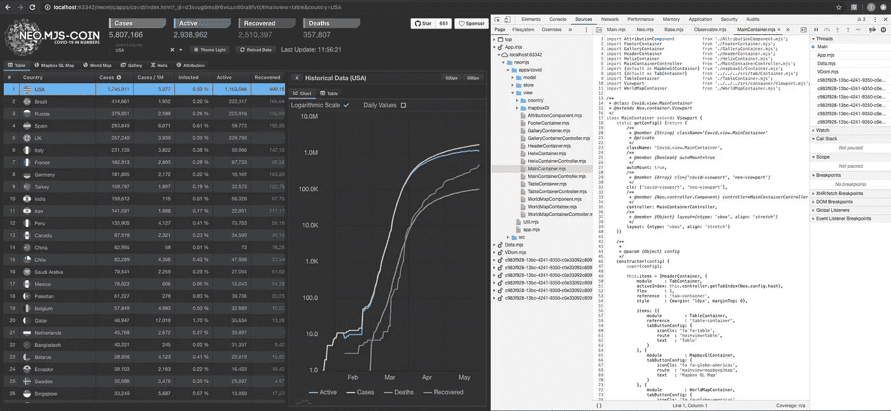
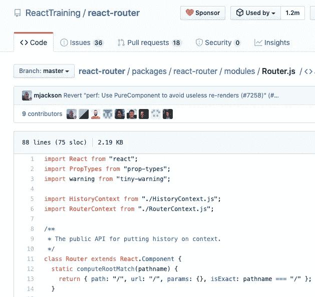
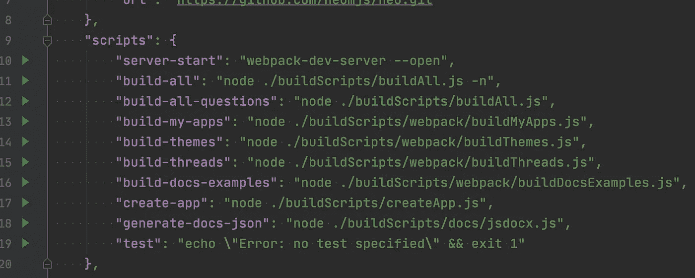
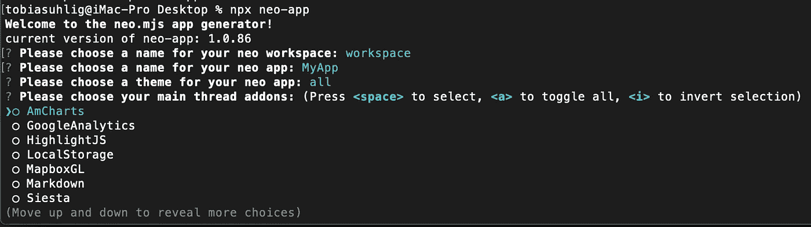
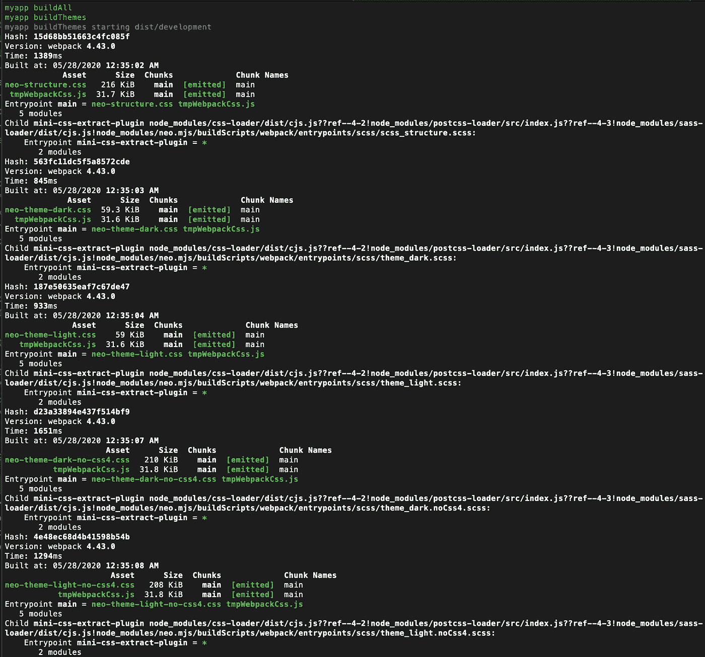
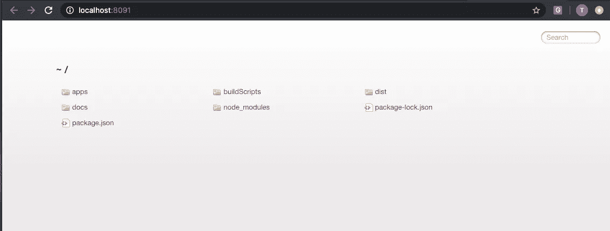
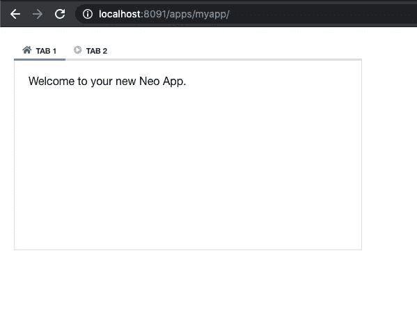
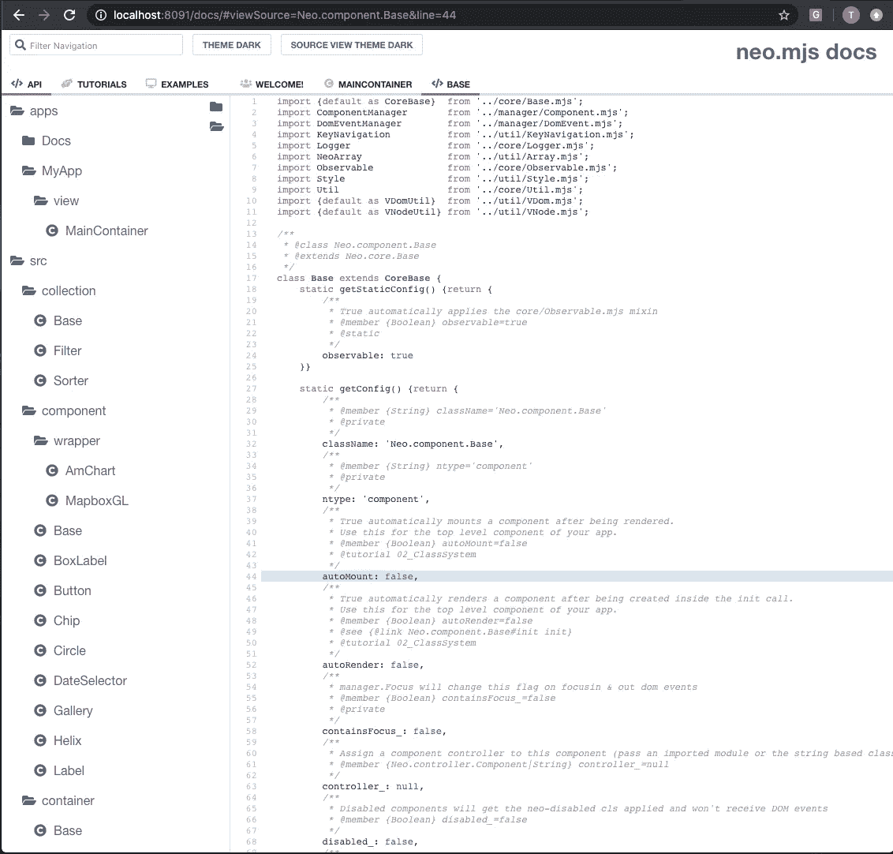
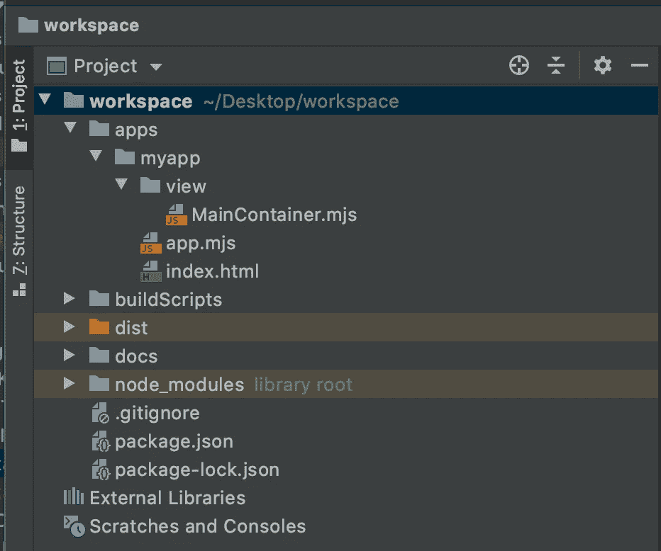

# webworkers 驱动的 UI 框架:neo.mjs v1.2.0 发布公告

> 原文：<https://blog.devgenius.io/the-webworkers-driven-ui-framework-neo-mjs-v1-2-0-release-announcement-a811ebe47252?source=collection_archive---------3----------------------->

我对第二个次要版本的发布感到非常兴奋，因为它投入了大量的精力。1.2.0 是关于生态系统的，更准确地说是关于框架的工具方面。

# 内容

1.  neo.mjs 是什么？
2.  1.2.0 版本有什么新功能？
3.  路线图上的下一个项目是什么？
4.  最后的想法

# 1.neo.mjs 是什么？

neo.mjs 是 webworkers 驱动的下一代 Javascript UI 框架。

[https://github.com/neomjs/neo](https://github.com/neomjs/neo)

它于 2019 年 11 月 23 日向公众发布。

在 GA 之前有 3720 次提交，之后有 1970 次，所以我们说的是总共 5690 次提交和大约 54000 行手工编写的 Javascript 代码。

包括所有示例应用程序在内的整个代码库都使用 MIT 许可证。

**的主要设计目标**是，框架的大部分部分以及你用它创建的应用程序在一个单独的线程(webworker)中运行，以保持主线程尽可能快地空闲。

让我们仔细看看下面的截图:

可以看到 MainContainer.mjs 文件(这个应用程序的主视图)位于应用程序线程内部。您还会注意到有两个额外的工作器:数据(例如与 API 的通信)和 vdom(将 vdom 转换成真正的 dom 标记&创建增量更新)。

如果您查看这个文件的源代码，您会注意到这是一个真正的 Javascript 模块，直接在浏览器内部执行。

这是**的第二个主要设计目标**:至少开发模式必须在没有任何 Javascript 构建或编译的情况下运行。这意味着您只需更改您的代码库，就可以在浏览器中立即看到这些更改。在这个模式中，你甚至不需要源地图。与使用其他框架相比，这对我自己的工作效率产生了巨大的影响。

平心而论:目前，开发模式只在 Chrome 80+中有效。

Firefox 和 Safari 确实支持浏览器主线程中的 JS 模块，但是它们还不能启动基于 JS 模块的 worker。这两种浏览器都有开放的门票，所以这是迟早的事。你可以随意增加它们的重量。

如果你是 TS 的粉丝，你当然可以使用它来编写你的应用程序代码，但是要注意，在这种情况下，你失去了开发模式的优势(你需要坚持使用 dist/dev development)。

第三个主要设计目标是，neo.mjs 完全由配置驱动。ES8 得到了增强，可以很好地支持类/实例属性。例如，如果您通过 get / set 定义一个属性，扩展该类，然后为给定的配置传递一个值，这不会替换 get / set 逻辑，而是在实例化时为其赋值。带有尾随下划线的配置将自动创建可选方法:

beforeGetX(值)
beforeSetX(值，旧值)
afterSetX(值，旧值)

所以前后处理都很到位。您可以使用 afterSet 方法将更改应用到 vdom 和 fire 事件。

您可以使用 myInstance.set()一次更改多个配置。如果基类是一个组件，这将确保只有一个 vdom 更新。

更多详情请点击此处:

[https://medium . com/@ tobiasuhlig/JavaScript-classes-state-management-v2-43d 4a 4b 5 e 753](https://medium.com/@tobiasuhlig/javascript-classes-state-management-v2-43d4a4b5e753)

**第四个设计目标**是，框架应该暴露其核心。

让我们看一下 React 路由器:

[https://github . com/react training/react-router/blob/master/packages/react-router/modules/router . js](https://github.com/ReactTraining/react-router/blob/master/packages/react-router/modules/Router.js)

路由器本身在 DOM 里面吗？显然不是。路由器应该有 render()方法吗？我不这么认为。在我看来，这是架构上的一大缺陷。要明确的是:不是在路由器上，而是在将 Component 作为 React 基类上。

在 neo.mjs 中，所有实用程序类(例如视图控制器)都可以扩展 core.Base。

**第五个设计目标**有点争议。neo.mjs 根本不用模板。相反，存在持久的 JSON 结构，您可以在整个组件生命周期中以完全相同的方式进行调整。特别是对于像 neo.mjs Helix 这样的复杂组件，这很有意义。如果您已经看到了基于伪 XML 字符串的模板，例如基于角度的网格实现，您可能会理解这一点。

没有模板意味着您可以动态地更改虚拟 dom。否则，只有在修改 JSX 输出的情况下才有可能。

这个设计目标不是一成不变的:如果您真的想使用模板，请随意实现它们。对 PRs 开放，只要它是可选的。

使用基于 JSON 的结构的定制 vdom 引擎非常快。

TL-BR:要了解结合这些设计目标的应用性能，请观看以下视频:

# 2.1.2.0 版本有什么新功能？

这个版本是关于生态系统/工具方面的。

我已经在上一篇文章中介绍了新的构建程序:

[https://medium . com/swlh/bundling-your-web pack-based-build-processes-performance-improvements-DD 7d 0 ffdd 788](https://medium.com/swlh/bundling-your-webpack-based-build-processes-performance-improvements-dd7d0ffdd788)

简而言之:

这些是 package.json 中的程序。您可以在命令行中通过传递选项来使用它们，也可以通过使用可视化查询程序界面来使用它们。

create-app 现在也变成了一个真正的程序。

版本 1.2.0 的真正意义在于将新程序连接到 npx neo-app。

你只需打开一个终端，输入“npx neo-app ”,这个一行程序就会为你创建一个应用程序，无需手动安装或克隆任何东西。

你可以选择你的工作空间(文件夹名)，应用程序名，你的主题和主线程插件。别担心，以后你可以随心所欲地改变一切。

您可以在以下 repo 自述文件中找到更详细的描述:

[https://github.com/neomjs/create-app](https://github.com/neomjs/create-app)

再次声明:你不需要克隆它。

npx neo-app 将触发相关程序并运行基于 webpack 的任务。有些错误会显示出来，但它应该(！)反正工作还好。

之后，将打开一个新的浏览器选项卡:

使用 Chrome 80+可以直接打开应用或文档，使用其他浏览器只需导航到 dist 文件夹。

你可以马上看到你“闪亮”的新应用。

您还可以使用 neo.mjs 用户界面获得 docs 应用程序:

线索是，您不仅可以获得框架的文档视图，还可以获得您自己的应用程序代码的文档视图。开箱即用。

如果你改变了你的代码，你只需要运行“generate-docs-json”脚本，这大约需要 5 秒钟。

您的输出将如下所示=> neo.mjs 本身位于 node_modules 文件夹中。

因为 1.2.0 版关注于框架= >生态系统，所以没有突破性的 API 变化。

# 3.路线图上的下一个项目是什么？

1.  对我来说，显而易见的下一个项目是创建一个关于我如何创建 Covid Dashboard 应用程序的博客系列。这将在你创建自己的应用程序时给你很大帮助，因为它将涵盖架构和实现。现在我给你最好的建议是查看源代码:【https://github.com/neomjs/neo/tree/dev/apps/covid】

2.  对拖放的支持很可能是下一个大项目。这允许我们创建一系列新的小部件，比如对话(您可以通过标题来移动或调整它们的大小)。
3.  支持触摸事件是一件大事。我们基本上需要重写 hammer.js，因为 touch*事件发生在主线程内部，虚拟化版本(JSON)将被发送到应用程序线程，我们需要将它们转换为点击、滑动、平移、缩放等。
4.  对缓冲呈现的支持= >列表和网格是一个巨大的支持。
5.  增强数据包，例如分组。
6.  一旦 Chrome 可以支持共享工作器中的 JS 模块，就可以支持可以同时在多个浏览器窗口中运行的应用程序(原定于 Chrome v81)。这是我最喜欢的项目，因为它将允许我们创建在多个屏幕上运行的应用程序。将 App worker 转换为 SharedWorker，并允许多个主线程连接到它。
7.  我也喜欢测试视频流，因为这可以跨工作人员工作(虽然工作人员不能直接访问 DOM，但他们可以直接访问特定的元素，如 Canvas)。

# 最后的想法

我最初的计划是在今年的会议上介绍 neo.mjs。多亏了新冠肺炎，这已经不可能了。这是一个大问题，因为 neo.mjs 仍然不为人所知，而且只是靠我自己，我无法改变这一点。非常感谢任何能让更多人关注这个项目的帮助。

框架代码库已经并将会得到麻省理工学院的许可。为了让 neo.mjs 走到这一步，我几乎烧掉了所有的个人积蓄。现在我需要赶上财务方面的事情，所以我正在积极寻找新的项目，我可以使用 neo.mjs 制作漂亮的应用程序。

1.  如果这个框架已经或者将要对你产生商业价值，那么非常欢迎你作为发起人加入进来。
2.  neo.mjs 需要更多的贡献者。如果你想加入一个可爱的开源项目，欢迎你加入(PRs 欢迎徽章是有原因的)。

这两个选项都可以大大加快开发时间。

长期业务模式是“业务即服务”(BaaS)，这意味着为您提供支持、咨询/专业服务和培训，以备您需要。尽管如此，对于这个项目来说，穿越“死亡之谷”(创业界的著名术语)并不是一件容易的事情。

我希望你喜欢这个版本，并祝你编码愉快！

随时跳入松弛通道，我愿意帮助新开发人员跟上速度。

感谢反馈！

最诚挚的问候，托拜厄斯