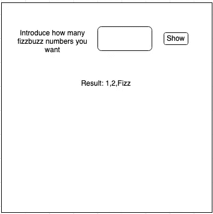
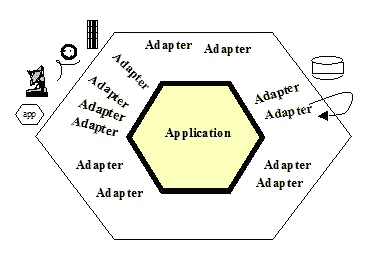

# 六角形建筑的原因

> 原文：<https://blog.devgenius.io/the-whys-of-hexagonal-architecture-1ccca8476c86?source=collection_archive---------1----------------------->

六边形建筑在最近几年已经成为一种非常流行的分层建筑。我想探讨一下这个架构下的原理，以及如何理解它。


> **六边形架构**，或**端口和适配器架构**，是用于[软件设计](https://en.wikipedia.org/wiki/Software_design)的架构模式。它旨在创建松散耦合的应用组件，这些组件可以通过端口和适配器很容易地连接到它们的软件环境。这使得组件在任何级别上都是可交换的，并且有助于测试自动化。
> [https://en . Wikipedia . org/wiki/hexagon _ architecture _(软件)](https://en.wikipedia.org/wiki/Hexagonal_architecture_(software))

阿里斯达·考克伯恩首先描述的这个架构的真理来源是这里的。

本文更侧重于如何遵循一些软件设计原则和 TDD 来实现类似的想法。很多这种东西都与 JB Rainsberger 所谓的[通用架构](https://fullstackradio.com/38)密切相关。

## 问题是

为此，我们将使用 fizzbuzz 形和一个简单的 web 应用程序来绘制 fizzbuzz 数字。想象一下，我们必须创建这个 webapp:



这个想法很简单，我想有一个文本字段，我们将介绍 fizzbuzz 数字显示的数量。当用户点击“显示按钮”时，我们将显示结果。

fizzbuzz 数字卡塔要求我们:

```
Write a program that prints the numbers from 1 to X. But for multiples of three print “Fizz” instead of the number and for the multiples of five print “Buzz”.
For numbers which are multiples of both three and five print “FizzBuzz “.
```

例如，如果用户输入 6，那么结果将是:
0，1，2，嘶嘶声，4，嗡嗡声

## 解决方案

让我们忘记**六边形架构**，只做一些 TDD (outside in)来解决问题。我将使用 javascript 和 react 来创建应用程序。但是我不会展示所有的步骤，只是对它们进行总结，以展示这个想法是什么。

当我们开始由外向内进行 TDD 时，我们将从应用程序的最高部分开始。让我们在屏幕上创建 html 组件和所有我们想要的东西。为此，我们可以创建一些测试来显示每个组件:

```
import {render, screen} from "[@testing](http://twitter.com/testing)-library/react";
import {fireEvent, render, screen} from "[@testing](http://twitter.com/testing)-library/react";
import {useState} from "react";*function* FizzBuzzComponent() {
    *const* [fizzbuzzNumbers, setFizzBuzzNumbers] = *useState*(*null*);

    *function* submitFizzBuzz() {
        setFizzBuzzNumbers(0);
    }

    *return* (
        <div>
            <h1>FizzBuzz number application</h1>
            <label *htmlFor*="fizzbuzzNumbers">Please write the number of fizzbuzz numbers</label>
            <input *id*="fizzbuzzNumbers"/>
            <button *onClick*={submitFizzBuzz}>Submit</button>
            {fizzbuzzNumbers!== *null* ? <p>The result is: 0</p> : *null*}
        </div>
    );
}describe('FizzBuzzComponent', function () {
    it('should show the header of FizzBuzz application', function () {
        render(<FizzBuzzComponent/>);
        expect(screen.getByText("FizzBuzz number application"));
        expect(screen.getByText("FizzBuzz number application")).toBeInTheDocument();
    }); it('should show the fizzbuzz number input and the button to click', function () {
        render(<FizzBuzzComponent/>);
        expect(screen.getByLabelText("Please write the number of fizzbuzz numbers")).toBeInTheDocument();
        expect(screen.getByRole("button")).toBeInTheDocument();
    }); it('should show the 0 fizzbuzz numbers when I ask for 1 fizzbuzz numbers', function () {
        render(<FizzBuzzComponent/>);
        fireEvent.input(screen.getByLabelText("Please write the number of fizzbuzz numbers"), 1);
        fireEvent.click(screen.getByRole("button"));
        expect(screen.getByText("The result is: 0"));
    });
});
```

在一些 TDD 周期之后，我们能够在页面中创建所有的组件以及它们之间的交互。

这些测试是集成测试。它们是集成测试，因为我们使用 react、react-testing 库等。我们的测试与我们用来绘画的基础结构紧密相连，但我们的代码也与基础结构紧密相连。我们可以说的一点是，集成测试有利于与我们不拥有的基础设施、库或框架进行交互。通过这种测试，我们测试的不是那些框架，而是我们希望使用它们达到的效果。
所以我们可以说我们的 Fizzbuzz react 组件是基础设施(因为任何被基础设施感染的东西都在基础设施中转换)，它应该在六边形之外。

现在，如果我们继续做 TDD，我们将需要添加越来越多的测试，以产生与计算 fizzbuzz 数序列相关的算法。这是我们可以用来理解我们正在做一件不同的事情的信号之一。
当我们试图给一个模块(在这种情况下是我们的组件)赋予多重职责时，测试的[爆炸就发生了，用 **S** OLID 的术语来说，你的组件在做不止一件事。我们没有遵守**单一责任**原则。这里生成的测试是因为我们需要开始测试应用程序的纯逻辑和 html 组件的交互。在一个组件中承担两种不同的职责，这样做的结果是为同一个组件添加越来越多的测试(在一个地方添加越来越多的代码)。](/unit-tests-c70618dc1e25?sk=de16c7a7bec6fa068728441e55365c97)

因此，当我们意识到这一点，我们可以采取设计决策。让我们保持 react 组件不变，并使用一个合作者来计算 fizzbuzz 序列。这是一个引入接口的好地方，接口实际上是一种行为，这将我们的基础设施从我们的逻辑中分离出来(fizzbuzz 数字序列生成器)。javascript 语言中没有接口，但是每个函数都代表一个接口。为了避免测试爆炸和维护我们的第一层运行，我们可以模仿我们的新合作者。

```
*export function FizzBuzzComponent*(props) {
    *const* [fizzbuzzNumbers, setFizzBuzzNumbers] = *useState*(*null*);
    *const* dispatch = *useDispatch*();

    *let* textInput = *useRef*(*null*);

    *function* submitFizzBuzz() {
        setFizzBuzzNumbers(textInput.current.value);
        dispatch({type: 'FIZZBUZZ_GENERATED'});
    }

    *return* (
        <div>
            <h1>FizzBuzz number application</h1>
            <label *htmlFor*="fizzbuzzNumbers">Please write the number of fizzbuzz numbers</label>
            <input *id*="fizzbuzzNumbers" *ref*={textInput}/>
            <button *onClick*={submitFizzBuzz}>Submit</button>
            {fizzbuzzNumbers !== *null* ? <p>The result is: {props.fizzBuzzNumber(fizzbuzzNumbers)}</p> : *null*}
        </div>
    );
}*import* {fireEvent, *render*, screen} *from* "@testing-library/react";
*import* * *as* React *from* "react";
*import* {FizzBuzzComponent} *from* "./FizzBuzzComponent";

describe('FizzBuzzComponent', *function* () {
    *const* myFizzBuzzNumberMock = jest.*fn*(); it('should show the header of FizzBuzz application', *function* () {
        *render*(<FizzBuzzComponent *fizzBuzzNumber*={myFizzBuzzNumberMock}/>);
        expect(screen.getByText("FizzBuzz number application")).toBeInTheDocument();
    }); it('should show the fizzbuzz number input and the button to click', *function* () {
        *render*(<FizzBuzzComponent *fizzBuzzNumber*={myFizzBuzzNumberMock}/>);
        expect(screen.getByLabelText("Please write the number of fizzbuzz numbers")).toBeInTheDocument();
        expect(screen.getByRole("button")).toBeInTheDocument();
    }); it('should show the 0 fizzbuzz numbers when I ask for 1 fizzbuzz numbers', *function* () {
        myFizzBuzzNumberMock.mockReturnValue("0");
        *render*(<FizzBuzzComponent *fizzBuzzNumber*={myFizzBuzzNumberMock}/>);
        fireEvent.*input*(screen.getByLabelText("Please write the number of fizzbuzz numbers"), {target: {value: 1}});
        fireEvent.*click*(screen.getByRole("button"));
        expect(screen.getByText("The result is: 0"));
    }); it('should show 0,1 when the number input is 2', *function* () {
        myFizzBuzzNumberMock.mockReturnValue("0,1");
        *render*(<FizzBuzzComponent *fizzBuzzNumber*={myFizzBuzzNumberMock}/>);
        fireEvent.*input*(screen.getByLabelText("Please write the number of fizzbuzz numbers"), {target: {value: 2}});
        fireEvent.*click*(screen.getByRole("button"));
        expect(screen.getByText("The result is: 0,1"));
    });

});
```

我们的 mock 定义了两个函数之间的契约，FizzBuzzComponent 和域逻辑(六角形里面的东西)。我们说我们的组件在“props”中需要一个名为 fizzbuzzNumber 的合作者，它必须接受一个数字并返回一个包含 fizzbuzz 数字序列的字符串。但是真正的实现还不存在。
我们创建的接口(契约)实际上就是六角形架构中所谓的“端口”。
那个接口的实现就是“适配器”。这只是应用依赖倒置原则的结果(SOLI **D** )。

> "依靠抽象，而不是具体."
> [https://en.wikipedia.org/wiki/SOLID](https://en.wikipedia.org/wiki/SOLID)

通常，提供域逻辑的端口被称为主要端口或用例。它们为我们提供了一组功能，我们的领域逻辑可以为我们的基础设施提供这些功能(我们应用程序的入口点)。
为了实现下一层，也就是我们在六边形中的**，我们可以使用单元测试，因为这一层不依赖于 javascript 之外的任何东西。这是真的，因为我们遵循**依赖倒置**原则，所以如果该层需要与库或类似的东西交互，遵循这个原则，我们应该生成一个抽象，而不是直接依赖它。这个抽象(一个接口，一个端口)将在我们的测试中被嘲笑。**

现在我们可以只关注逻辑本身来创建我们的 fizzbuzz 逻辑。我们可以创建尽可能多的测试用例，我们不会将我们的领域测试与测试 react 组件所需的基础设施耦合在一起。这就是为什么我们可以用单元测试来测试那些行为。

## 辅助端口

当我们的领域需要产生任何副作用时，遵循**依赖倒置**原则，我们将需要创建一个接口和一个适配器来使用允许我们这样做的库或类。
在我们的领域测试中效果将是相同的，我们将被迫为我们的接口创建一个模拟。
该接口的实际实现与允许我们与基础设施交互的库相耦合。因此，让我们在集成测试中使用真实的库，而不是模拟库，并使用[假库](https://martinfowler.com/bliki/TestDouble.html)来模拟丑陋的外部世界。
例如，在 javascript 中，如果我们需要调用后端，使用任何响应 http 请求的假 http 服务器实现来避免模仿 fetch。通过这种方式，我们测试了我们与 fetch (axios，无论您想使用什么)的交互，以确保我们使用了允许创建副作用的功能。
这就是[嘲笑你拥有的类型](https://www.markhneedham.com/blog/2009/12/13/tdd-only-mock-types-you-own/?utm_source=feedburner&utm_medium=feed&utm_campaign=Feed%3A+MarkNeedham+%28Mark+Needham%29)的原因。

外部世界和我们的端口之间的那层必须非常薄，我们应该强迫自己将尽可能多的逻辑转移到我们的领域。因为我们的领域代码与我们的基础设施完全分离，所以当我们需要改变我们的基础设施时，我们不需要改变它。

## 贫血模型

正如我们所说的，在依赖性反转之后，我们不能依赖于下一层的细节，所以在我们的六边形中，我们所有的代码都依赖于六边形的一部分，而不是六边形之外的代码(二级端口是六边形的一部分)。这种方法的一个常见问题是复制类、相同的字段，但是放在不同的包、文件夹中，这只是为了遵守原则。这往往会产生贫血的模型。
我们需要克服这一点，让我们重构代码，将尽可能多的逻辑转移到这些传输对象上，我们可以做到这一点，因为我们没有耦合到任何基础设施。

所以如果我们从外向内做 TDD:

*   我们只模仿我们自己的接口。
*   我们用单元测试来测试我们的纯逻辑，并模拟我们的端口。
*   我们用集成测试来测试我们的基础设施，并模拟我们的领域逻辑。
*   我们试图遵循单一责任原则(使用来自我们测试的反馈)。
*   我们遵循依赖倒置原则(依赖抽象)。
*   我们将相互依赖的东西移到一个文件夹或包中。

我们将会创造出类似六边形建筑的东西。

