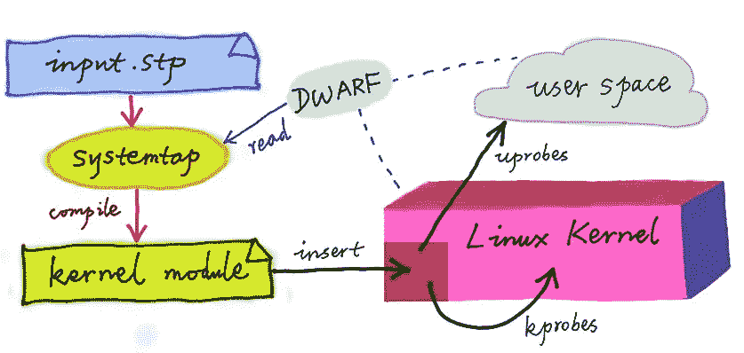
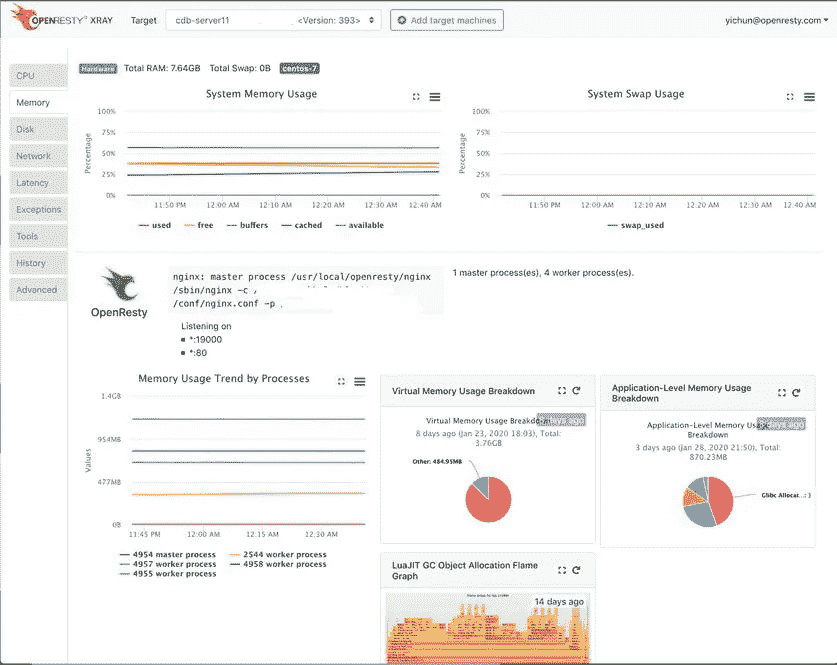

# 动态追踪的奇妙世界(第 2 部分，共 7 部分)

> 原文：<https://blog.devgenius.io/the-wonderland-of-dynamic-tracing-part-2-of-7-a682bb88762b?source=collection_archive---------16----------------------->

这是 7 部分系列“动态追踪的仙境”的第二部分这个系列将包括动态跟踪世界的最新发展。

前一部分，[第 1 部分](https://medium.com/@openresty/the-wonderland-of-dynamic-tracing-part-1-of-7-dd121505c795)，介绍了动态跟踪的基本概念并涵盖了它的优点。这一部分将继续关注开源世界中一些最流行的动态跟踪框架。

# DTrace

谈到动态跟踪，我们不能不提到 [DTrace](http://dtrace.org/blogs/about/) 。DTrace 是最早的现代动态跟踪框架。它起源于本世纪初的 Solaris 操作系统，由 Sun Microsystems 的工程师开发。很多人可能听说过 Solaris 系统及其原始开发者 Sun。

围绕 DTrace 的创建流传着一个故事。从前，Solaris 操作系统的几个内核工程师花了几天几夜排除了一个非常奇怪的在线问题。他们最初认为这非常复杂，并不遗余力地解决这个问题，结果发现这只是一个非常愚蠢的配置问题。从痛苦的经历中吸取教训，他们创建了 DTrace，这是一个高度复杂的调试框架，可以启用一些工具来防止他们在未来经历类似的痛苦。事实上，大多数所谓的“奇怪问题”(高 CPU 或内存使用率、高磁盘使用率、长延迟、程序崩溃等。)都是如此尴尬，以至于在明确了真正的原因之后，更加令人沮丧。

作为一个高度通用的调试平台，DTrace 提供了 D 语言，这是一种看起来像 c 语言的脚本语言。所有基于 DTrace 的调试工具都是由 D 编写的。D 语言支持特殊的符号来指定“探测器”，这些“探测器”通常包含有关目标软件系统中代码位置的信息(在操作系统内核中或在用户登陆进程中)。例如，您可以将探测器放在某个内核函数的入口或出口，或者某些用户模式进程的函数入口或出口，甚至放在任何机器指令上。用 D 语言编写调试工具需要对目标软件系统有一些了解和知识。这些强大的工具可以帮助我们重新获得对复杂系统的洞察力，大大增加了可观察性。Sun 的前工程师 Brendan Gregg 是最早的 DTrace 用户之一，甚至在 DTrace 开源之前。Brendan 写了很多可重用的基于 DTrace 的调试工具，其中大部分都在名为 [DTrace Toolkit](http://www.brendangregg.com/dtracetoolkit.html) 的开源项目中。Dtrace 是最早也是最著名的动态跟踪框架之一。

# DTrace 优缺点

DTrace 在与操作系统内核紧密集成方面具有优势。D 语言的实现实际上是一个虚拟机(VM)，有点像 Java 虚拟机(JVM)。D 语言的一个好处是，它的运行时驻留在内核中，非常紧凑，这意味着调试工具的启动和退出时间非常短。然而，我认为 DTrace 也有一些明显的弱点。最令人沮丧的是 D 中缺少循环语言结构，这使得很难编写许多针对目标中复杂数据结构的分析工具。官方声明将这种缺乏归因于避免无限循环的目的，但显然 DTrace 可以在 VM 级别上限制每个循环的迭代次数。这同样适用于递归函数调用。另一个主要缺陷是它对用户模式代码的跟踪支持相对较弱，因为它没有对使用用户模式调试符号的内置支持。所以用户必须在他们的 D 代码中声明所使用的用户模式 C 语言结构的类型。 [1](https://blog.openresty.com/en/dynamic-tracing-part-2/#fn:1)

DTrace 的影响力如此之大，以至于许多工程师将其移植到其他几个操作系统上。例如，苹果公司在其 Mac OS X(以及后来的 Mac OS)操作系统中增加了 DTrace 支持。事实上，近年来推出的每一款苹果笔记本电脑或台式电脑都提供了一个现成的`dtrace`命令行工具。有苹果电脑的可以试试它的命令行终端。除了苹果系统，DTrace 也进入了 FreeBSD 操作系统。FreeBSD 中的 DTrace 内核模块默认不启用，必须通过额外的用户命令来加载。Oracle 还试图将 DTrace 引入他们自己的 Linux 发行版 Oracle Linux 中，但没有取得太大进展。这是因为 Linux 内核不受 Oracle 控制，但 DTrace 需要与操作系统内核紧密集成。类似的原因长期以来使得一些大胆的业余工程师尝试的 DTrace 到 Linux 的移植远远低于生产级别的要求。

这些 DTrace 端口到处都缺少一些高级功能(如果有浮点数支持就好了，它们也缺少对许多内置探针的支持，等等)。)此外，它们不能真正匹配 Solaris 操作系统中的原始 DTrace 实现。

# SystemTap

DTrace 对 Linux 操作系统的另一个影响体现在开源项目 [SystemTap](https://sourceware.org/systemtap/) 中，这是一个相对独立的动态跟踪框架，由 Red Hat 和其他公司的工程师构建。SystemTap 有自己的[小语言](https://sourceware.org/systemtap/langref/)，SystemTap 脚本语言，它与 DTrace 的 D 语言不兼容(尽管它也类似于 C)。红帽服务于广泛的企业级用户，自然依赖于每天都要应对大量“怪异问题”的工程师。现实生活中的需求必然促使它开发这项技术。在我看来，SystemTap 是当今开源 Linux 世界中最强大、最有用的动态跟踪框架之一，我已经在工作中使用它很多年了。SystemTap 的作者，包括 Frank Ch。Eigler 和 Josh Stone 都是充满热情的非常聪明的工程师。我曾经通过他们的 IRC 频道和他们的邮件列表提出问题，他们经常很快很详细地回答我。我一直在通过添加新功能和修复错误来为 SystemTap 做贡献。

# SystemTap 的利弊

SystemTap 的优势包括它在自动加载用户模式调试符号方面的高度成熟，用于编写复杂探测处理程序的完整循环语言结构，以及对大量复杂聚合和统计的支持。不幸的是，由于早期 SystemTap 和 Linux 内核的实现不成熟，对 SystemTap 的过时批评已经充斥了互联网。在过去几年中，我们目睹了它的重大改进。2017 年，我成立了 OpenResty Inc .，该公司也一直在帮助改进 SystemTap。

当然，SystemTap 并不完美。首先，它不是 Linux 内核的一部分，缺乏与内核的紧密集成意味着 SystemTap 必须时刻跟踪主线内核的变化。其次，SystemTap 通常将其语言脚本(用自己的语言)编译(或“翻译”)成 Linux 内核模块的 C 源代码。因此，经常需要在在线系统中部署完整的 C 编译器工具链和 Linux 内核的头文件 [2](https://blog.openresty.com/en/dynamic-tracing-part-2/#fn:2) 。由于这些原因，SystemTap 脚本的启动速度比 DTrace 慢得多，与 JVM 的速度相似。总的来说，尽管有这些缺点，SystemTap 仍然是一个非常成熟和优秀的动态跟踪框架。

# DTrace 和 SystemTap

DTrace 和 SystemTap 都不支持编写完整的调试工具，因为它们都缺乏方便的命令行交互原语。这就是为什么大量基于它们的现实世界工具都带有用 Perl、Python 甚至 Shell 脚本编写的包装器。为了用干净的语言编写完整的调试工具，我曾经将 SystemTap 语言扩展成一种更高级的“宏语言”，叫做 [stap++](https://github.com/openresty/stapxx) [5](https://blog.openresty.com/en/dynamic-tracing-part-2/#fn:5) 。我使用 Perl 实现了 stap++解释器，它能够直接解释和执行 stap++源代码，并在内部调用 SystemTap 命令行工具。有兴趣的请访问 GitHub 获取我的开源代码库 stapxx，那里有很多由我的 stap++宏语言支持的完整调试工具。

# 结论

本系列的这一部分介绍了两个著名的动态跟踪框架，DTrace 和 SystemTap，并讨论了它们的优缺点。下一部分，第三部分，将谈论 SystemTap 的应用来解决真正困难的问题。敬请期待！

# 关于 OpenResty 射线的一句话

[OpenResty XRay](https://openresty.com/en/xray) 是由我们的 OpenResty Inc .公司提供的一款商业动态追踪产品。我们在类似本文的文章中使用该产品来演示实现细节，并提供真实世界应用程序和开源软件的统计数据。总的来说， [OpenResty XRay](https://openresty.com/en/xray/) 可以帮助用户深入了解他们的在线和离线软件系统，无需任何修改或任何其他协作，高效地解决性能、可靠性和安全性方面的难题。它利用了由 OpenResty Inc .和其他公司开发的高级动态跟踪技术。

我们欢迎您[联系我们](https://openresty.com/en/xray/apply-trial/)免费试用该产品。

# 关于作者

张宜春(Github handle: agentzh)，是 [OpenResty](https://openresty.org/en/) 开源项目的最初创建者，也是 [OpenResty Inc.](https://openresty.com/en/) 的 CEO

宜春是“开源技术”最早的倡导者和领导者之一。他曾就职于许多国际知名的科技公司，如 Cloudflare、Yahoo！。他是“边缘计算”、“动态跟踪”和“机器编码”的先驱，拥有超过 22 年的编程经验和 16 年的开源经验。作为被超过 4000 万个全球网站域名采用的 [OpenResty](https://openresty.org/en/) 的项目负责人，宜春在开源领域非常出名。

[由宜春在 2017 年创立的企业软件初创公司 OpenResty Inc.](https://openresty.com/en/) ，其客户来自一些全球最大的公司。其旗舰产品 [OpenResty XRay](https://openresty.com/en/xray) 是一款非侵入式剖析和故障排除工具，显著增强并利用了动态追踪技术。

作为一名狂热的开源贡献者，宜春已经为众多开源项目贡献了超过百万行代码，包括 Linux 内核、Nginx、LuaJIT、GDB、SystemTap、LLVM、Perl 等他还创作了 60 多个开源软件库。

# 翻译

我们为这篇关于[blog.openresty.com.cn](https://blog.openresty.com.cn/)的文章提供了[中文翻译](https://blog.openresty.com.cn/cn/dynamic-tracing/)我们也欢迎感兴趣的读者贡献其他语言的翻译，只要全文翻译无误。我们提前感谢所有愿意这样做的人。