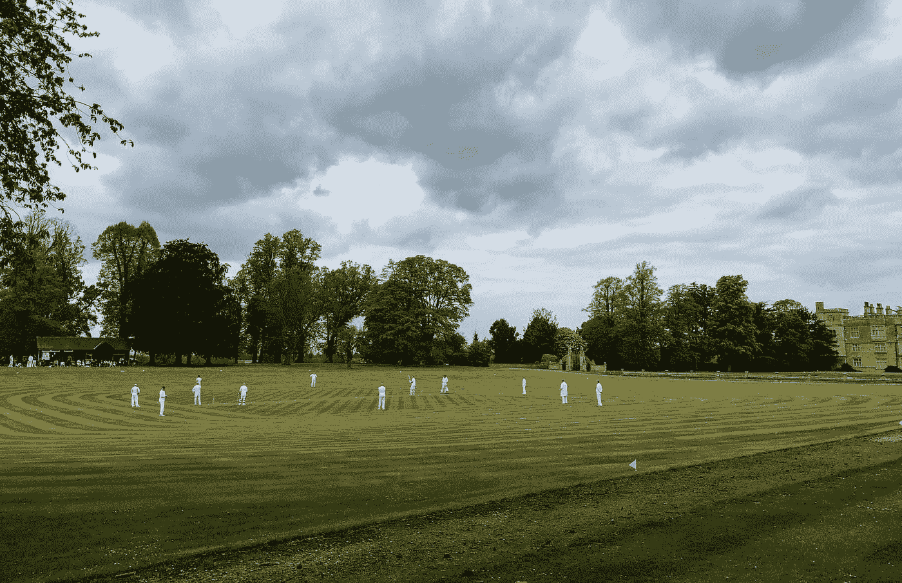
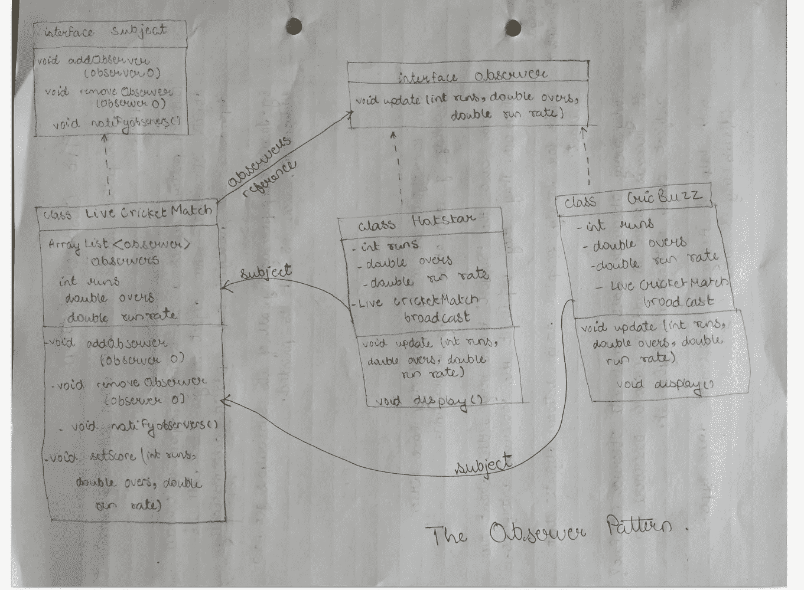

# 世界测试锦标赛和观察者设计模式

> 原文：<https://blog.devgenius.io/the-world-test-championship-and-the-observer-design-pattern-17f9b69eff8a?source=collection_archive---------1----------------------->

## 当对象之间存在 1-M(一对多)关系时，使用观察者设计模式。许多对象依赖于一个特定的对象。使得当“一个对象”被修改时，从属对象被自动通知。

英格兰板球测试赛

嗯，观察者设计模式的定义很书生气。让我们用一个真实的例子来理解这一点。最近，英格兰举办了世界测试锦标赛，并由印度的“HotStar”和“CriccBuzz”播出。这两家媒体关注比分，一球一球地展示比分。

每当现场板球比赛的比分发生变化时，这两家媒体都会得到通知。这两个平台关心分数。这就是观察者设计模式。

像“HotStar”和“CriccBuzz”这样的许多对象都依赖于现场板球比赛的一个对象。板球直播比赛和很多转播商是一对多的关系。而且最重要的是，每当板球比赛直播的对象发生变化，很多转播商都会自动得到通知。

> 当对象之间存在 1-M(一对多)关系时，使用观察者设计模式。许多对象依赖于一个特定的对象。使得当“一个对象”被修改时，从属对象被自动通知。

在这里，当现场板球比赛的状态改变时，广播公司会自动得到通知，并开始行动。板球直播赛是一米关系中的*‘一’*或者板球直播赛也可以称为***‘主语’*** HotStar 和 Criccbuzz 是依存对象。

主题实况板球比赛具有完全的自由来添加或移除观察者或广播者或从属对象。从属对象还可以选择他们是否想要充当实况板球比赛的观察员，广播公司可以选择他们是否想要广播世界测试锦标赛。

一旦我们理解了定义并了解了上下文。让我们试着阅读下面写的代码，让我们试着理解它的实现。

这个想法很简单，主题将所有的观察者存储在一个列表中。创建观察者时，会将其添加到列表中。当主体的状态改变时(当分数改变时)，通知每个观察者。一旦观察者被通知并且它适应了该变化，观察者就显示该变化。

让我们看看这个场景的类图

类图