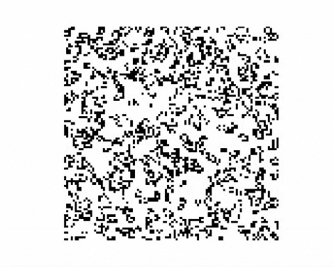

# 研磨 LeetCode 问题的禅:第 12 天-生活的游戏

> 原文：<https://blog.devgenius.io/the-zen-of-grinding-leetcode-problems-day-11-game-of-life-5644995d1b0a?source=collection_archive---------6----------------------->

续 [**LeetCode 日常练习系列**](https://medium.com/@matei.danut.dm/the-zen-of-grinding-leetcode-problems-day-0-motivation-681842565166) **。**今日总结: **2 中**问题 **30 分钟。**从现在开始，我将*过渡到灵媒*来迎接额外的挑战。我是这么做的。

# 2 的力量

 [## 2 - LeetCode 的重排序幂

### 给你一个整数 n。我们以任何顺序(包括原始顺序)对数字进行重新排序，这样前导…

leetcode.com](https://leetcode.com/problems/reordered-power-of-2/) 

**见解**:

*   首先，我编写了一个函数，它接受一个数字并返回一个包含以下格式元组的集合:(digit，count)。通过这样做，我可以很容易地**检查两个数字是否有相同的数字**，而不用关心它们的*顺序。*姑且称之为一个数*的*集合表示*。*
*   然后，我构建了一个列表，其中包含小于约束条件中给出的*限制的 2 的幂的所有集合表示*
*   最后，我检查了给定数字的集合表示是否在我的列表中
*   我本可以使用元组而不是集合，但是我认为这样更显而易见

# 康威的生活游戏

 [## 生活的游戏- LeetCode

### 根据维基百科的文章:“生命的游戏，也简称为生命，是一个细胞自动机，由…

leetcode.com](https://leetcode.com/problems/game-of-life/) 

**见解**:

*   试试谷歌“生活的游戏”，看看会发生什么:)
*   [**生命的游戏**](https://en.wikipedia.org/wiki/Conway%27s_Game_of_Life) 是一个相当简单的概念，意在展示复杂系统的**从相对简单的规则中涌现出来。**
*   **它是被称为 [**细胞自动机**](https://en.wikipedia.org/wiki/Cellular_automaton) **的更大一类“程序”的一部分。**它们是一个简单的 **2D 网格**，带有开/关单元，以及一系列**条件**，决定这些单元如何变化。**
*   **如果你觉得这个主题特别吸引人，那么我强烈推荐史蒂夫·沃尔夫勒姆的书****(是*免费网络版*的链接)。它在我的阅读清单上已经有很长一段时间了，因为它是一部跨越 1200 页的巨著，但考虑到它的作者是 [**Wolfram Alpha**](https://www.wolframalpha.com/) 的创作者，我相信这是值得做的努力。******
*   *****回到问题，*有 **2 件事**值得以后面试学习:**矩阵绑定检查**和**编码信息******
*   *****绑定检查*很容易解释，基本上就是第 5 行和第 6 行。记住这一点，并在将来用它来解决你所面临的矩阵问题。这并不难，但是你应该能够在 10 秒钟之内稳定地写完，没有错误。****
*   ****我之所以坚持这一点，是因为过去我决定使用 **try-except 块**来编写函数，期望每当我**越界**时就会出现**异常**。我忘记了一个事实:在 Python 和中*访问一个具有负索引的矩阵是可能的，它**不会触发任何异常。*******
*   ****编码信息是一个更宽泛的概念，但是这个概念是你想要尽可能高效地使用你正在使用的内存。在这个场景中，我可以为矩阵中的每个条目使用一个 *2 元素元组*，一个用于旧状态**，一个用于新状态******
*   ****但我认为没有必要，因为我只需要 **1s** 和 **0s** 。所以这就是为什么我选择了一个 2 位数的表示法，第二个表示旧状态，第一个表示新状态****
*   ****首先，我**计算新状态**，并将其添加到矩阵中每个插槽的当前状态。然后，在我对所有的插槽都做了这个*之后，我可以用**除以 10** 来得到旧的状态。现在，新的国家将取而代之。*****

****结束语:****

*   ****我发现**计算机科学**是一个有很多和**很多很酷的想法和概念要学习的领域******
*   ****完成了一个计算机工程大学项目后，我有足够多的机会学习这样的东西，并与许多和我有相同兴趣的人交流****
*   ****我意识到的是，大学毕业后，除非你去做研究，否则你开始越来越少地与生活游戏**之类的东西互动******
*   ****这并不是因为工作很无聊或者没有什么新东西要学，事实上与**相反的是真实的**。但是**强调的是实用性**，编写好的、可重用的代码，与他人互动，将需求转化为代码，思考架构等等。****
*   ****尽管生活游戏很酷，但你永远不会用它来工作。也许如果你做研究并且愿意**投入数千小时**，那么你可以说这是你工作的很大一部分，但除此之外它是非常小众的。****
*   ****那么**了解所有这些的意义是什么？******
*   ****一方面，*没有*。你的薪水不会增加，你不会更擅长与非程序员交谈，甚至可能会觉得无聊乏味。****
*   ****另一方面，有一些公司专门寻找在计算机科学、数学、物理等领域拥有硕士学位和博士学位的人来雇佣他们，并付给他们一大笔钱来编写代码。他们写代码的速度没有那么快，但是他们的思维方式从根本上受到他们多年研究的影响****
*   ****那我们该怎么办？你是做 *10 年的教育和研究*还是仅仅把它当成*正常的朝九晚五的工作*？你甚至可以是 ***中间的某个地方*** ？****
*   ****我诚实的意见是，没有**没有** **好答案，**你应该检查你的 ***内在价值观和目标*** 是什么，然后 ***围绕它们*** 建立你的日常生活。****
*   ****回家并在周末合上笔记本电脑并没有本质上的好坏。一天花 10 个小时在周末**编程和看报纸上**本质上没有好坏之分。只要确保你过着你想过的生活。****