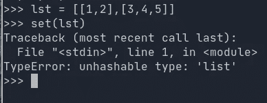
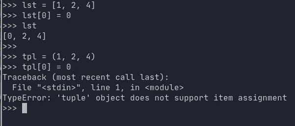

# 研磨 LeetCode 问题的禅:第 17 天-催眠哲学

> 原文：<https://blog.devgenius.io/the-zen-of-grinding-leetcode-problems-day-17-hypnophilosophy-8b7fe32eea24?source=collection_archive---------15----------------------->

您好，欢迎回到 [**LeetCode 日常练习系列**](https://medium.com/@matei.danut.dm/the-zen-of-grinding-leetcode-problems-day-0-motivation-681842565166) **。**今天我做了**1**中等题， **2 易**题。下面是解决方法和一些想法。

修普诺斯是睡眠之神，所以因为我最近没怎么睡，所以我要漫谈一下

# 所有递增的子序列

 [## 递增子序列- LeetCode

### 给定一个整数数组 nums，返回给定数组的所有不同的可能的递增子序列，至少…

leetcode.com](https://leetcode.com/problems/increasing-subsequences/) 

**见解**:

*   我们的想法是，列表中的任何数字都可以开始一个递增的子序列，所以我们将它单独添加到第 9 行的**中。**
*   此外，我们得到的当前数字可以继续任何先前创建的以较小数字结尾的子序列。检查**线 8** 。
*   你必须小心*不只是继续先前的子序列*，而是实际上**创建一个新的子序列**并将其添加到我们的列表中
*   你可能想知道为什么我用集合而不是列表来表示每个子序列。嗯，这与我们想要*独特的子序列这一事实有关。如果我们想把我们的子序列列表转换成一个集合，并且我们使用常规列表，我们将会受到这个好的错误的欢迎:*

不愉快？但我只想做一套…

*   **列表**是**不可哈希**数据结构**、**，而**元组**是**可哈希**数据结构。这源于这样一个事实，即**列表**是**可变的，**不同于**元组**是**不可变的。**这意味着列表可以就地修改，但元组不能:

并非所有数据类型都是平等的

*   **不可变数据结构**的其他例子有*字符串*、 *frozensets* 和*所有基本数据类型，如 int、bool、float 等。*
*   由于集合确实类似于*字典*，你会发现同样的限制也适用于**字典键**:它们也必须是可散列的。

# **思考** **关于** **约数**

 [## 构造矩形 LeetCode

### web 开发人员需要知道如何设计网页的大小。所以，给定一个特定的矩形网页的面积，你的…

leetcode.com](https://leetcode.com/problems/construct-the-rectangle/) 

**见解**:

*   一个效率较低的解决方案是遍历从 **1** 到 **area / 2** 的所有数字，然后只记住最佳的一对
*   但是这并不是真正必要的，因为如果你查看 sqrt(area ),你会两次考虑同一个除数，所以你应该只停留在 sqrt(area)上
*   最后，很容易看出，在数量级上最接近的除数在 sqrt(area)附近，所以应该从那里开始向下。

# (不仅仅是二叉树)树中的后序

 [## n 元树后序遍历- LeetCode

### 给定一个 n 元树的根，返回其节点值的后序遍历。四叉树输入序列化是…

leetcode.com](https://leetcode.com/problems/n-ary-tree-postorder-traversal/) 

**见解**:

*   当谈到二叉树(每个节点最多可以有 2 个子节点的树数据结构)时，有 3 种可能的方式来遍历它和打印它的元素:前序、中序和后序
*   Preorder 意味着我们首先打印当前节点，然后继续遍历子节点，inorder 意味着我们首先遍历左边的子节点，然后打印节点值，然后遍历右边的子节点。最后，postorder 意味着我们首先遍历子节点，然后才打印当前节点。
*   对于我们人类来说，最容易理解的遍历结果是 preorder，因为您可以在子节点之前看到每个节点
*   在 n 元树的情况下，其中 n>2(意味着每个节点可以有更多的子节点)，只有 2 种可能的遍历方式，因为顺序不再有意义
*   除此之外，这是标准算法，*递归和所有的*

结束语:

*   从昨天到现在还是筋疲力尽，只睡了半个晚上。但好笑的是，白天的时候我没那么感觉，一边忙着看书，一边到处走。
*   然而，我明确感到有些事情不对劲的地方是我对智力任务的专注程度。我只是不能像休息时那样 100%的投入。
*   然而，精疲力尽的好处是你不再想太多，你不在乎别人的看法，你更自由地接受焦虑的想法。
*   我不是在提倡睡眠不足，但似乎时不时地这样做是一种临时的做事方式。如果你知道拖延会减少你的睡眠时间，你会突然更有动力去完成你必须做的工作。
*   所以我想，当我真的需要时，我激励自己的一种方式是这样的:我失去了几个小时的睡眠，第二天我提醒自己，任何一分钟的拖延都等于第二天晚上少睡一分钟。