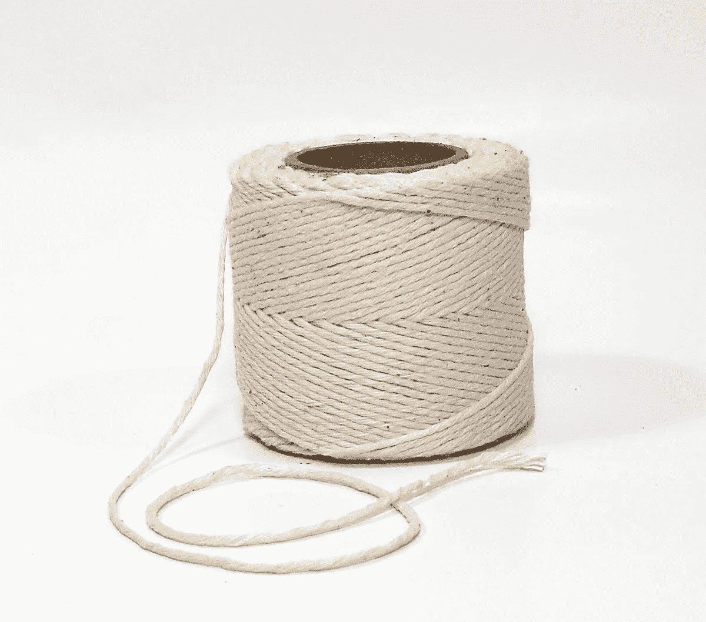

# 研磨 LeetCode 问题的禅:第 29 天-字符串和子字符串

> 原文：<https://blog.devgenius.io/the-zen-of-grinding-leetcode-problems-day-28-strings-and-substrings-5e8b5bbf995b?source=collection_archive---------18----------------------->

嘿，欢迎回到 [**LeetCode 每日练习系列**](https://medium.com/@matei.danut.dm/the-zen-of-grinding-leetcode-problems-day-0-motivation-681842565166) **。**今天我解决了**1**易题和 **2 中题**。开始吧！

# 彻底的搜索

 [## 对字符串中的元音子串进行计数- LeetCode

### 子字符串是字符串中连续(非空)的字符序列。元音子串是这样的子串…

leetcode.com](https://leetcode.com/problems/count-vowel-substrings-of-a-string/) 

**见解**:

*   子串是字符串的任何连续部分，因此遍历所有子串是现实的( **O(n )** )。我们不能对所有的子序列都这样做( **O(2^n)** )
*   为了检查一个子串是否只由 o 个元音字母组成并且包含所有的元音字母，我们从它的元素中创建一个集合，对它进行排序，然后将它转换成一个字符串。如果我们不进行排序，字母的顺序就无法保证。

# 什么使一个中等的问题

 [## 只有 1s - LeetCode 的子字符串数

### 提高你的编码技能，迅速找到工作。这是扩展你的知识和做好准备的最好地方…

leetcode.com](https://leetcode.com/problems/number-of-substrings-with-only-1s/) 

**见解**:

*   这个问题与前一个问题的最大区别是更严格的约束:与前一个问题中的最大长度 **10** 相比，字符串的长度可以达到 **10⁵**
*   这意味着一个 **O(n )** 算法不适合我们对每个 LeetCode 问题可用的*近似* **10⁶** 运算，所以我们应该争取 **O(n)**
*   于是，我们必须找到一个字符串的子串个数的公式，精确到 n + (n-1) + … + 2 + 1 = n * (n+1) // 2。要了解这一点，从长度为 1 的子字符串开始，然后是长度为 2 的子字符串，依此类推。

# 一个小变化

 [## 同质子字符串的计数- LeetCode

### 给定一个字符串 s，返回 s 的同质子字符串的数目。由于答案可能太大，返回它的模…

leetcode.com](https://leetcode.com/problems/count-number-of-homogenous-substrings/) 

**见解**:

*   如果你能够解决前面的问题，那么你也可以解决这个问题了！唯一的附加步骤是*对连续的字母串*进行分组。否则就是**相同**。
*   这就是为什么即使你只能完成 LeetCode 上所有问题中的一小部分，对于面试来说也足够了，因为很多问题都是基于相似的想法。

结束语:

*   不管前一周我有多没效率，今天我去上班，做我的事，好像什么都没发生。我觉得这很奇怪，因为当像这样改变工作负载时，我通常会经历**惰性**
*   这就是为什么人们建议，如果你在学习上真的有很大的问题，你甚至不能集中注意力 1 个小时，你应该从仅仅 **15 分钟**开始，每天增加 **5 分钟**。通过这样做，你很快就会*每天学习 4 个多小时*！
*   尽管如此，在某些情况下，你可能无法像这样持续进步，因为你可能会达到稳定期，但总的趋势是积极的。
*   然而，相反的现象对我来说更为常见。一整天都很有效率，感觉很好，然后第二天来了，我几乎不做工作之外的任何事情。
*   我不确定我是真的累了，还是因为害怕过度疲劳而产生了心理障碍。我意识到我对持续早睡有一种厌恶感，即使我很清楚这很有效，而且这是我养成的最好习惯之一！
*   我想可能是因为，出于某种原因，整天努力工作，早早睡觉，感觉像是一种惩罚。和腿部日或腹肌日一样，感觉上**像是不必要的痛苦**。尽管如此，根据我个人的经验，这两者对肌肉平衡都是必不可少的。
*   在*我们为自己做出的*好决定和*实际做*执行这些决定的不那么有趣的工作之间，存在着这种**差距**。当我们承诺做一些艰难但有益的事情时，我们会想到当我们完成时会有多好，但是当我们真正开始时，我们会意识到这很难，我们宁愿做一些有趣的事情。
*   因此，解决方案应该是考虑决策的两个部分，在我们计划和实施的时候都要考虑。第一，这个对我真的那么重要，值得以后牺牲吗？第二，我过去不是已经下定决心，收益如何远远超过成本吗？
*   通过考虑选择的两个部分，你往往会减少反复思考的循环:“我现在不喜欢它，所以我会让未来的我处理它”，然后是“过去的我真的再次弄脏了我”。