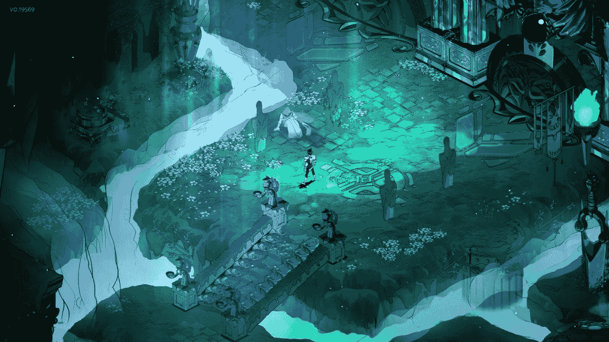

# 研磨 LeetCode 问题的禅:第 43-57 天

> 原文：<https://blog.devgenius.io/the-zen-of-grinding-leetcode-problems-day-43-57-more-to-go-196a396834bf?source=collection_archive---------18----------------------->

欢迎回到 [**LeetCode 日常练习系列**](https://medium.com/@matei.danut.dm/the-zen-of-grinding-leetcode-problems-day-0-motivation-681842565166) **。**今天我做了**2**易题和 **1 中题**。我们开始吧！

# 重新排序路线，使所有路径都通向城市零点

 [## 重新安排路线，使所有路径都通向零里程编码的城市

### 有从 0 到 n - 1 和 n - 1 条道路的 n 个城市，这样在两个城市之间只有一条路可以走…

leetcode.com](https://leetcode.com/problems/reorder-routes-to-make-all-paths-lead-to-the-city-zero/) 

**见解**:

*   为了解决这个问题，从节点号 0 开始**就足够了。唯一的另一件事是将所有的**逆边**添加到图中，其**成本为 1** 。**
*   每次我们跟踪一条边，我们就把它的成本加到总成本中。它可以是 0 或 1，取决于我们是否需要反转它。
*   按照这个过程，我们计算了从节点 0 到任何其他节点必须反转的边的**数量。然而，我们想要的是相反的。所以我们**从总边数**中减去这个数。**
*   再提一次:我使用了一个 **defaultdict** 来确保我总是可以添加到一个节点的邻居列表中，即使它还没有初始化。幕后发生的是 Python 使用我们提供的**构造函数作为参数** (list)来创建一个不存在的新元素。

# 将字符串拆分成平衡字符串

 [## 将字符串拆分成平衡字符串- LeetCode

### 平衡字符串是指具有相同数量的“L”和“R”字符的字符串。给定一个平衡的字符串 s，分裂它…

leetcode.com](https://leetcode.com/problems/split-a-string-in-balanced-strings/) 

**见解**:

*   平衡字符串是具有相同数量的字符的任何子串。
*   因为它们*不能与*重叠，我们可以从左边开始，每当两个字符的**数量相等的时候就把它分开**

# 唯一元素的总和

 [## 唯一元素的和- LeetCode

### 提高你的编码技能，迅速找到工作。这是扩展你的知识和做好准备的最好地方…

leetcode.com](https://leetcode.com/problems/sum-of-unique-elements/) 

**见解**:

*   想想在没有列表理解的情况下，写这个解决方案*需要多少行代码。*

结束语:

*   我曾经读过一篇文章，讲的是在某些科学研究(生物学、物理学、统计学)中，我们最初是如何教给学生在实践中足够好的简化模型的，尽管有已知的更复杂的替代方案(T2)。
*   假设我们想计算表面摩擦力的公式。
*   作为一个**初学者**，你会使用 **μ = F/N** ，因为它很简单，而且这是*唯一一个你曾经学过的*。
*   如果你决定**深入挖掘，到达更高级的层次**，你会发现有成吨的**更复杂的模型**需要考虑*许多其他因素*。
*   最后，如果你**过了这一关，进入专家级**，你会意识到对于*大多数实际用途*，那些基本公式的小加法相互抵消，所以**最终你会使用μ = F/N** 。
*   因此，初学者和专家使用相同的东西，但是出于不同的原因。专家已经走过了漫长的道路，从缺乏信息到获得大量多样的知识，再到只保留有用的见解。你最终回到了起点，但是你更有信心，你**已经采取措施找到了正确的答案**，不管那是什么。
*   当你经历一门数学课程时，你必须**证明一个定理**，这是同样的原理。练习不会问你*它是否为真*，它**已经断言它是**。那么，如果完成证明后，你**不会学到任何关于初始定理**的新知识，那么你自己在纸上经历所有这些步骤又有什么意义呢？
*   好吧，你会说服自己它的有效性，你必须信任的知识集作为一个给定的将**只限于公理**。知道你已经**在过去**证明了一个定理，这是不一样的，即使你忘记了步骤，这也是可以做到的。
*   我还记得艾伦·沃茨的一些讲座，讲述类似的事情如何发生在 T2 的 T4 禅城。你从一个基本原则开始，比如不强迫的艺术。然后你寻找一位大师来教你开悟的所有方法。你学习不同的*公案和冥想练习*，你让它成为每天强烈关注的主题，结果**意识到你已经从一开始就拥有了你所需要的**。这是一个错综复杂的游戏，一圈又一圈地转，直到你意识到你正在走的道路实际上是循环往复的。
*   我认为思考这些事情并在不同的学科之间建立联系是很有趣的。也许你学到了一些不同的东西，发现了一个新的兴趣，或者将你的一系列经历重新组织起来。然后你可以与他人分享这些经历，每个人都会从中受益。