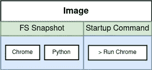

# 码头工人理论

> 原文：<https://blog.devgenius.io/theoretical-of-docker-33f9f4e840?source=collection_archive---------10----------------------->

## docker 背后的概念以及 docker 对 IT 行业的重要性


图片由 [Droptica](https://www.droptica.com/blog/codeception-how-start-automatic-tests/) 提供:Docker 徽标

本文将解释 docker 的基本概念。希望了解 docker 的基础知识能够帮助您简化 docker 的实现。

# Docker 概述


Stephen Grider 的图片:安装软件的常见问题

安装软件是开发人员的日常活动之一，因为在创建或管理服务时，开发人员需要软件来支持日常任务。有时候开发人员在安装软件时会面临一些问题，比如不可用的依赖或不兼容的版本。这些错误使得开发人员不得不做重复性的工作来排查和解决错误。


作者图片:安装软件时经常出现的问题

如果有一种工具可以帮助开发人员提供具有依赖性的安装软件，并且它可以管理开发人员机器上的资源，以确保在安装软件时没有任何依赖性崩溃，这将是很容易的。这就是 docker 产生的原因。Docker 希望在安装软件或服务时简化开发人员的任务，并管理其背后的资源和依赖关系。

# Docker 是什么？


斯蒂芬·格里德的图片:码头工人的生态系统

Docker 是一个生态系统，由许多旨在通过容器运行图像的功能和特性构成。镜像可以被想象成操作系统安装的 ISO，它将提供安装程序和软件的所有依赖项。图像将在容器中运行。容器是一种与计算机隔离的资源，用于独立于整个系统运行映像。这意味着安装在容器下的每个依赖项都不会影响计算机的整个依赖项。例如，容器将隔离 200 MB 可用硬盘空间来运行映像，因为映像需要它来存储软件和所有依赖项。

## 关于图像的更多解释



斯蒂芬·格里德的《图像》:图像中的表象

图像的另一种表现形式是，我们可以将它想象成一个包文件夹，其中包含所有与它相关的文件以及正确运行它的方法。图像是无状态的。无状态意味着映像是独立的，不需要存储中的持久数据。因此，图像可以通过互联网传输，保存在注册表中，进行版本控制，并保存为文件。

## 关于容器的更多解释


斯蒂芬·格里德的图像:一个容器的表现

容器是图像的运行实例。换句话说，容器是运行图像的地方。容器将硬盘、网络、RAM 和 CPU 等资源与计算机隔离开来以运行映像。隔离是基于过程的。这意味着，如果我们有两个或更多不同的进程，它将在单独的隔离资源中。与图像不同，容器是有状态的。有状态意味着容器依赖于存储中的其他资源。

# Docker 安装和基本设置

## 装置

Docker 在每个操作系统中都可用，在这一节中，我不会一步一步地介绍如何安装 docker。虽然，我会用文档支持你在 [Windows](https://docs.docker.com/desktop/windows/install/) 、 [MacOS](https://docs.docker.com/desktop/mac/install/) 和 [Ubuntu](https://docs.docker.com/install/linux/docker-ce/ubuntu/#set-up-the-repository) 上安装 docker。

> 这是一个最佳实践技巧。在开始安装 docker 之前，确保你已经[注册了 docker hub](https://hub.docker.com/signup) 。Docker Hub 简化为所有公共图像或您的私人图像的存储库。

## 基本设置

这个基本的设置技巧是配置 docker 运行，而不需要 sudo 命令。这里是完整的文档[如何在 ubuntu](https://docs.docker.com/install/linux/linux-postinstall/#manage-docker-as-a-non-root-user) 中不用 sodu 命令运行 docker。我将根据文档为大家重述这些步骤。

1.  创建一个名为 docker 的新用户组

```
sudo groupadd docker
```

2.将我们的当前用户添加为该组的成员

```
sudo usermod -aG docker $USER
```

3.刷新更改

在 ubuntu 中，我们可以运行这个命令来刷新组更改

```
newgrp docker
```

接下来，使用以下命令确保安装完成

```
docker run hello-world
```

如果仍然有权限被拒绝，重新启动您的计算机。它将刷新您所做的所有更改。

# 码头工人流动


斯蒂芬·格里德的图片:码头工人的流动

在解释 docker 流之前，我们需要了解两个与 docker 相关的术语，它们是 Docker 客户端和 Docker 服务器。Docker 客户端或 Docker CLI 是我们与之交互的界面。输入命令和输出结果将通过 Docker CLI 显示。虽然，用户请求的所有处理都会由 Docker 服务器或者 Docker 守护进程来处理。

根据服务运行的次数，有两个主要的 Docker 差异流。是第一次还是之前已经跑过了？

## 服务以前已经运行过


Stephen Grider 的图片:以前已经运行的服务(docker 流)

如果图像之前已经运行，将执行来自码头工人客户端的命令，并将请求发送到码头工人服务器。每一个已经执行的图像，都将保存在我们本地计算机的图像缓存中。因此，Docker Server 将从图像缓存中获取图像并执行它。

## 首次运行服务


Stephen Grider 的图像:图像首次运行(docker flows)

第一次运行的映像与以前具有相同的流程，但仍从 Docker Client > Docker Server >映像缓存运行。因为图像是第一次运行，所以图像缓存将为空。这就是为什么会有额外的流量。码头工人服务器将向码头工人中枢发送请求，码头工人中枢将通过将图像下载到图像缓存中进行响应。安装完成后，文件服务器将通过图像缓存执行图像

这就是码头工人的基本理论。我希望本文能对你们所有人有所帮助，尤其是那些想开始学习和了解 Docker 的人。如果您不介意，您可以访问我最新的关于云和数据科学的文章。

[](https://andriruslam.medium.com/pandas-tools-preprocessing-data-python-data-science-pemula-95f10ebec14d) [## 熊猫:数据预处理工具——python |数据科学 pemula

### 熊猫 sebagai 库预处理数据 Python 的快速介绍

andriruslam.medium.com](https://andriruslam.medium.com/pandas-tools-preprocessing-data-python-data-science-pemula-95f10ebec14d) [](https://andriruslam.medium.com/kenalan-bersama-bigquery-c0fb3d1a1688) [## Kenalan Bersama BigQuery

### Salah satu 工具数据工程

andriruslam.medium.com](https://andriruslam.medium.com/kenalan-bersama-bigquery-c0fb3d1a1688)