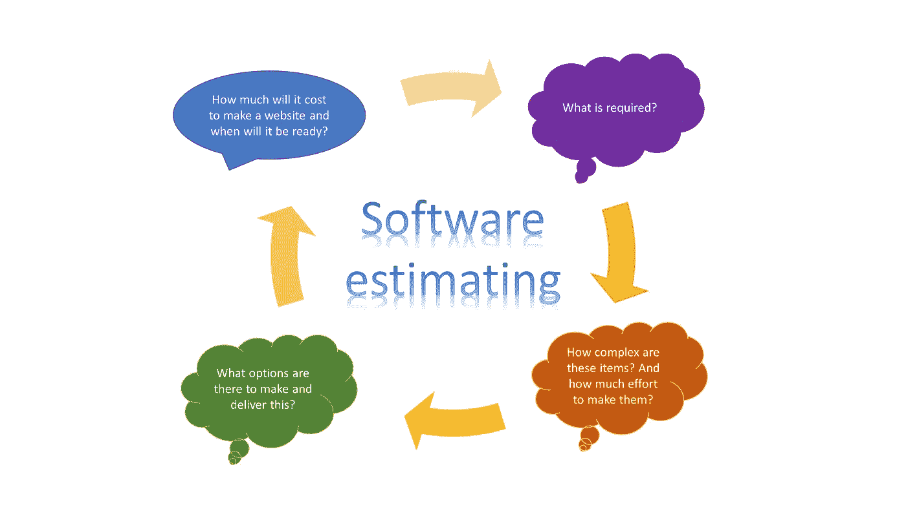
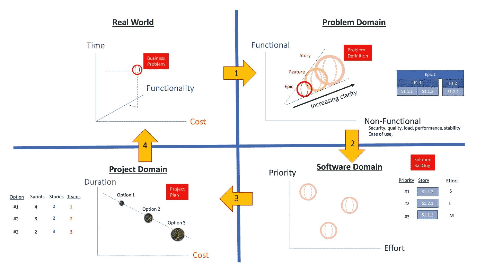
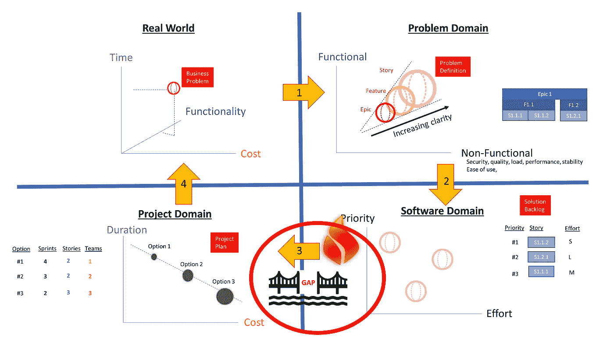

# 软件开发工具中有一个巨大的缺口，这个缺口对评估至关重要

> 原文：<https://blog.devgenius.io/there-is-a-yawning-gap-in-software-development-tools-that-is-critical-for-estimates-5abab6310636?source=collection_archive---------6----------------------->

## 评估过程中的缺失部分

亚历克斯·拉德里奇在 [Unsplash](https://unsplash.com?utm_source=medium&utm_medium=referral) 上的照片

当被问到“**这个难题时，这个项目需要多长时间我们必须经历几个阶段。每个阶段将问题转化为我们可以解决的不同领域，然后最终结果可以转化为发起人想要知道的*时间*和*成本*的单位。我们的方法和工具集已经发展到可以灵活地解决这些领域中的一些问题，但是在最后还有一个**缺口**，这是工程师和项目经理发生冲突的地方。**

***那么为什么没人看看修复这个呢？***

让我们从作为工程师进行评估时通常会经历的一系列基本步骤开始。

为什么我把它画成一个循环？

很简单，这个过程通常要重复几次:

*   客户在开始时很少提供细节，也不知道解决方案的成本。
*   工程师们根据很少的信息胡乱猜测。
*   然后，项目管理人员通过最大日费率费用来衡量这个大胆的猜测，一个巨大的数字被传回给客户。
*   顾客吓晕了。

然后，客户恢复过来，询问“**为什么估计值这么大？”**据解释，没有足够的信息给出更准确的报价。这种缺乏精确性会导致计划和减轻风险的成本高昂，然后循环又会重新开始。

几个周期后，成本和时间量开始稳定在比第一次报价更低的值。这个过程并不快速，当然也感觉不到敏捷，而且每次计算都演变成复杂的电子表格。电子表格不会与客户共享，而是简化为一个表格，显示 X 天乘以 Y 费率等于 Z 总成本。所以顾客只能看到两个要讨论的东西*天数*或*费率*。

日费率就是这样，即不可协商，因此剩下的唯一要攻击的是天数。逻辑是这样的，

*   我不想付 Z，因为太贵了
*   您必须减少天数 X
*   因此你一定估计错了

当发生以下情况时，就会产生打击

*   销售团队同意成本 ZZ(低于 Z)
*   估计值降低到 XX 天(因为 XX *天费率= ZZ)
*   因此，开发团队被告知他们必须在 XX 天内完成，于是叫嚣开始了
*   或者/
*   几个月后，财务团队发现开发花了 X 天时间，但收费却是 XX 天，所以公司亏损了。暗示更多的喊叫。

那么，在不使这一过程变得更复杂或更慢的情况下，如何改进呢？

很好的估计是:

*   从一个已经被证明有效的**模型**(经验法则风格)来看，例如一个 5 页的网站是 1000 和每额外一页 100。所以一个 7 页的网站是 1200。
*   来自**历史数据**的接近解决方案的数字，例如，我们为 988 做了一个 5 页的网站，为 1436 做了一个 10 页的网站，所以一个 7 页的网站可能是中间的，比如 1212。
*   承认一切都是典型的**定制**，所以首先完成高层次的设计，这是估计。例如，5 个标准页面，每个页面有 4 个部件，一个部件的制作成本约为 50 英镑。第 6 页和第 7 页使用了一个比 5 或 6 个普通小部件更难构建的高级小部件，因此该页面大约需要 300 美元。合计= (5*4* 50)+(2* 300)= 1600。

第三种也是最复杂的评估技术是最常用的，并且变得非常复杂，因为现实生活中的项目并不那么简单。

对于像这样需要跟踪和记录大量项目的复杂周期，理想的解决方案是使用工具。与其使用 excel 表格或项目管理工具，为什么不使用软件开发工具呢？

想象一系列的循环，这些循环阐述了一个基本的需求，为每个循环增加了细节。当详细程度和选项足以让客户做出决定时，循环就停止了。实现仅仅是添加更多的设计和实现信息，即代码到这个项目待办事项中。

我们目前有一些工具，如**吉拉**、**微软 Azure Devops** 等，它们允许定义功能层次结构，并将细节和描述添加到各个部分。然后可以粗略估计这些需求，并将数字添加到票务系统中。然后可以在待办事项中对这些进行优先排序。然后，它需要相对较少的额外信息(*日费率*)和处理(将*工作量*乘以*费率*)来获得潜在客户的信息(*成本*和*持续时间*)。

> 这就是当前工具的差距…

至于解决这种差距的办法？我将让你对这篇文章提出任何建议。

# 进一步阅读

 [## 由于 VUCA，软件评估失败

### 估计与实际不符，这种差距从何而来？

blog.devgenius.io](/software-estimates-fail-due-to-vuca-2fc4031f1d17)  [## 如何不传达一个估计！

### 敏捷评估及其导致的混乱

blog.devgenius.io](/how-not-to-communicate-an-estimate-fef77d5b40aa)  [## 在大约 3.4 分钟内虚张声势你的估计

### 如何像专业人士一样估算！

blog.devgenius.io](/bluff-your-estimate-in-roughly-3-4-minutes-c2961364b0a3) 

# 关于作者的更多信息

**Greg** 是一名经验丰富的软件专业人士，也是[**outsource . dev**](https://outsource.dev/)**，**的首席技术官，他曾在多家公司工作过，现在热衷于帮助他人在软件开发、管理和外包方面取得成功。他刚刚写了一本名为“**”的短篇小说。**

**如果你喜欢这篇文章，请鼓掌👏和**关注**我或者 [**订阅**](https://greg-billington.medium.com/subscribe) 一封邮件✉️。**