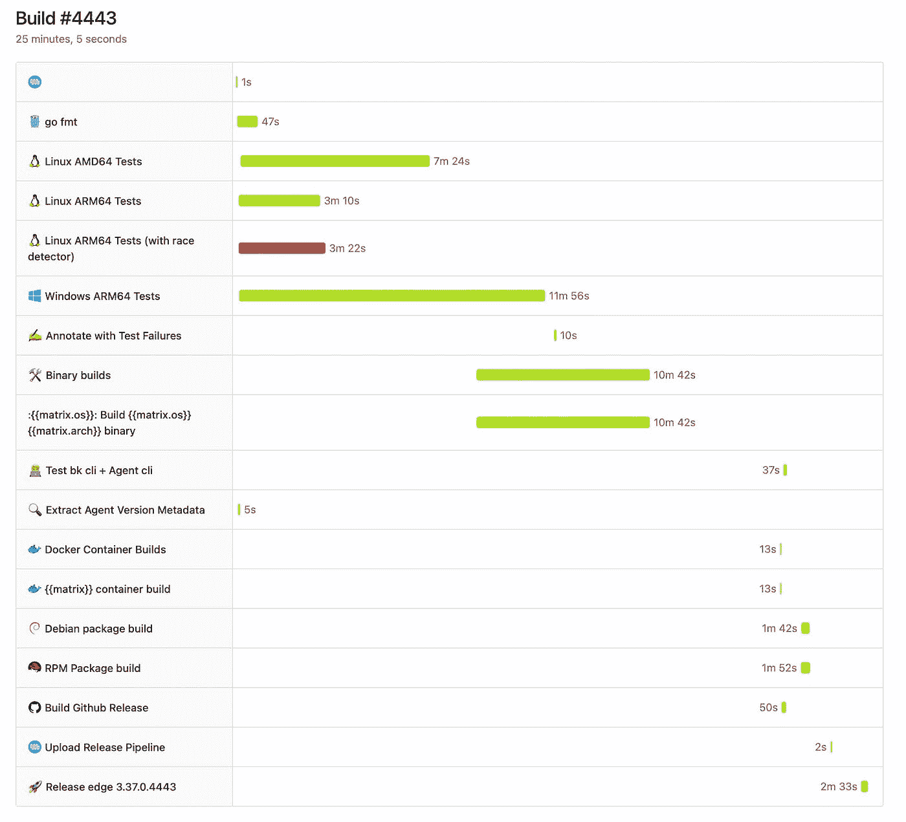

# 有一个秘密的 Buildkite URL 可以更好地可视化你的构建步骤

> 原文：<https://blog.devgenius.io/theres-a-secret-buildkite-url-for-better-visualizing-your-build-steps-5655836ddf2f?source=collection_archive---------17----------------------->

[https://buildkite.com/](https://buildkite.com/)

Buildkite 是一个很棒的平台，可以让你“在自己的基础设施上运行快速、安全和可伸缩的持续集成管道”，根据它自己的网站和我的说法，我已经在生产中使用它一年多了。

除了上述优点，Buildkite 的一个优点是它有一个非常好的用户界面，可以很容易地看到你的管道和它们各自的构建步骤发生了什么。

日志很容易查看，从视觉角度来看，错误非常清楚，事情看起来很干净。

每个构建步骤出现的时间，但是尽管如此，可能有无限的方式来显示这些信息，最近我了解到 Buildkite 团队正在讨论的另一种方式。换句话说，这是一种*秘密*网址，除了它真的不是秘密，因为我发现它的方式是非常合法的，最终是公开的。

换句话说，这个网址并没有被广泛传播或者是官方的；它还没有被真正的生产化，并通过文件和诸如此类的东西进行宣传。

然而，我发现它非常有用，我鼓励你尝试一下，因为它非常简单。

首先，我是通过 Buildkite 的联合创始人、现任 CEO 基思·皮特(Keith Pitt)了解到这件事的。在他的推特上，他发布了这个:

Buildkite 用户 Ryan Bigg 回应了这条推特，表达了他使用该功能的主要愿望:

最终，Pitt 透露，你所需要做的就是点击一个单独的构建页面，然后在 URL 的末尾添加`/waterfall`。这本身将为您的可视化需求打开新的 UI。

礼貌基思·皮特。

它很有用，因为您可以看到哪些步骤是并行运行的，或者它们在什么时候开始，并且您还可以看到每个步骤相对于另一个步骤花费了多长时间。

我想，一旦 Buildkite 清理了所有东西，并支持了他们发现的任何错误，这将很快变得广为人知，但现在，想象你是一个非常酷的早期采用者俱乐部的一部分。

如果你觉得这篇文章很有帮助或者只是喜欢阅读它，考虑一下[注册成为一个媒体会员](https://tremaineeto.medium.com/membership)。每月 5 美元，你可以无限制地阅读媒体上关于软件、技术等主题的报道。如果你用我的链接注册，我会得到一小笔佣金。

 [## 通过我的推荐链接加入 Medium—Tremaine Eto

### 作为一个媒体会员，你的会员费的一部分会给你阅读的作家，你可以完全接触到每一个故事…

tremaineeto.medium.com](https://tremaineeto.medium.com/membership)