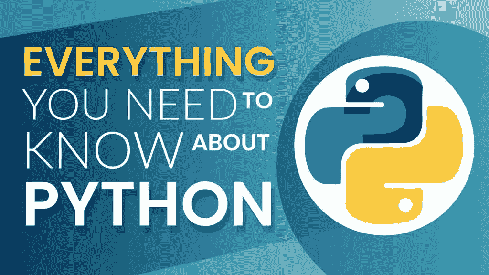
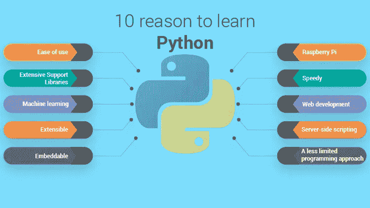

# Python 程序员应该知道的 10 件事

> 原文：<https://blog.devgenius.io/things-python-programmers-should-know-ba2d7faeb76d?source=collection_archive---------9----------------------->

Python 是一种通用语言，这意味着它可以用来构建任何东西，只要有合适的工具/库，这将变得很容易。思科、IBM、Mozilla、谷歌、Quora、惠普、Dropbox 和高通等科技巨头都在使用这种语言，因为它简单而优雅

从专业上来说，python 主要可以用于:

*   后端 web 开发
*   数据科学
*   人工智能
*   科学计算。
*   机器学习
*   开发游戏和许多其他这样的领域是一个人想要工作并创造未来的领域。

## 在我们开始今天博客的实际内容之前，如果有人真的想使用 python，请使用以下资源:

1.  [https://www.python.org/](https://www.python.org/)
2.  [https://docs.python.org/3/](https://docs.python.org/3/)
3.  [https://stackoverflow.com/](https://stackoverflow.com/)
4.  [https://www.w3schools.com/python/](https://www.w3schools.com/python/)

> **让我们讨论一些 Python 程序员应该并且必须知道的重要概念:**

# **1。PYTHON 外壳**

Python 最有用的一个方面是它自动安装了自己的外壳。Python Shell 可以通过从命令行输入`python`来执行。这样做，你会看到默认的版本号，三个箭头`>>>`要求你输入。如果你安装了多个版本的 Python，你可能需要添加版本号`python3.3`来获得正确的版本。Python shell 允许用户测试一些简单的命令，以检测是否存在逻辑或语法错误，从而帮助避免消耗大量时间或内存。

# 2.**不同版本的 Python 编程平台**

了解 python one 的工作版本非常重要，因为这会改变很多事情。Python 编程语言版本通常编号为 ABC。例如，从 2.7.3 到 2.7.4 的变化表明 Python 对平台做了一些小的错误修复，但是从 Python 2 到 Python 3 的变化表明两个版本之间发生了重大变化。

# 3. **Python 框架和对象关系映射器(ORM)**

清楚地理解 Python 框架非常重要，但这并不意味着一个人必须了解所有的框架。根据你要执行的项目，你需要知道对这个项目最重要的，但是最常用的是 Flask，Django。此外，需要理解如何通过 ORM 连接和使用应用程序，比如 Django ORM 和 SQLAlchemy。与编写 SQL 相比，这更容易、更高效、更快。

# 4. ***类和功能***

使用`def`在 Python 中定义函数非常容易，而且递归函数也不复杂，不像其他编程语言如 Java，

# **5。文件管理**

python 脚本使用文件作为输入，因此理解将文件合并到代码中的最佳方式非常重要。

`f.close()`很重要，因为这样做是为了释放内存。来自官方文件:

# **6。字典和集合的基本概念**

到目前为止，列表是我在 Python 编程中最常用的数据结构，但是我仍然大量使用字典、集合和其他数据结构，因为它们有自己的优点。

集合只是一个保存项目的容器，就像列表一样，但是只保存不同的元素。也就是说，如果您将元素`X`添加到已经包含`X`的集合中，该集合不会改变。这可能是集合优于列表的一个优势

## **器械包创建后，您不能更改其物品，但可以添加新的物品。**

除了集合，我发现**字典**是一种非常有用的数据结构。字典是将每个*键*与一个*值*相关联的东西，所以它本质上是一个将元素配对在一起的函数。

# 7.限幅

这是一个涉及获取一些数据的子集的过程，它主要应用于列表和字符串。切片不仅仅局限于从数据中删除一个元素。在这种情况下，为了让程序员对切片有更好的直觉，可以在使用代码之前使用 Python shell 来进行半复杂的切片。

# 8。前端和后端技术的区别

前端是用户访问页面时看到的内容，而后端是在幕后发生的事情。后端是程序执行的地方，它从数据库中查询数据并显示给网站。Python 是用于开发后端的编程语言之一。但是，需要 python 开发人员与前端开发人员链接，才能将客户端与服务器端链接起来。在这种情况下，了解前端如何工作以及应用程序将如何出现是至关重要的。

# **9。没有大括号**

与 Java 和 C++不同，Python 不使用大括号来分隔代码。Python 的缩进是强制性的。如果您选择从 __future__ 包中导入它，它会给您一个巧妙的错误。

# **10。Python 支持一个语句中的多个赋值**

python 将允许您在一条语句中为多个变量赋予相同的值。它还可以让你一次给多个变量赋值。

这也意味着 Python 中的交换更快，只用一行代码就可以完成:

# #PythonFact

# 比起法语，人们更喜欢 Python

根据最近的一项调查，Python 取代法语成为小学最受欢迎的语言。十分之六的父母更喜欢他们的孩子学习 Python 而不是法语。关于 Python 编程，我最喜欢的一个事实是。

希望您在探索 Python 的新事物时感到愉快

谢谢你

马南·沙阿