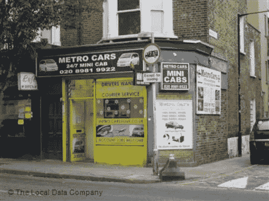

# 人们谈论编程时让我恼火的事情。

> 原文：<https://blog.devgenius.io/things-that-annoy-me-when-people-talk-about-programming-cfb51e72ea1?source=collection_archive---------18----------------------->

我经常在 Quora 上写关于编程的话题，这些年来，同样的事情一次又一次地出现。这是我的不满清单。

**C/C++。**

请不要再说“C/C++”。它们是不同的语言，不要混淆。是的，C++基于 C，但 Obj-C 部分基于 Smalltalk，但我们不会假装它们是同一种语言。别说了。现在。

**C 是一种低级语言。**

不，不是的。

毫无疑问，c 是一种高级语言。有些人会告诉你“但是当时 C 是高水平，现在不是了”。别听那些人的。c 语言比 Lisp 晚了 10 年，比 COBOL 晚了 10 年，比 Simula 晚了 8 年，几乎与 Smalltalk 和 Pascal 同时出现。业界，甚至在 1969 年就知道*确切地*他们所说的“高级语言”是什么意思。它现在的意思和那时一样。高级语言是从计算机的机器语言中抽象出来的语言，C *显然是。*

低级语言是汇编语言，不是 C，不是 C++，不是 Go，不是 Rust。

**解释语言与编译语言。**

没有这样的事情。

没有所谓的“解释的”或“编译的”编程语言。编程语言是规范，而不是实现。这就是为什么你可以得到 C 编译器和 C 解释器。C *不是*编译语言。没有这种区别。

**编程语言 *x* 优雅。**

不，不是的。

优雅是晚礼服的风格。

编程语言是工具，你不会得到优雅的编程语言，就像你不会得到优雅的电钻一样。

**编程需要 *x* 。**

不你不知道。你不需要 Mac，你不需要 Linux，你不需要三个屏幕，你不需要笔记本电脑，你不需要花哨的游戏 GPU，你肯定不需要机械键盘。任何电脑都可以。

我知道 UNIX。

不，你不需要，你下载过一次 Linux 并使用过一段时间。

**iPhone 上不能运行 Java。**

[是](https://www.codenameone.com/)。你。 [可以。](https://openjdk.java.net/projects/mobile/ios.html)

***x* 是一家科技公司。**

你确定吗？你确定不只是一个大的微型出租车办公室？

优步总部