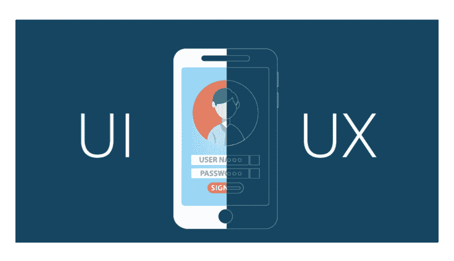
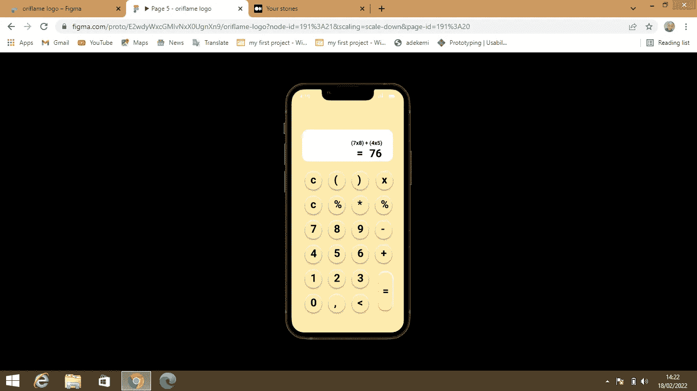
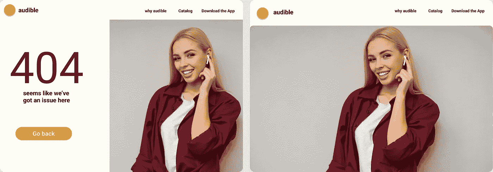

# 作为 UI /UX 初学者必须知道的事情

> 原文：<https://blog.devgenius.io/things-you-must-know-as-a-beginner-in-ui-ux-eb1339c45981?source=collection_archive---------7----------------------->

我想和大家分享一些我进入这个领域以来学到和发现的东西。这些东西真的帮助了我的设计之旅。

让我们钻研一下

首先，上一门关于设计原理的课程。有些网站可以免费帮助你，或者你可以付费参加全部课程。我们有像 [*Coursera*](http://www.coursera.org) 和 [*Careerfoundry*](http://www.careerfoundry.com) 这样的网站。我参加了 [*careerfoundry*](http://www.careerfoundry.com) 和 *Coursera* 的免费课程，学到了很多东西。这是一个你不应该错过的机会。

接下来你需要做的就是掌握一个设计工具。你可以选择 [Figma](http://www.figma.com) 或者 [Adobe XD](http://www.Adobe XD.com) 。然后继续练习。此外，你可以加入一个像图玛之友或者 T21 这样的社区。

我没有几本书可以推荐给你。它们都是有实际例子的好书。阅读它们对我帮助不小。像这样的书；
-别让我思考- **史蒂夫·克鲁格**
-日常事物的设计- **唐·诺曼**
-冲刺- **杰克·纳普**

虽然我们可以互换使用用户界面 UX，但两者并不相同。它们有不同的意义和作用。我们来看看他们的各种角色。

UX 设计师的角色是什么？根据弗雷德·比彻(《UX》的导演)的说法，作为一名 UX 设计师，你的职责是让产品和技术对人类来说是可用的、令人愉快的和可及的。作为一名 UX 设计师，你有责任确保产品或服务满足业务需求。UX 设计师可能会执行一些常规功能。哪些是；
-进行用户研究
-进行用户角色
-确定产品的信息架构
-设计用户流程和线框
-创建原型
-进行用户测试。
*我们来详细看看这几个角色。*

**用户研究**
用户研究侧重于通过观察技术、任务分析和其他反馈方法来了解用户的行为、需求和动机

**用户的角色**
“角色”是真实用户的虚拟表现，应用于产品开发或产品重新设计的早期阶段。

*为什么客户角色很重要？*

加深对客户需求以及如何解决这些需求的理解

**信息架构**
信息架构(IA)是将信息结构化以满足用户需求的实践。
信息架构是为用户提供产品行为和功能操作地图的文档。

**线框图**
线框图是 UX 设计师使用的一种做法，允许他们定义和规划网站、应用程序设计的信息层次。

**原型**
原型是为测试概念或流程而构建的产品的早期样本、模型或发布。这是一个在各种上下文中使用的术语，包括语义、设计、电子和软件编程。系统分析师和用户通常使用原型来评估新设计，以提高精确度。

**可用性测试**
可用性测试是以用户为中心的交互设计中使用的一种技术，通过对用户进行测试来评估产品。这可以被看作是不可替代的可用性实践，因为它给出了真实用户如何使用系统的直接输入

UX 设计师完成这些功能后，UI 设计师就可以进来设计产品了。他必须确保用户界面结构良好。

UI 设计师的工作是设计用户将要移动的所有屏幕，并创建视觉元素和它们的交互属性来促进这种移动。

UI 设计考虑产品界面的所有视觉、交互元素，包括按钮、图标、间距、排版、颜色、方案和响应设计。

*可以学习 UI UX 设计的网站。*

1.黑客设计——黑客设计是一门由世界上一些最杰出的设计师教授的设计课程。这个免费的资源通过玩设计拼图教你优秀设计的技术和工具。

2.Coursera 是一个全球性的在线学习平台，任何人、任何地方都可以获得顶尖大学和公司的在线课程和学位。

3. [**技能分享**](http://www.skillshare.com)——是一个在线学习社区，任何人都可以在这里发现、参加甚至教授课程。

*可以获得灵感的地点*
1。 [**Behance**](http://www.behance.net) -是 Adobe 旗下的一个社交媒体平台，主要致力于展示和发现创意作品。
2。**-是一个面向数码设计师和创意者的自我推广和社交网络平台。它是一个设计组合平台、工作和招聘网站，也是设计师在线分享工作的最大平台之一。
3。[**Awwwards**](http://www.awwwards.com)——是一家专业的网页设计开发竞赛机构。它旨在认可和推广最好的交互式网页设计。**

***我练习的时候做的一些设计***

********

****结论**
给自己成长的机会，不断练习，不断学习。如果你刚刚开始，采纳上面列出的一些建议，看着自己成长。创建您的设计并在不同的平台上发布。征求反馈，继续设计。**

**感谢阅读到最后！**