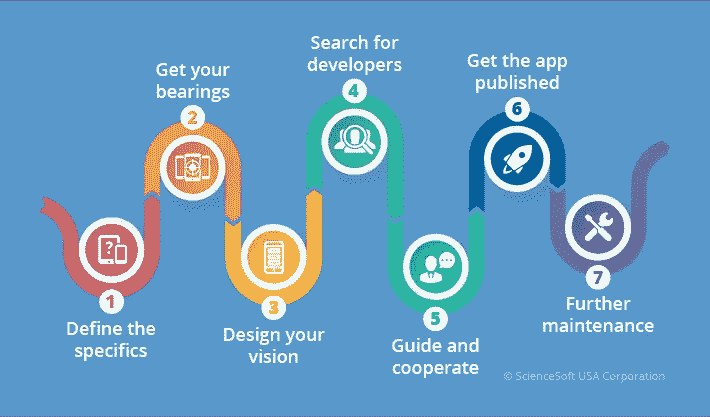
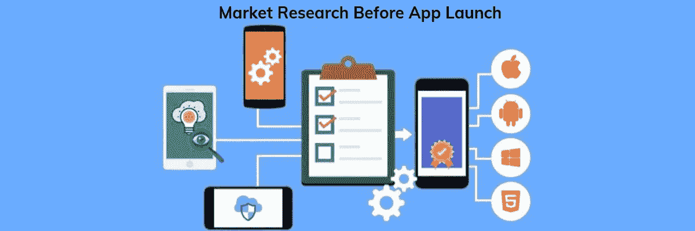
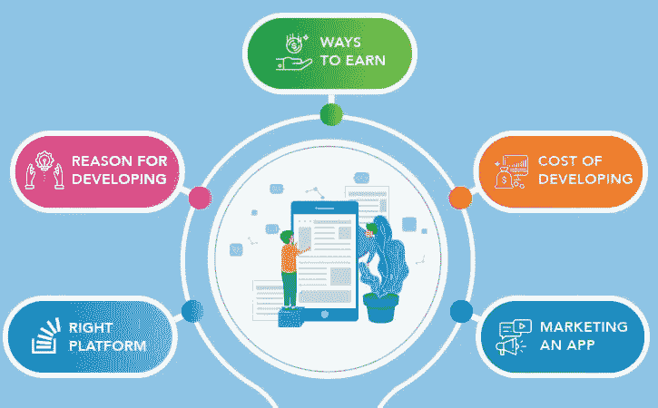
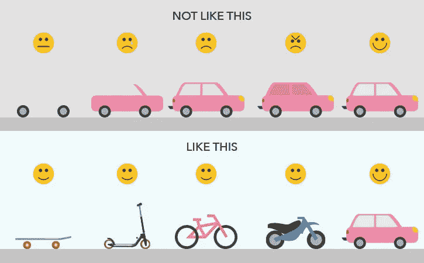
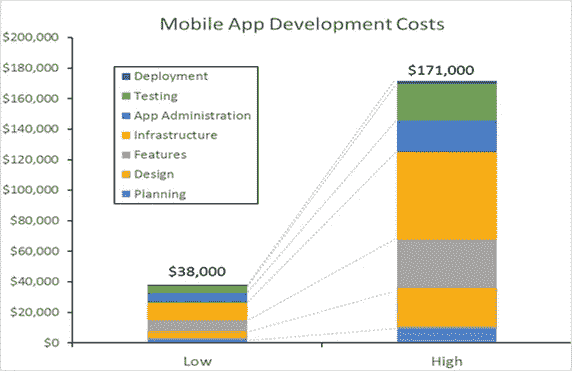

# 构建应用程序之前需要知道的事情

> 原文：<https://blog.devgenius.io/things-you-need-to-know-before-building-an-app-3f62c32a8d5e?source=collection_archive---------12----------------------->

## 创建一个应用程序显然没有你想象的那么简单，它需要一个清晰的愿景，知道什么该做，什么不该做，你必须在创建应用程序之前知道这些事情

随着手机应用的数量自发布以来呈指数级增长，你的应用很有可能会被发现。创建一个移动应用不仅仅是让你的开发者来完成。与其他业务流程一样，移动应用程序需要进行管理、策略制定和设计，以满足最终用户的利益。

 [## 美国和印度前 20 大移动应用开发公司

### 你是一个想在移动优先的世界里做大小企业的企业家吗？绝对的！没有人想…

medium.com](https://medium.com/mobile-app-developments/top-20-mobile-app-development-companies-in-usa-india-7258525f32) 

在你决定创建一个移动应用之前，提前预测它的结果是非常必要的。为了做到这一点，在参与移动应用程序开发过程之前，最好考虑一下这些因素。

 [## 云计算在移动应用开发中的主要优势

### 简单来说，开发移动应用程序就是创建一个为移动智能手机设计的移动应用程序。这是相当…

fugenxmobileappdevelopment.medium.com](https://fugenxmobileappdevelopment.medium.com/top-benefits-of-cloud-computing-in-in-mobile-app-development-c910ea507eb1) 

选择合适的平台
关于为你的应用程序选择最佳平台的讨论水平可能完全令人困惑。然而，当在 Android 和 iOS 之间做出选择时，考虑一个全面的用户界面，你可以专门提供给你的应用程序。

此选项不影响开发人员；这完全影响了应用程序的范围和灵活性。移动应用程序开发所需的编码决定了应用程序提交的目的和兼容性。

 [## 印度孟买班加罗尔最佳移动应用开发公司美国

### 我们是富勤科技，世界领先的技术服务提供商，专门从事移动应用，人工…

www.fugenx.com](https://www.fugenx.com/) 

**2)进行市场调查** 在做任何事情之前，尝试并进行市场调查总是一个好主意。创建一个应用程序也不例外，进行深入的调查可以帮助你获得对当前市场情况和竞争对手的宝贵见解。

这将有助于你掌握所使用的各种战术以及对手所犯的错误。你会从这些错误中吸取教训，并提出一个改进的计划。确保在你的研究中包括客户评论。问问你的听众他们想要什么；评估重要的需求，并做出所有必要的决定来实现它们。

 [## 印度顶级移动应用开发公司

### 印度顶级移动应用和游戏应用开发公司

fugenxmobileappdevelopment.medium.com](https://fugenxmobileappdevelopment.medium.com/top-mobile-app-development-companies-in-india-abca79c13fa0) 

了解你的客户
在你的目标受众不知道的情况下开发一款应用就像在黑暗中拍摄一样。应用程序的成功完全取决于它，因此了解客户的需求非常重要。如果你的应用程序不能解决他们的问题或增加价值，用户就不会使用电话。

听取顾客的反馈总是有帮助的；听取客户的反馈和意见，了解他们的需求。让你的目标与客户的需求保持一致，就没有什么能阻止你的应用了。

**4)选择合适的应用开发公司** app 的创意完全是你的，但其实现取决于你选择的 app 开发公司。应用程序开发公司在使你的应用程序用户友好、美观和自然方面发挥着创造性的作用。

在选择开发公司之前，你应该检查并澄清所有后续的要点:

> 检查所有使用的技术
> 阅读他们的案例研究
> 联系他们过去工作过的公司
> 记住有效沟通的时区
> 良好的设计知识对于为您的开发人员提供最佳客户体验至关重要。你的开发者必须考虑使用。开发人员必须构建应用程序，以便用户可以在没有帮助的情况下执行指定的功能。

**5)证明你开发应用程序的理由** 这似乎是最不需要回答的问题。然而，由于您需要向开发人员简要介绍您的应用程序，因此您必须首先阐明具体目的。

定义网站和应用程序产品之间的差异非常重要。必须有一个清晰的战略，说明你通过应用程序提供的服务与网站相比有多独特。

敏锐的视觉对于制作应用程序至关重要。此外，它必须与业务目标以及应用程序如何实现这些目标保持一致。

创建一个最小可行的应用程序，在应用程序上市前对其进行测试是非常必要的。MVP 是你的应用程序的一个版本，它只包含最重要的功能。

MVP 是必须的，因为它回答了许多重要的问题，例如:

你的应用解决了什么问题？
你的用户会用什么流程来解决问题？是什么让你的应用变得至关重要？你的应用程序最重要的特点是什么？
你在应聘中必须具备的特质是什么？你应该优先考虑哪些特性？
简单地说，MVP 就是对你的应用程序的深刻洞察。它可以让你准确地理解应用程序的本质。

 [## 公司新闻

### 成就、合作协议、合并、全球事件、办公室扩展和新分支机构。这些是问题…

www.fugenx.com](https://www.fugenx.com/company/company-news/) 

**7)确定用应用赚钱的方法** 在创建移动应用之前，你需要找到让你的应用赚钱的方法。很少有策略，比如在你的应用程序中添加私人广告，来开始通过点击付费或观看付费来赚钱。

您还必须确定是否对用户的下载收费，或者是否在应用程序中集成购买策略。出于最初的原因，你总是可以选择免费增值。

一旦应用程序达到 1000 次安装，免费的横幅广告服务将有效地预先构建在每个模板上。现在，您可以在应用程序中包含您的广告代码，并且您可以继续通过联盟广告获得收入。

确定开发一个应用程序的成本。
决定移动应用开发成本的因素有很多。在设定预算限额之前，必须仔细分析这些因素。

除了我们之前讨论的建立平台的关键要素之外，还有其他子要素需要您做出某些战略上一致的决策。

*   决定用户是否应该登录。在这里，你必须做出一个至关重要的决定，将登录与社交媒体平台如
    脸书或推特整合。
*   如果用户必须在应用程序中创建个人配置文件，请精确设置规则。在这种情况下，用户将在公共查看协议中输入信息。
*   如果你打算把一个应用和你的网站结合起来，那么当然需要做一个 API(应用编程接口)。这是你所有友好的应用程序相互通信的方式。
*   确定移动应用程序的设计标准与其实用性一样重要。
*   您的应用程序可以是简单的或标准的，或者您可以进一步扩展它们，使它们看起来足够漂亮，以便您的用户提高他们的 UX。

这些因素可以分为移动应用程序开发的几个阶段，每个阶段都有成本。下图显示了每个阶段中应用程序开发成本的分布情况

从技术上讲，应用程序开发的成本是基于小时费率的。这些费用因公司而异，甚至地理位置在确定开发移动应用程序的成本方面也起着关键作用。

在主要市场开发移动应用程序的行业标准如下:

*   美国和加拿大的公司每小时收费 50-250 美元
    澳大利亚应用开发机构提供的服务收费为 50-150 美元
*   西欧和英国的应用程序开发者收取 35 至 170 美元的费用
    东欧人(这就是我们所在的地方)对 20 至 150 美元的费用相当满意
*   印度每小时 10 到 80 美元的工资很有吸引力
*   这些成本取决于功能、复杂性和平台。
*   在确定开发移动应用程序的成本时，还需要考虑后端服务器。后端服务器通常最终会花费更多。
*   开发一个基本的印度应用程序的成本可能在 8000 美元到 12000 美元左右。
*   此外，留出一点预算用于更新、营销和维护也是明智的。

 [## 富根科技公司的客户

### 我们在富根克斯科技公司的骄傲客户。我们已经与全球 1200 多家客户合作过，包括初创企业…

www.fugenx.com](https://www.fugenx.com/customers/) 

**一个移动应用开发者团队通常会收取**的费用

*   UX /用户界面设计师，负责创建将在项目中编码的可视内容。
*   项目经理，负责与客户联络，并与应用程序开发人员协调，以达到预定的里程碑。
*   负责与项目经理沟通的业务开发人员，代表监督应用程序开发流程的主管执行职能。

**9)推广应用** 向目标用户推广应用同样重要。部分原因是为了进入应用商店，并通过让观众知道对他们来说有一些基本的东西来稍微影响他们。确保执行 A / B 测试以实现高效转换。

营销人员经常陷入常用技术的陷阱，例如为应用市场和社交媒体营销进行 SEO 活动。相反，明智的做法是掌握移动营销技巧的艺术，并让它适合你的业务。

**结论**
在开发移动应用程序之前，在脑海中记住这些事情可以使您的应用程序不那么脆弱。也就是说，移动应用开发是一个战略要求，而不是技术要求，因此必须由公司的价值观和目标来培育。

## 选择合适的地点为您的企业开发移动应用程序，因为我们是在美国、阿联酋、欧洲、伦敦、班加罗尔、孟买、德里和海德拉巴获奖的移动应用程序开发公司。

> 联系 FuGenx 移动应用程序开发专家团队

 [## 印度孟买班加罗尔最佳移动应用开发公司美国

### 我们是富勤科技，世界领先的技术服务提供商，专门从事移动应用，人工…

www.fugenx.com](https://www.fugenx.com/)