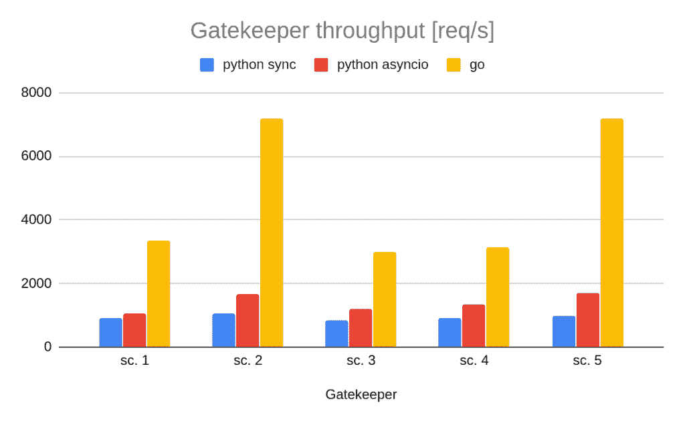

# 在向您的微服务架构添加另一种语言之前，请三思

> 原文：<https://blog.devgenius.io/think-twice-before-adding-another-language-to-your-micro-services-architecture-8b870df89fbd?source=collection_archive---------7----------------------->

[斯科特·格雷厄姆](https://unsplash.com/@sctgrhm?utm_source=medium&utm_medium=referral)在 [Unsplash](https://unsplash.com?utm_source=medium&utm_medium=referral) 上拍照

当处于启动模式时，非常重要的一点是要灵活。你的产品还没有被很好的定义，它可能会频繁而剧烈的变化。我们知道这一点，并决定使用*Python*——它很简单，允许非常快速的开发。

业务增长，我们开始有客户。随着每一个新客户的出现，我们对产品的理解也在加深。事实证明，有些功能比其他功能更相关，因为它们为客户创造了更多价值。我们开始了解什么是我们的核心产品，并开始剔除不相关的功能。

# 改变焦点

下一步是做我们正在做的事情——做得更好。我们如何在降低成本的同时提供相同(或更多)的价值。我认为开发方面有三个相关的组成部分:

*   *开发成本*使用该平台开发产品的难易程度对其影响最大
*   *部署成本*由运行整个产品的成本定义。这与代码性能和使用的技术有关，
*   *维护成本*取决于某人需要多少专业知识来维护平台上的产品。

Python 很棒，但也有它的局限性。它被设计成易于使用，而像 C 语言、Java 语言和 Go 语言被设计成具有高性能。

在这些语言中，Go 是一个很酷的新词，受到我的一些同事的喜爱，所以我们决定尝试一下。假设是它应该在性能方面轻松击败 Python。

# 研究:比较 Python 和 Go 的性能

我们在我们的平台中采用了一种叫做*看门人*的服务，这是我们最大的瓶颈。它与 *MongoDB* 和 *Kafka* 进行了大量的通信，而那些 *IO 操作*结果花费的时间最长。这是我们最想改进的部分。

由于我们产品的性质，测试更侧重于增加吞吐量，而减少延迟不太重要。我们已经在*看门人*上确定了 5 个应该测试的场景。在 Python 中，我们实现了同步和异步版本。Async 使用了 asyncio，这是 Python 最新的库，允许实现协程。此外，Go 仅限于一个内核来复制我们的生产设置。

结果是:

*Go* 在所有 5 个场景中都是明显的赢家。当考虑到现实生活中每个场景发生的频率时，**预计吞吐量增加约 450%** 。这对我们的*部署成本来说是个好消息。*

# 值得转行吗？

对我来说，计算是否值得转换的公式是这样的:

*y = A × x(开发)+ B × y(开发)+ C × z(主)*

*x(dev)，y(depl)*&*【z(main)*是表示解决方案对每个成本构成的影响的值。 *A* 、 *B* & *C* 是权重——降低每项成本有多重要。 *y* 是最终结果，考虑到我们的优先级，一个解决方案的成本是多少。我们正努力把它保持在尽可能低的水平。

例如，在开始时，我们并不太关心部署和维护的*成本，所以我们的公式可以是这样的:*

*y = 0.75×x(dev)+0.1×y(depl)+0.15×z(main)*

我们可以真正专注于**降低*开发*** 成本，而不是真正关心其他两个。

现在，我想说事情已经平衡了很多。公式看起来更像这样:

*y = 0.5×x(dev)+0.25×y(depl)+0.25×z(main)*

我们的主要驱动因素仍然是*开发成本*，但其他两项相对于它已经大幅增加。这给了我们很大的动力去考虑改变现状。

# 我们有什么选择？

我们可以重写一切。可惜有点不现实。学习围棋和重写要花很长时间。这也会对我们的生产力产生负面影响。我们的*开发成本*和*维护成本*将会暴涨。

我们可以一直呆在 Python 里。我们将保持*开发和维护*的低成本，但是它保持*部署*的高成本。

我们可以尝试的最后一个选择是在最重要的地方引入 Go，同时保持对使用该平台的开发人员的影响最小。我们的微服务架构允许我们用另一种语言进行部分重写。我们可以尝试只重写那些处理开发人员看不到的内部内容的组件。这应该会使*的开发成本*略低，但是*的平台维护成本*却增加了，因为现在我们必须维护 2 种语言。

# 从来不是非黑即白

我们将尝试进行部分重写。如果事情进展顺利，我们可以逐步改用围棋。可能有更合适的语言或实现会有更大的帮助，但我们必须前进。我们只能猜测事情会如何发展。我们能做的最好的事情就是经常进行现实检查，以了解我们是否在早期做出了正确的选择(如果没有，就转向)。

> 这篇文章最初发表在我的博客上。考虑订阅😊