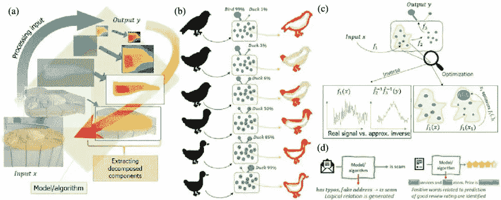
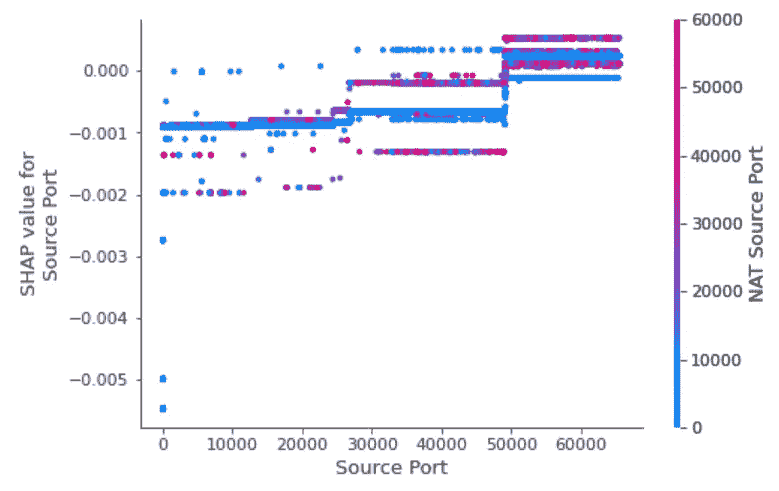

# 跳出(黑)盒子思考:可解释的人工智能解释

> 原文：<https://blog.devgenius.io/thinking-out-of-the-black-box-explainable-ai-explained-7959a672fcb7?source=collection_archive---------3----------------------->

## 我不知道你怎么想，但我有一种强烈的感觉，我的伦巴和 Alexa 串通起来反对我，我不会惊讶地得知 Alexa 有个人恩怨——所以，以伦巴的名义，我怎么能信任一台机器代表我做决定呢？

最近，欧盟委员会公布了可信人工智能的道德准则，欧洲电信标准研究所(ETSI)等标准化机构。电气和电子工程师协会(IEEE SA)也强调可解释的人工智能模型的重要性，表明各种人工智能模型的可解释性越来越重要。

但这意味着什么呢？

在 AI(人工智能)中，**黑盒**概念意味着我们不知道“引擎盖下”是什么。人工智能模型生成预测或决策，但我们并不真正知道算法是如何工作的，以及它为什么生成结果 A 而不是结果 b。我们只是被迫信任机器。由于许多机器学习和人工智能的算法都是黑箱，我们无法在事后检查它们的预测，因此无法理解具体的预测是如何和为什么做出的。

我不知道你怎么想，但我有一种强烈的感觉，我的伦巴和 Alexa 串通起来反对我，我不会惊讶地知道 Alexa 有个人恩怨，所以，以伦巴的名义，我怎么能信任一台机器来代表我做决定呢？

在别出心裁的法国电视节目“Le Bureau”中，描述了法国情报机构内部的故事，精神病顾问提供了一个关于担心自己生命安全的资产所造成的潜在威胁的诊断。她接着讲了一个故事:“ ***想象你去做肺部扫描，然后被告知立即停止吃肉。你问放射科医生“这有什么关系？放射科医生说“我真的不能说”。*** ***那会有什么感觉？”。***

停止吃肉和肺部扫描有什么关系？

现实生活中，我们总是在寻找答案和解释。我们发现仅仅因为“有人这么说”就很难甚至不可能接受事情，即使是我们信任的医生。然而，我们大多数人对人工智能系统如何做出决策知之甚少，而基于人工智能的决策就在我们周围。例如，如果你申请一份工作，你会相信人工智能会对你是否适合这份工作进行第一次评估吗？

2018 年，亚马逊使用一种算法对申请工作的候选人进行排序。该算法“偏爱”男性候选人，而不是女性候选人，因为神经网络是使用主要是“优秀”男性申请人的数据集进行训练的。换句话说，**算法有偏差**。

深度学习( **DL** )和机器学习( **ML** )都是基于数学模型、概率论、数据集和统计学。原始数据正在输入，各种模型正在评估，我们期待着一个准确的预测将产生。

**准确吗？真的吗？**

2017 年，一位名叫格伦·罗德里格斯(Glenn Rodríguez)的美国囚犯被拒绝假释，他在狱中度过了 26 年，是改造的典范。假释委员会解释说，一个名为 COMPAS 的计算机系统将他列为“高风险”他和董事会都不知道这个风险分数是如何计算的，COMPAS 的创造者拒绝解释算法是如何工作的，声称这是商业秘密。最终，经过一场争斗，罗德里格斯被从监狱释放，因为很明显算法中有问题。

是的，我们在生活的许多方面越来越依赖算法。保险公司使用算法来评估索赔，银行使用算法来评估贷款，医生使用算法来诊断，未来的自动驾驶汽车将使用算法来安全地开车送你回家。想想看，有多少预测和决策是以我们的名义做出的，然而你对这些算法以及它们为什么会这样工作一无所知。你为什么应该相信这些算法，我们如何知道私营公司不会隐藏他们基于人工智能的系统中的缺陷，以防万一？

# 推理的理由

**XAI** ，或**可解释的人工智能**，是数据科学的一个新领域，旨在将我们有缺陷的人类大脑与日益复杂的 ML 模型联系起来。XAI 使用了几种方法，使我们能够理解预测过程和偶然推理中潜在的数据证据，以这种方式使我们能够回答下列问题:

1.  **我们是否同意算法试图解决的问题的定义**
2.  **算法所表现和处理的问题在多大程度上是真正准确的？**
3.  **我们同意预测模型核心的基本事实吗？**
4.  **模型是否真正代表了我们的目标受众？**
5.  为什么我们的模型在给定的情况下提供了特定的预测？
6.  **模型什么时候准确，什么时候不准确？**
7.  我们如何识别我们的模型不能准确处理预测的用例？

# “这只是无礼的噪音”

许多 DL 模型的另一个问题是，在太多的情况下，有太多的背景“噪声”和冗余特征/变量，对预测准确性没有贡献。XAI 模型可以减少基于噪声的决策数量，同时简化算法复杂度。使用更简单形式的机器学习算法，如决策树，它基于 **if-then** 问题，(更接近我们人类的思维方式)，我们可以在决策过程中实现很大程度的透明度，并查看哪些变量具有更高的层次，哪些变量是多余的。降低噪声有助于提高性能，并建立更可靠和准确的预测。

XAI 模型可以帮助我们理解预测是如何得出的，从而让我们改善未来的决策、决策理解和信任。关键词是**溯源**。有了 XAI，我们可以追踪人工智能采取的行动，让用户和研究人员能够第一手了解决策循环，并选择控制它。

2020 年 8 月，国家标准与技术研究所(NIST)发布了他们关于可解释人工智能的四项原则:

**解释**:系统为所有输出提供附带的证据或理由。
**有意义的**:系统提供个人用户可以理解的解释。
**说明** **精度**:说明正确反映了系统产生输出的过程。
**知识** **限制**:系统仅在设计条件下运行，或者当系统对其输出达到足够的置信度时运行。

通过实施 XAI，我们可以开发更好的预测算法，同时大幅减少错误数量和对人工干预的需求，同时提高我们的预测道德和透明度。

# XAI 是如何运作的

有几种方法可以以对人类友好的方式解释和可视化模型。这些方法可以提供局部或全局模型。局部模型对每个局部预测起作用，而全局模型在神经网络本身内在全局范围内起作用，你可以把它看作是“逆向工程”的一种方式。

**局部模型**(如石灰)是线性的，因此容易理解和遵循。我们使用导致特定预测的给定数据集，并将其分解为每个变量和组件。这种方法与他们要解释的模型类型无关。

使用 LIME 进行文本分类

**全球模型**，如 **SHAP(沙普利附加解释)**，由[伦德伯格和李(2016)](https://proceedings.neurips.cc/paper/2017/file/8a20a8621978632d76c43dfd28b67767-Paper.pdf) 发明，基于博弈论方法，在寻求解释的同时，将数据分布可视化。SHAP 可以在本地和全球模式下工作。

使用 SHAP 进行多类分类

# **XAI ==责任与信任管理**

信任管理是人与技术之间关系的关键要素。使用 XAI，并因此纠正不平衡的数据集，将增强用户的信任。在接下来的五年中，我们预计各种 AXI 方法将在所有行业中得到更多的开发和部署。随着基于人工智能的技术将成为我们日常生活中的一个自然组成部分，这些技术将受到严格的监管，因为组织将承认 XAI 对于人工智能模型在系统中的实际部署是一个至关重要的功能，更重要的是，对于满足人工智能用户的基本权利来说。实施 XAI 模式还将迫使组织对自己的行为负责，因为归根结底，责任总是落在人手里，而不是机器。

这是不是意味着我的伦巴舞会毁了我昂贵的地毯的流苏？日子会告诉我的朋友。日子会证明一切。

> ***Ruth Haephrati 是一位实干型企业家，Secured Globe，Inc .的联合创始人，C++硕士，对计算机视觉、深度学习和 IOT 有着深刻的理解。Ruth 还是网络安全和网络情报方面的专家，拥有 20 多年的经验。她著有*** [***L* 收入 C++**](https://www.manning.com/books/learning-c-plus-plus) ***，与*** [***迈克尔·哈弗提***](https://www.linkedin.com/in/michaelhaephrati/)***出版，由***[*曼宁出版*](https://www.manning.com/) ***。***