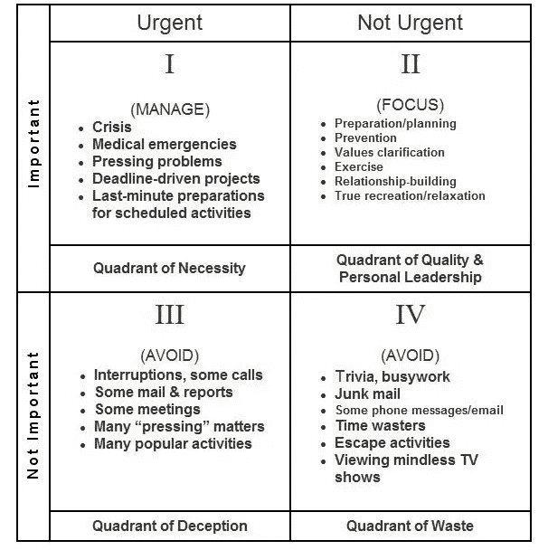
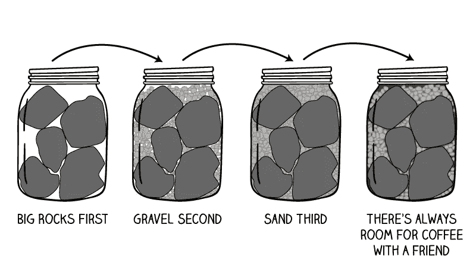

# 这就是开发人员如何用更少的时间完成更多的事情

> 原文：<https://blog.devgenius.io/this-is-how-i-accomplish-more-in-less-time-in-a-busy-schedule-2cd575835370?source=collection_archive---------12----------------------->

## 时间是定义生命的东西，但却是我们最不在乎的东西。

在 [Unsplash](https://unsplash.com?utm_source=medium&utm_medium=referral) 上由 [Aron 视觉](https://unsplash.com/@aronvisuals?utm_source=medium&utm_medium=referral)拍摄的照片

我是一名 Web 开发人员，我知道最后期限意味着什么，以及它们有多重要，尤其是当有很多你不知道它们从哪里来的 bug 的时候。

与此同时，我有一个计算机科学学位要完成，为了增加负担，我的家人不在乎时间(非常擅长浪费我的时间以及他们的时间)。

在经历了这一切之后，我仍然很有效率，完成了很多事情，是的，我和我的朋友和家人度过了美好的时光(这是我喜欢的)。我将与你分享，你如何能做同样的事情。

我要和你分享的想法来自斯蒂芬·R·科维，我是他的超级粉丝，他们非常有帮助。谢谢你，斯蒂芬！

在他的书**高效人士的 7 个习惯**中，他谈到了人们是如何浪费大量时间而收效甚微的。他说…

人类有独立的意志，他们可以自由地做任何他们想做的事情。

例如，你完全有权力停止阅读这篇博客，或者继续阅读或者坚持到最后(这是我强烈推荐的)，这完全由你决定。你一定听说过我们可爱的本叔叔的电影《蜘蛛侠》**拥有巨大的力量也伴随着巨大的责任**。

同样，人类有独立的意志，因此需要掌握他们的巨大力量，以便他们可以做重要的事情和不重要的事情。下面的数据证明了人类的效率有多低。

专家估计，大脑每天会思考 6000 到 8000 个想法。平均每小时有 250 到 330 个想法。

> **“坏消息是时间过得很快。好消息是你是飞行员**
> 
> **—迈克尔·阿尔特舒勒**

许多这样的想法会让你分心，你会失去注意力，结果，你原本要在一个小时内完成的工作占用了你一整天的时间。哎呀，你需要再乞求一次最后期限的延长。

人们做出了很多承诺，仅举几个例子:创业，学习机器学习，学习跳舞和唱歌，花更多时间陪家人，做更多运动，但什么都没完成。

问题？我没有太多的时间。但是今天我要帮你改变，帮你腾出时间做真正重要的事情！

别再浪费时间了！让我们开始吧

茱莉亚·M·卡梅隆从[派克斯](https://www.pexels.com/photo/top-view-photo-of-person-writing-on-white-paper-4144153/?utm_content=attributionCopyText&utm_medium=referral&utm_source=pexels)拍摄的照片

# 重要的事情先来

> **我们大多数人在紧急的事情上花了太多时间，而在重要的事情上花的时间不够。—斯蒂芬·科维**

把重要的事情放在第一位也许是时间管理最重要的原则。

基于这个基本原则，Stephen Covey 提供了一个优秀的时间管理工具来帮助个人和组织确定他们应该把时间花在什么地方，以达到他们最重要的目标。

柯维的时间管理矩阵是一个拯救生命的工具，它帮助你评估你最有价值的资产。你浪费的 1 分钟时间，即使 10 亿美元也买不回来。所以请珍惜你的时间。

> **“时间比金钱更宝贵。你可以得到更多的钱，但你不能得到更多的时间。”—吉米·罗恩**

书中的矩阵象限:高效人士的 7 个习惯

这个矩阵本身是不言自明的，但请仔细研究它。

## 象限三和象限四

这是所有问题的起点，时间在这里被浪费，这是你所有时间管理问题的发源地。

你接到的所有电话、信息、不必要的会议、漫不经心地在社交媒体上冲浪(而不是花时间在媒体上)，总是计划但从不实施，如果我们写下我们浪费时间的地方，即使是一本书也不够。我劝你远离这对讨厌的象限。

## 象限一和象限二

这是你开始掌控自己时间的地方。大多数时候，象限 1 是由于浪费你的时间而建立起来的，这包括最后一分钟的编辑(这是我过去经常遭受的)。

象限二是我敦促你关注的地方:你的长期目标，将使你在生活中成功的活动。把你所有的注意力都放在这里！

> 先做重要的事情，不做次要的事情——彼得·德鲁克

**我将与你分享我遵循的一个提示**——每当我要做某事时，比如出去买杂货，我会想一会儿，这个活动属于哪个地方，我问自己，我有必要出去吗，或者我最好坐下来做我的项目，然后再去。

如果我在 iPhone 上收到信息通知，我不会立即拿起手机查看谁给我发了信息，而是遵循象限法则，我会问自己——我需要在这个正确的时刻查看我的手机吗，或者在我喝咖啡休息时查看是否合适。相信我，这个简单的技巧改变了我的生活，也将帮助你。

> "**最重要的事情决不能受最不重要的事情的支配**"
> 
> 约翰·歌德。

大岩石的例子非常有名，同样有效地帮助你理解如何在不影响你的主要目标的情况下管理低优先级的任务。

# 大石头

来源:mindfulambition

这个罐子代表你的生活

大石头象征着生命中真正重要的东西。对你来说最重要的事情。象限 I

砾石是重要的，但在第二层次。象限 II

沙子代表了生活的细节。第三和第四象限

奖励是咖啡。这是你通过优化时间而获得的自由时间，最终，你将有时间舒适地与你的朋友、孩子或对你重要的关系坐在一起。这种满足感是无价的。

如果你还没有看过这个练习，我建议你看一下这个经典的柯维视频，[大石头](https://www.youtube.com/watch?v=zV3gMTOEWt8)。

照片由[猎人在](https://unsplash.com/@huntersrace?utm_source=medium&utm_medium=referral) [Unsplash](https://unsplash.com?utm_source=medium&utm_medium=referral) 上比赛

# 最终想法:

如果你真的想有效地管理你的时间，那么现在就开始应用大岩石技术吧！并积极地将你的活动分类到每个象限。首先把你的目标放在你的生活中，然后让其他的东西进来。

我们每天都有同样多的时间。我们如何利用这段时间完全取决于我们自己。这也是你我与埃隆·马斯克和比尔·盖茨等人取得如此巨大成就的同一时期。

希望我为你的生活增添了价值，谢谢你坚持到最后。

阅读更多内容…

 [## Youtube vs 面向开发者的书籍:为什么你需要更多地阅读书籍！

### “书籍是最安静和最忠实的朋友；他们是最容易接近和最明智的顾问，和…

medium.com](https://medium.com/@ali10haider/youtube-vs-books-for-developers-why-you-need-to-read-books-more-6099716a9dbd)  [## 理解 JS 中的对象

### 主对象来立即改进您的编码。

codeburst.io](https://codeburst.io/understand-objects-in-js-ff39e5b5e1dc)