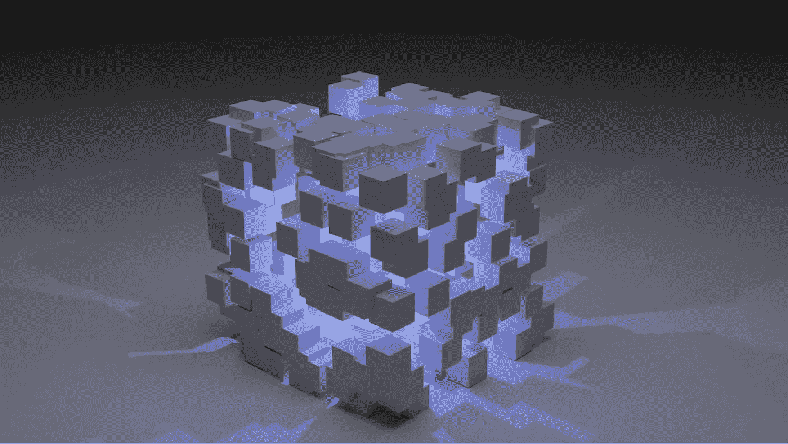

# 理解 Web3 所需的唯一文章

> 原文：<https://blog.devgenius.io/this-is-the-only-article-you-need-for-web3-1de1c3091807?source=collection_archive---------11----------------------->

照片由 Shubham Dhage 在 Unsplash 上拍摄

Web3，也称为去中心化 Web，是一个用来描述互联网下一次发展的术语。与传统的集中式 web (web2)不同，web2 由几家大型科技公司主导，并依赖中央服务器来存储和处理数据，web3 利用区块链等分散技术来创建一个更加开放的分布式网络。web3 的这种去中心化特性允许更大的隐私和安全性，以及更透明和公平的系统的潜力。

以下是我们将在本文中涉及的内容:

**web 3 和去中心化 web 介绍:
-**web 3 的定义及其在现代互联网中的意义。【web2 和 web3 的区别，以及去中心化技术的好处。
——区块链技术在 web3 中的作用。

**web 3 的应用:
-** 分散金融(DeFi)及其对传统金融体系的影响。
-分散自治组织(Dao)及其革新治理和决策的潜力。
-web 3 在博彩业和不可替代代币(NFT)中的使用。
-web 3 实现新型社交媒体和在线社区的潜力。

**让我们开始**

> **对 web3 和分散式 web 的介绍:**

Web3 已经开始变革金融、治理和游戏等行业。在金融领域，web3 促成了分散金融(DeFi)平台的出现，这有可能颠覆传统的金融体系。在治理方面，分散自治组织(Dao)正在使用 web3 来实现更高效、更透明的决策过程。在游戏行业，不可替换令牌(NFT)作为一种代表独特数字资产的方式已经变得很流行。

然而，广泛采用 web3 仍然存在挑战。web3 技术的基础设施和可扩展性仍在开发中，用户体验和易用性将是主流采用的重要因素。监管框架也将在 web3 的采用中发挥作用，因为政府和组织正在努力应对分散技术的影响。

尽管存在这些挑战，但 web3 推动经济和社会变革的潜力是巨大的。随着 web3 的基础设施和用户体验的不断改善，它可能会对我们与互联网以及彼此之间的交互方式产生重大影响。从启用新形式的社交媒体和在线社区，到颠覆传统的商业模式，web3 的可能性确实令人兴奋。

**web 3 的定义及其在现代互联网中的意义。**

Web3，也称为去中心化 Web，指的是使用去中心化技术，如区块链，来创建一个更加开放和分布式的互联网。传统的集中式 web (web2)由几家大型科技公司主导，依赖中央服务器来存储和处理数据，与之形成对比的是，web3 寻求创建一个更加分散和分布式的网络。

web3 在现代互联网中的重要性在于它有可能解决一些随着传统网络的发展而出现的问题和挑战。这些问题包括隐私、安全以及权力集中在少数大型科技公司手中。

通过利用去中心化的技术，web3 有潜力创造更加安全和私密的在线体验，以及更加透明和公平的系统。它也有可能实现新形式的在线协作和社区建设，并打破传统的商业模式。

随着 web3 的基础设施和用户体验的不断改善，它可能会对我们与互联网以及彼此之间的交互方式产生重大影响。

【web2 和 web3 的区别，以及分散技术的优势

Web2 指的是我们今天所熟悉的传统的集中式 Web。它依靠中央服务器来存储和处理数据，并由几家大型科技公司主导。Web2 实现了许多我们今天认为理所当然的在线体验和服务，如搜索引擎、社交媒体和电子商务。

另一方面，Web3 指的是使用去中心化的技术，如区块链，来创建一个更加开放和分布式的互联网。与依赖中央服务器来存储和处理数据的 web2 相反，web3 利用分散的网络来存储和处理数据。web3 的这种去中心化特性允许更大的隐私和安全性，以及更透明和公平的系统的潜力。

分散技术的一个主要好处是，它允许创建安全和私密的在线体验，因为第三方更难以访问或操纵分散网络上存储的数据。分散技术也有可能创造更加透明和公平的系统，因为它能够创建分散的自治组织，这些组织能够根据其成员的共识而不是单一的中央权威作出决定。

此外，分散技术有可能打破传统的商业模式，并实现新形式的在线协作和社区建设。web3 和去中心化技术仍处于早期，其全部潜力尚未实现。然而，随着 web3 的基础设施和用户体验的不断改善，它可能会对我们与互联网以及彼此之间的交互方式产生重大影响。

**区块链技术在 web3 中的作用**

区块链技术在 web3 中发挥着核心作用，因为它是去中心化网络的关键使能技术。区块链是一个分布式数据库，它维护着一个不断增长的记录列表(称为块),这些记录使用加密技术进行链接和保护。每个块都包含一个时间戳和一个到前一个块的链接，形成了一个块链。

在 web3 的环境中，区块链技术用于创建分散的网络，这些网络可以以分布式方式存储和处理数据，而不依赖于中央服务器。以区块链为基地的网络的这种分散性质允许更大的隐私和安全，因为第三方更难以访问或操纵存储在网络上的数据。

区块链技术还用于创建去中心化自治组织(Dao)，这是一种去中心化的网络，可以根据其成员的共识做出决定，而不是单一的中央权威机构。Dao 有可能彻底改变治理和决策过程，因为它们能够以更加透明和公平的方式运作。

总之，区块链技术是 web3 的关键使能技术，因为它允许创建分散的网络，可以以安全和保密的方式存储和处理数据，并允许创建分散的自治组织，这些组织可以根据其成员的共识做出决策。

> **web 3 的应用:**

Web3 有潜力革新广泛的行业和应用。以下是 web3 正在改变世界的几个应用。

*   **分散金融(DeFi)及其对传统金融体系的影响。**

分散金融(DeFi)是指使用分散技术(如区块链)来提供金融服务，如借贷和交易，而不需要传统的金融中介。DeFi 已经成为 web3 的一个主要应用，并有可能颠覆传统的金融系统，使金融服务更加容易获得和透明。

DeFi 的主要优势之一是，它允许金融系统具有更高的包容性和可及性。传统的金融体系可能具有排他性，特别是对于金融基础设施不发达的国家的个人或组织而言。DeFi 允许创建不依赖于传统中介(如银行)的金融服务，因此可以被更广泛的人和组织使用。

DeFi 也有潜力创造更加透明和公平的金融体系。传统的金融体系可能不透明，难以理解，特别是对非专业人士而言。另一方面，DeFi 平台通常建立在开源技术之上，并使用透明协议，使用户更容易理解它们的工作方式。

此外，DeFi 有可能减少对传统金融中介的依赖，这对用户有利，因为它可以减少费用，提高金融交易的速度。

总体而言，DeFi 有潜力通过提高包容性、透明度和效率来显著影响传统金融体系。然而，DeFi 仍处于早期阶段，其广泛采用还存在挑战，如可扩展性和监管问题。随着 DeFi 平台的基础设施和用户体验不断改善，我们很可能会看到这项技术在金融行业得到更广泛的采用。

分散自治组织(Dao)及其革新治理和决策的潜力。

分散自治组织(Dao)是分散的网络，可以根据其成员的共识做出决策，而不是单一的中央权威。Dao 是由区块链技术支持的，已经成为 web3 的一个主要应用。它们有可能彻底改变治理和决策过程，因为它们可以更加透明和公平地运作。

Dao 的主要好处之一是，它们能够实现更加分散和民主的决策过程。在传统组织中，决策通常是集中的和自上而下的，少数个人或董事会掌握着大部分决策权。另一方面，Dao 允许在所有成员达成共识的基础上做出决策，这可以带来更具包容性和公平的决策流程。

任务负责人还有可能提高治理和决策过程的透明度和问责制。传统组织可能不透明，很难理解决策是如何做出的以及由谁做出的。另一方面，Dao 通常建立在开源技术之上，使用透明的协议，这使得用户更容易理解它们是如何工作的。透明度的提高有助于在决策过程中建立信任和加强问责制。

总体而言，一体行动任务负责人有可能通过实现更加分散和民主的决策以及提高透明度和问责制，对治理和决策过程产生重大影响。然而，Dao 仍然处于早期阶段，它们的广泛采用还面临着挑战，比如可伸缩性和监管问题。随着 DAOs 的基础设施和用户体验的不断改善，我们很可能会看到这项技术在治理和决策过程中得到更广泛的采用。

**web 3 在博彩业和不可替代代币(NFT)中的使用**

随着不可替代代币(NFT)的出现，Web3 对游戏行业产生了影响。NFT 是独特的数字资产，可以代表游戏中的物品、艺术品和收藏品等。它们是由区块链技术实现的，并且作为代表和交易独特的数字资产的方式已经变得流行。

非功能性数字技术的主要好处之一是，它们允许创造和交易具有实际价值的独特数字资产。在传统的网络游戏中，玩家经常赚取和交易虚拟物品，但这些物品往往不是唯一的，不具有现实世界的价值。另一方面，NFT 可以代表具有实际价值的独特数字资产，因为它们在区块链上得到验证，无法复制或伪造。

NFT 也促进了所谓的“元宇宙”的兴起，这是一个虚拟世界，人们可以相互交流和参与，也可以使用数字资产。元宇宙是一个已经存在了一段时间的概念，但 NFT 使人们在虚拟世界中拥有和交易独特的数字资产变得更加可行。

总的来说，NFT 有可能通过创造和交易具有实际价值的独特数字资产，以及促进元宇宙的发展，对游戏产业产生重大影响。然而，对于 NFTs 来说还处于早期阶段，广泛采用它们还存在一些挑战，比如可伸缩性和监管问题。随着 NFTs 的基础设施和用户体验的不断改善，我们很可能会看到这项技术在游戏行业得到更广泛的采用。

【web3 实现新形式的社交媒体和在线社区的潜力。

Web3 有潜力实现新形式的社交媒体和在线社区，它们更加分散，更少依赖中央服务器来存储和处理数据。这将带来更加私密和安全的在线体验，以及更加透明和公平的系统。

分散的社交媒体和在线社区的一个主要好处是，它们允许更大的隐私和安全性，因为存储在这些平台上的数据不依赖于可能被黑客或第三方访问的中央服务器。分散的社交媒体和在线社区也有可能变得更加透明和公平，因为它们可以建立在开源技术的基础上，并使用透明的协议，使用户更容易理解它们的工作方式。

此外，分散的社交媒体和在线社区有可能实现更加分散和民主的决策过程。传统社交媒体平台通常由少数大型科技公司集中和控制，这可能导致审查和压制某些声音等问题。另一方面，分散的社交媒体和在线社区允许根据所有成员的共识做出决定，这可以导致更具包容性和公平的决策过程。

总的来说，web3 支持新形式的社交媒体和在线社区的潜力是巨大的，因为它允许更私人和安全的在线体验，以及更透明和公平的系统。然而，分散式社交媒体和在线社区仍处于早期阶段，它们的广泛采用还存在挑战，如可扩展性和用户体验问题。随着这些平台的基础设施和用户体验的不断改善，我们很可能会看到这项技术在社交媒体和在线社区领域得到更广泛的采用。

本文到此为止。

谢谢你一直读到最后。我希望你喜欢这个。请随意评论您对此的想法。

如果你想让我为你写一篇文章，请联系我在 itssouravshrivas@gmail.com 的办公室，或者在下面留言。