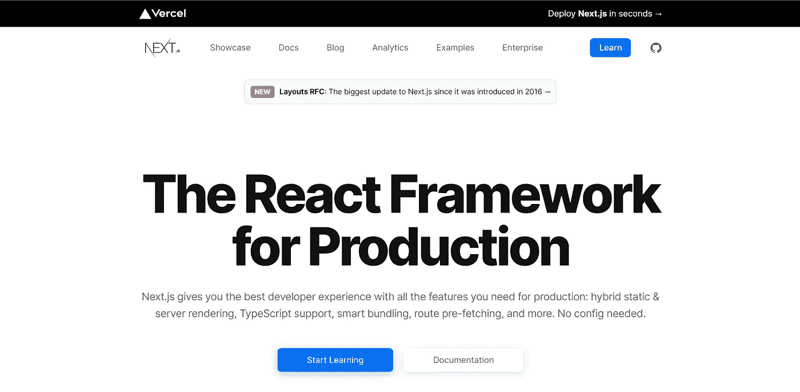
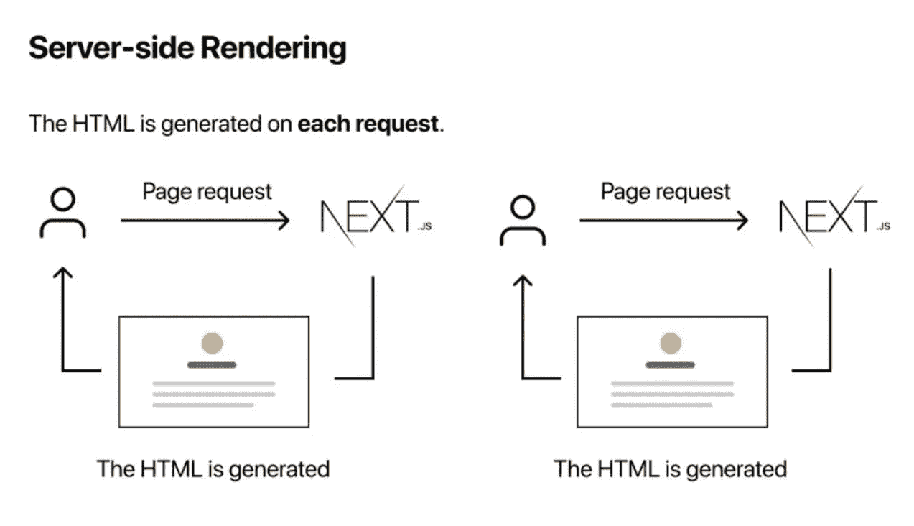
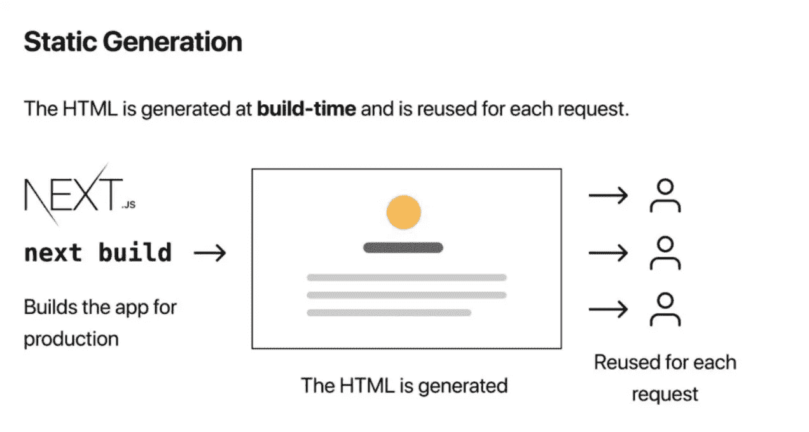
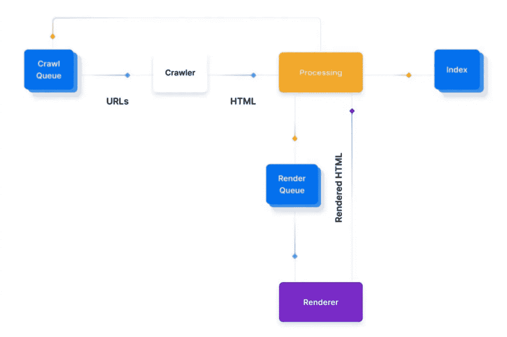

# 这就是你作为前端开发者应该使用 Next.js 的原因

> 原文：<https://blog.devgenius.io/this-is-the-reason-why-you-should-use-next-js-as-a-front-end-developer-359f1d2d72ce?source=collection_archive---------1----------------------->

Next.js 是专门为 React.js 创建的 J *avaScript* 框架，这个框架通常被称为“React.js 附魔者”，因为它已经成功修复了 React.js 本身的一些缺点，如*渲染、路由页面、*等等。

Next.js 官方页面

Next.js 也是一个现成的框架，它将帮助您轻松地构建您的项目(生产就绪)。因此，您不需要在过程中切换开发模式和生产模式。

除此之外，Next.js 还是一个全栈框架，既充当构建网站界面的前端框架，也充当处理渲染过程和数据库管理的后端框架。这意味着你不需要使用两个框架来建立一个网站。

毫不奇怪，许多公司使用 next.js 来建立他们的网站，因为它实用而高效。例如抖音、Hulu、耐克、票务大师等等。

在我们了解了 Next.js 的含义之后，让我们来分解 Next.js 的过程。

## **next . js 的程序**

Next.js 在服务器上做网站渲染流程(预渲染)。因此，当浏览器请求一个页面时，服务器将以 HTML 格式发送该页面作为响应。

为什么会这样？好吧，Next.js 服务器已经提供了包含 React、JavaScript 和 HTML 的捆绑包。所以浏览器不需要操纵 DOM(文档对象模型)到 React 和 JavaScript 包来预览 HTML。

这给我们的结果是，网站内容将立即显示，而无需为用户购买一些时间来等待渲染过程。

它与 React.js 的过程不同，react . js 的渲染过程发生在浏览器中(客户端渲染)，这意味着网站的大小会影响渲染时间。

js 有两种预渲染方法:服务器端渲染(SSR)方法和静态端生成器(SSG)方法。

## 服务器端渲染(SSR)

使用服务器端呈现方法，每次浏览器调用网站的页面时，服务器都会将 React 和 JavaScript 包转换为 HTML。

## 静态站点生成器(SSG)

使用静态站点生成器方法，服务器不需要在每次请求页面时都生成 HTML。这是可能的，因为服务器已经在构建阶段生成了 HTML。更推荐 SSG，因为它会加快网站的加载时间。

## Next.js 功能

那么，什么样的特性会让你的工作更有效率呢？

## 1.路由页面

在 Next.js 中， *Pages* 文件夹中的所有页面文件也将是网站上实际页面的路由。这意味着您不需要为每个页面设置不同的路由文件。

我会缩短编写代码的时间，这样我们的工作会更有效率。

## 2.内置 CSS 支持

在 Next.js 中，可以从 JavaScript 文件导入 CSS，因为 Next.js 有强大的内置 CSS 支持。

默认情况下，Next.js 使用<style.jsx>标签，这样标签内的 CSS 脚本就可以从指定的页面中分离出来，这样你就不需要为页面重写 CSS 脚本了。</style.jsx>

## 3.布局组件

Next.js 将允许我们将页面构造器重构为一个组组件，这样我们就可以很容易地在其他页面上重用我们的组件。

例如，我们可以在所有网站页面上重用相同的标题组件，而无需在每个页面上重新编写标题脚本。

## 4.图像优化

Next.js 为我们提供了 *next/image* 组件，这是 HTML < img >组件的魔法版。该组件将根据浏览器配置调整图像大小，以便图像在每个设备上都有响应。

## 5.字体优化

默认情况下，Next.js 会在构建阶段自动设置内联字体 CSS，这样可以加速声明 pl 字体的过程。这将使页面上的字体加载过程高效完成。

## 6.脚本优化

来自 Next.js 的脚本组件将为我们提供组织第三方脚本的优先加载。

示例:您有三个脚本来分析内容、广告管理和社交媒体小部件。您可以通过将分析的内容放在脚本的第一行来设置其优先级。

这将加速网站加载，并防止页面上出现未显示的内容

## 7.静态文件服务

Next.js 会在 *Public* 文件夹中给我们提供一个静态文件。它将帮助我们调用和使用指定页面的静态文件。

示例:对于图像文件，您可以调用并调整我们想要的每个页面上的图像大小。所以我们不需要为我们的项目保存不同大小的相同图像。

## 8.快速刷新

快速刷新是 Next.js 的特性，它将在脚本更新后直接刷新页面。

它将帮助我们作为开发人员，所以我们不需要在更新脚本后手动刷新页面。

## Next.js 优势

Next.js 拥有所有这些特性，但也有许多不可低估的优势，例如:

## 1.搜索引擎友好

在 Next.js 上，浏览器在加载网站页面的时候就已经生成了 HTML。这将有助于谷歌抓取 HTML 格式的网站内容。

这将有助于搜索引擎的索引过程，并在搜索引擎中产生良好的网站排名。

如果更容易在搜索引擎中被发现，会增加网站的流量潜力。这就是 Next.js 是一个 SEO 友好框架的原因。

## 2.轻松设置项目

即使对于初学者来说，在 next.js 中建立一个项目也非常容易。我们只需要安装 Node.js 环境并运行一些脚本，我们不需要准备另一个插件或库。它可以在任何平台上完成，例如 MAC、Windows 和 Linux。

## 3.良好的性能

得益于其*代码拆分*和*客户端导航，Next.js 有着不错的性能。*

通过*代码分割*，Next.js 可以在将要加载到浏览器上的页面上进行 JavaScript 渲染，而不是一次性加载。它将使页面加载时间变得更加高效。

有了*客户端导航*，我们可以使用*链接*组件在页面间导航，就像单页面应用程序一样。这意味着它在页面之间导航的时间非常短。

## 4.轻松部署项目

由于与 Vercel 的集成，Next.js 项目的部署过程变得非常容易，Vercel 是一个基于云的框架，对 Next.js 提供一流的支持。

这个部署平台有几个优点，例如:

*   每个页面可以自由使用 SSR 或 SSG
*   使用 SSG 的页面将使用独立于 Vercel 的服务器，因此页面加载的效率将会提高。
*   使用 SSG 的页面将是一个无服务器的功能，所以它将减轻服务器的任务。

鉴于以上所有优势，Next.js 是开发任何类型网站的绝佳选择，无论是电子商务、新闻、博客、社交媒体，还是流媒体服务。