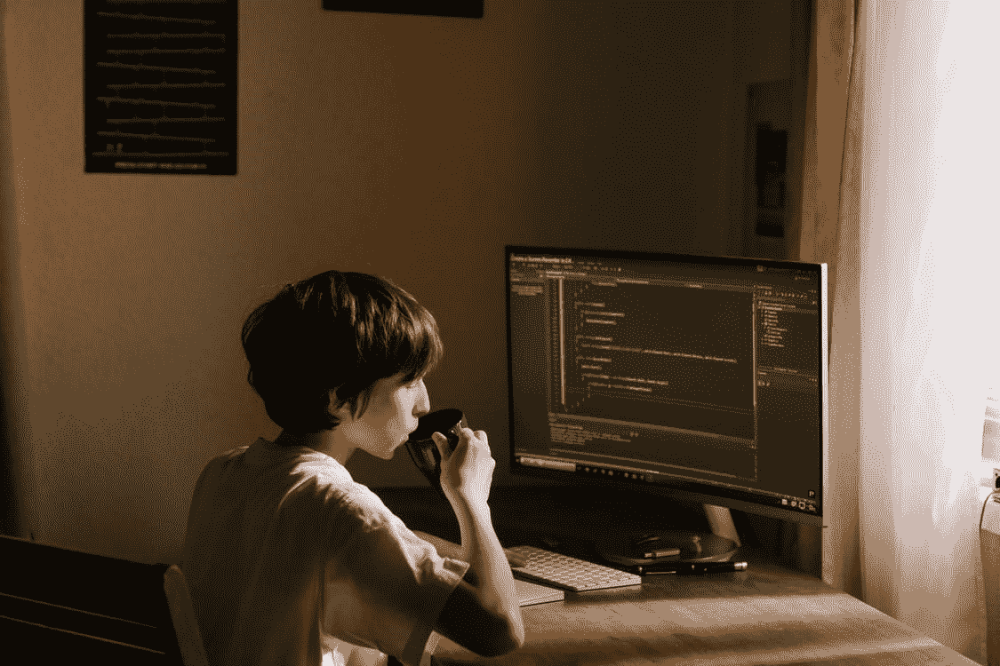

# 这就是注释代码至关重要的原因

> 原文：<https://blog.devgenius.io/this-is-why-commenting-your-code-is-crucial-5d00f8a5211c?source=collection_archive---------4----------------------->

## 技术/编程

## 我失去了三个月的工作，这怎么会发生在你身上。

现在是 2018 年初。我的朋友让我开始编程，向我展示了从哪里开始和其他一些资源。我真的很喜欢玩电子游戏，现在仍然如此。我一直梦想创造自己的游戏。而且，如果我学会了编程，我的梦想就会实现！

## 开始

我很快学会了基本的 C#和一些面向对象的概念，这些概念在 Unity 中应该是有帮助的。看了一小时又一小时的教程，终于开始编程了。我太兴奋了，事情似乎进行得很顺利！

我开发了一些基本的角色艺术和动画，以及一些怪物和抛射物。我还用像素艺术创建了瓷砖——因为我的世界是基于瓷砖的——并从中获得了很多乐趣。我用 Unity 把它们整合在一起，设计了一个小的演示世界，在那里我可以测试我的新机制。

## 升级

同样，我开始掌握它的窍门。我编程越多，做得越好。我添加了一个健康系统，动画，冷却时间，武器，更多的怪物，属性调整，一个菜单，一个 HUD，一个加载屏幕…同样，我想我甚至创建了一个库存系统。我用这个花了几十个小时，它似乎一直在增长。

我让几个朋友跳上 discord，向他们展示我的[新视频游戏](https://jertogames.itch.io/floating-pixels-the-jumper)。这没什么大不了的，因为图形非常基础，而且只有演示级别，但他们喜欢其中的机制。我一直在平滑一切，平衡基本怪物和武器，再生和耐力统计…看起来一切正常。

## 实现

后来有东西坏了。就这么简单。一些东西停止了工作——损坏机制——我不明白为什么。我试图回到我的代码并修复它，但后来我意识到一些事情:我不能阅读我自己的代码。

> 我意识到我不能修复我的游戏，因为我不理解我自己的代码。

起初，我想，也许，用一些耐心，我最终会修好它。但我还是不断打破越来越多的东西。我的代码一塌糊涂。我回到了上一个版本——那个损坏机制仍然被破坏的版本——并保持代码原样。我停止了这个项目的工作，并且从未完成它。

## 错在哪里？

此刻你可能已经猜到了:我没有注释任何一行代码。我没有记录我的函数。我没有构建我的文件树。一切都注定会在某个时候崩溃，我只是很幸运，我连续三个月没有出现重大错误。

我不自责。作为初学者，每个人都会犯错，没有人完全知道自己在做什么。我和其他人一样，认为评论是无用的，是浪费时间。我大错特错了。

## 我们应该如何注释和记录我们的代码？

这里有一个[深度指南](https://guides.lib.berkeley.edu/how-to-write-good-documentation)，你可以用它来专业地记录你的代码。它向用户展示了什么时候以及为什么编写代码文档是重要的，并且教授了针对不同编程语言的不同编码风格。

我正计划写一篇关于评论技巧和窍门的文章。但是，现在，我会向你推荐这个优秀的资源。

不要忘记在下面评论你自己的经历。我想知道你是否像我一样，不得不艰难地学习编写代码文档！

*更多内容尽在*[*blog . dev genius . io*](http://blog.devgenius.io)*。*