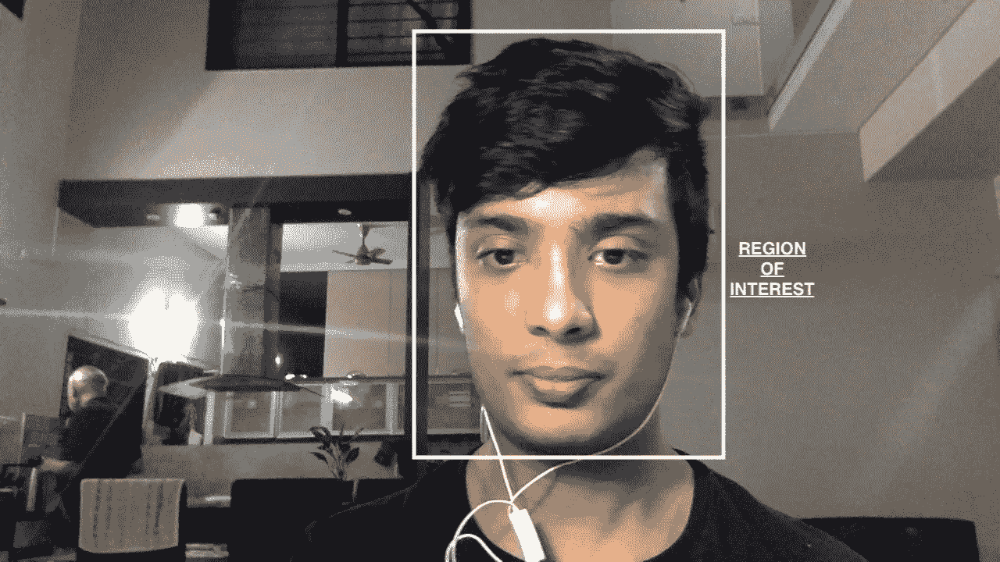

# 这个简单的代码允许你在 Mac 上使用 Face ID

> 原文：<https://blog.devgenius.io/this-simple-code-allows-you-to-use-face-id-on-mac-29fc8334f080?source=collection_archive---------19----------------------->

## iPhone，iPad，windows 笔记本电脑都有人脸识别，为什么 Mac 没有？


Kari Shea 在 Unsplash 上拍摄的照片

每次打开 mac 的盖子都要输入冗长的密码，这让我很沮丧。我的手机和 Ipad 有 Face ID，为什么 Mac 没有？

每当我家里有客人/表亲时，如果我不得不在我的 Mac 上给他们看一些东西，快速键入我的密码会感觉很奇怪，这样他们就看不出我在键入什么。我们都经历过类似的情况，不是吗？。

下面是我在 YouTube 上展示最终结果的有趣视频的链接。

# 让我们解决这个问题

来源:thedailyshow.com/

你需要几样东西来开始

用于 mac 的 Python 3 和[睡眠监视器](https://www.bernhard-baehr.de/)。此外，请确保 pip 正常工作，以便安装所需的库。

# 收集图像

首先，我们需要收集图像来训练我们的模型。

我们从导入 cv2 开始，它允许我们处理图像，并用它做很多事情。pickle 允许我们将 python 对象转换成字节流，以文件的形式存储(我们现在不需要它)。os 允许我们在这段代码中查找和检查文件和文件夹。时间允许我们暂停脚本，以便我们可以轻松地收集图像。pathlib 允许我们获得所有文件所在目录的路径。然后我们加载 [haar_cascade](https://github.com/opencv/opencv/tree/master/data/haarcascades) 来检测人脸。下面的 while 循环检查图像中是否有人脸，并收集有人脸的图像，并将它们存储在名为 Images/{name}的文件夹中。姓名是用户输入的人员姓名。

完整的代码和所有可用的文件[在这里](https://github.com/patni11/Face_ID) :-

[](https://github.com/patni11/Face_ID) [## patni11/Face_ID

### 此时您不能执行该操作。您已使用另一个标签页或窗口登录。您已在另一个选项卡中注销，或者…

github.com](https://github.com/patni11/Face_ID) 

现在我们已经收集了图像，我们需要训练我们的模型。

# 训练模型

这里我们将使用 LBPH 人脸识别器。我找到了一篇由 Kelvin Salton do Prado 撰写的极好的文章，解释了这个概念。

[](https://towardsdatascience.com/face-recognition-how-lbph-works-90ec258c3d6b) [## 人脸识别:理解 LBPH 算法

### 人类每天都在自动进行人脸识别，几乎不费吹灰之力。

towardsdatascience.com](https://towardsdatascience.com/face-recognition-how-lbph-works-90ec258c3d6b) 

那是我的一张非常糟糕的照片

在 for 循环中，我们首先找到存储在 images 目录中的所有图像。现在，我们使用之前创建的文件夹名称提取它们的标签。现在每张图像都被转换成灰度，然后我们得到感兴趣的区域(只有人脸存在的区域)。

现在，我们在最后 3 行中训练 LBPH 识别器，并将面部特征数据保存在 trained.yml 文件中，将标签保存在 label.pickle 文件中。注意—请收集一个人以上的图像，因为分类器无法针对一个单独的类别进行训练。

# 创建面部检测器

这是面部检测器，你可以在多个项目中使用它。它类似于 collecting_images.py 文件，不同之处在于它以图像和坐标的形式返回面部区域，而不是保存图像。

这是项目的主要文件，它结合了我们到目前为止所做的一切。playsound 库是可选的，但它允许你一登录就播放音乐，你可以通过注释掉它。确保您安装了 pyautogui，这允许我们的代码键入密码。

因此，首先我们加载我们的 trained.yml 文件以使用所收集的关于面部的数据，然后我们使用我们在上面创建的面部检测器类来获得感兴趣的区域，即带有坐标的面部，然后我们打开我们的 labels.pickle 文件以获得我们为其保存图像的所有用户的姓名。现在，我们使用我们的识别器(rec ),并将感兴趣区域传递给它，以获得被检测人的姓名和置信度，即我们的分类器有多确定被检测人确实是那个人。如果置信度大于 80%，并且检测到的人的名字是“shubh”(即我)，那么它会键入密码(在我的情况下是“Microsoft_Sucks”，请将其更改为您的密码)，然后自动按 enter 键。你应该把那部分改成你的名字，你也可以用‘或’来允许更多的人访问。我还添加了每次欢迎我的代码，你可以根据自己的需要进行编辑。

# 还缺少一样东西

我们还没有告诉计算机在唤醒时运行这个代码，让我们这样做。

为此我们需要使用 sleepwatcher，你可以从这里下载:[https://www.bernhard-baehr.de/](https://www.bernhard-baehr.de/)。确保你把所有的东西都放在桌面上的一个文件夹里。现在我已经准备了一个 bash 脚本来完成设置，并完成您需要做的一切。

但在此之前，只需创建这个小文件:-

现在，这个 bash 脚本由 sleepwatcher 在登录时运行，这个脚本调用我们的 Face_ID.py 文件。我不能直接从 sleepwatcher 运行 Face_ID.py，因为我得到了权限错误，即使我给了它所有的权限，如果你知道原因，请评论。

现在让我们创建完成设置的最终文件。

这个文件完成了 sleepwatcher 的设置，开始收集 _images.py，创建 _files.py，现在可以退出代码，退出程序了。

打开终端并运行这段代码来启动程序。

```
/usr/local/sbin/sleepwatcher --verbose --wakeup ~/Desktop/Face_ID/hello.sh
```

如果您有任何问题，请在 G [itHub](https://github.com/patni11/Face_ID) 上检查我的目录结构。

有什么改进这段代码的想法吗？下面让我知道。