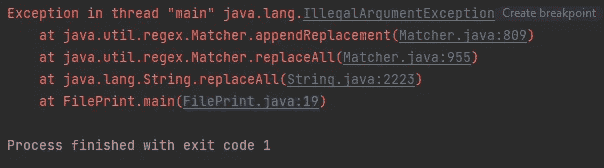
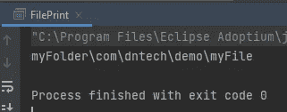

# Java 中的这段小代码导致我们的构建管道失败

> 原文：<https://blog.devgenius.io/this-small-code-in-java-caused-our-build-pipeline-to-fail-bd0c88abb0b0?source=collection_archive---------11----------------------->

## 方案

在我的工作中，我们有一段代码从属性文件中获取一个字符串。这个字符串指定了一个包名，我们将使用它来构造一个文件路径。为简单起见，代码如下所示:

```
final String myPackage = "com.dntech.demo";

final String samplePath = "myFolder" + "\\\\" + myPackage.replaceAll("\\.", "\\\\") + "\\\\" + "myFile";

FileInputStream fileInputStream = new FileInputStream(samplePath);
```

正如我们在上面看到的，我们有一个 myFolder 前缀，后跟一个路径分隔符，我们用路径分隔符替换包字符串中的所有点，最后添加文件名。最后，我们使用字符串来访问文件。

当我们的同事将代码从本地提交到远程存储库时，远程构建**失败了**。

## 你能想到构建失败的原因吗？

这和**跨平台**有关。


在我们的团队中，我们被给予 **Windows** 平台来开发我们的应用程序。在某人完成了他们的代码之后，他/她将推送到 BitBucket repo，这将触发我们公司的内部构建管道来构建应用程序。然而，构建我们的应用程序的系统不再是 Windows，而是 Linux。

为了解决这个问题，我们使用 Java 库 ***文件***——来获取路径分隔符，这样 JVM 将帮助我们基于操作系统获取相应的分隔符。

```
final String PATH_SEPARATOR = File.*separator*;
final String myPackage = "com.dntech.demo";

final String samplePath = "myFolder" + PATH_SEPARATOR + myPackage.replaceAll("\\.", PATH_SEPARATOR) + PATH_SEPARATOR + "myFile";

FileInputStream fileInputStream = new FileInputStream(samplePath);
```

很简单！

让我们先在本地运行应用程序…

什么？一个错误？



它说:“线程中的异常”main“Java . lang . illegalargumentexception:缺少要转义的字符”。

> 在这里暂停。你能找出原因吗？

在 Windows 中，路径分隔符是反斜杠(" \ ")。

正则表达式里看着眼熟吗？同一字符在正则表达式中用作转义字符。因此，当我们调用 *replaceAll()* 方法时，反斜杠被视为转义字符，它希望它后面的某个字符进行转义。

如 Matcher.java 文档中提到的 *replaceAll()* 方法:

> 请注意，替换字符串中的反斜线(\)和美元符号($)可能会导致结果与被视为文字替换字符串时不同。如上所述，美元符号可以被视为对捕获的子序列的引用，并且反斜杠用于对替换字符串中的文字字符进行转义。

## 那我们怎么解决呢？

不使用正则表达式替换字符串字符，我们可以只使用 char sequence —使用 *replace()* 而不是 *replaceAll()* 。

```
final String samplePath = "myFolder" + PATH_SEPARATOR + myPackage.replace(".", PATH_SEPARATOR) + PATH_SEPARATOR + "myFile";
```

现在，我们可以看到结果被正确打印出来，并且能够跨平台工作:



我希望这篇文章对你有所帮助。如果你像我一样，渴望学习 Java 和更多关于后端工程的知识，请关注我的频道，了解我在日常工作和生活中获得的灵感。

> ***阅读更多:***[*一个关于 Java 静态关键字在职期间的案例*](/a-case-about-java-static-keyword-during-my-job-53cebb6af597)[*如何解决这个 Java 多线程面试问题？*](/how-can-you-solve-this-java-multithreading-interview-problem-8e6ec53fab27)