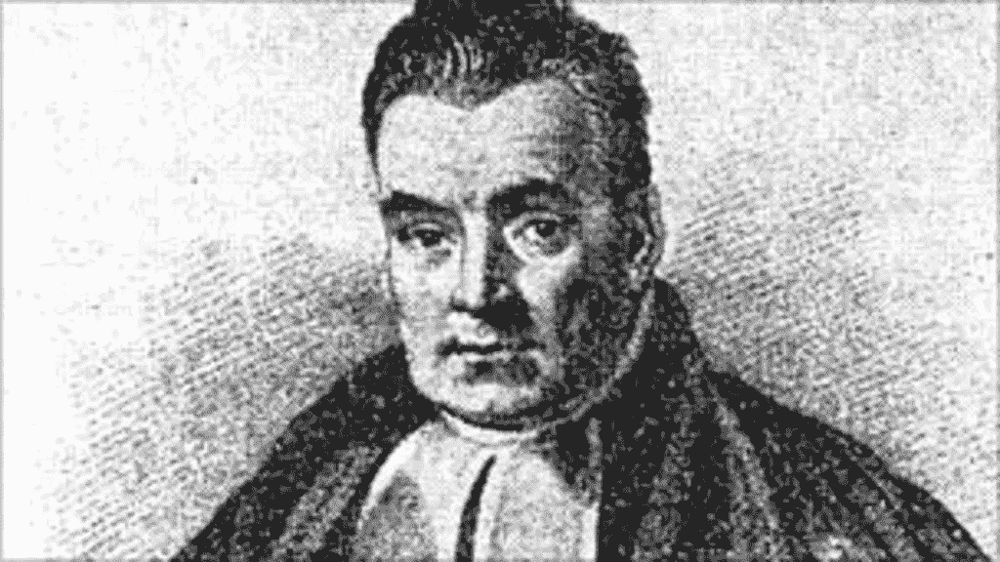

# 托马斯·贝叶斯:制定统计学的人

> 原文：<https://blog.devgenius.io/thomas-bayes-the-man-who-have-formulated-statistics-11c56126db6c?source=collection_archive---------6----------------------->

一个人永远改变了统计数据。即使在今天，他的贡献仍被广泛应用。

其中一个人发展数学的方式使得他的贡献成为理解现代技术的基础，尽管他没有创造任何东西。在这里，我们将概述托马斯·贝叶斯对现代生活的贡献。

## 1-他制定了统计学

尽管他的主要贡献在于概率，尽管他的定理被皮埃尔·西蒙·拉普拉斯证明了，但仍足以阐明统计学的主要组成部分。更重要的是，他的定理正被用来理解统计学和数学中的进一步主题，理解人工智能、数据科学和区块链等现代技术。此外，人工智能专家必须使用贝叶斯过程和随机过程来加强他们的自动化决策。

## 他为不同领域的现代测量提供了基础

在统计学中，没有一个领域是独立于贝叶斯方法的，因为贝叶斯统计提供了一个精确的现代测量系统，高度兼容并在不同时期得到验证。甚至统计上遥远的地方也不能摆脱他的方法。作为一个例子，贝叶斯定理被应用于医学、统计学、物理学、生物学、经济学和许多其他已知的使用他的定理得到精确估计的领域。

## 3-他创造了贝叶斯统计

在托马斯·贝叶斯介入并通过证明他的定理对概率做出贡献之前，只有经典概率(由帕斯卡和费马在 17 世纪创立)很少用于数学。但是当他在数学基础上发现、证明并应用他的定理时，事情将永远改变，统计学将引领巨大的飞跃，创造科学基础并通过其证明推进数学。此外，它们为创造现在和将来可能使用的现代技术提供了基础，并且它们继续以各种形式被使用。

## 商业评估已经用他的定理完成了

分析师大多使用贝叶斯定理进行估计，以确保准确性，并洞察各种事件发生的可能性，从而做出相应的估计。为了清楚起见，让我们举个例子:你是一家投资公司的分析师，你将对公司的产品是否有风险做出决定。某些参数会告诉你潜在的风险以及成功和失败的概率。当你找到结果后，你就可以做出你的解释，并将你的报告提交给高层管理人员进行决策。

*你如何看待托马斯·贝叶斯？根据你的说法，他对现代技术和分析有什么贡献？在下面的评论区分享你的观点和想法。*