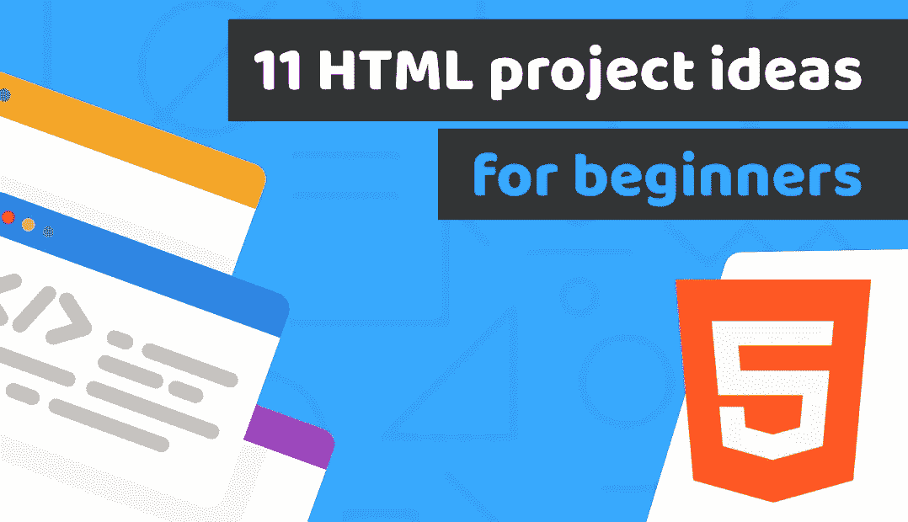
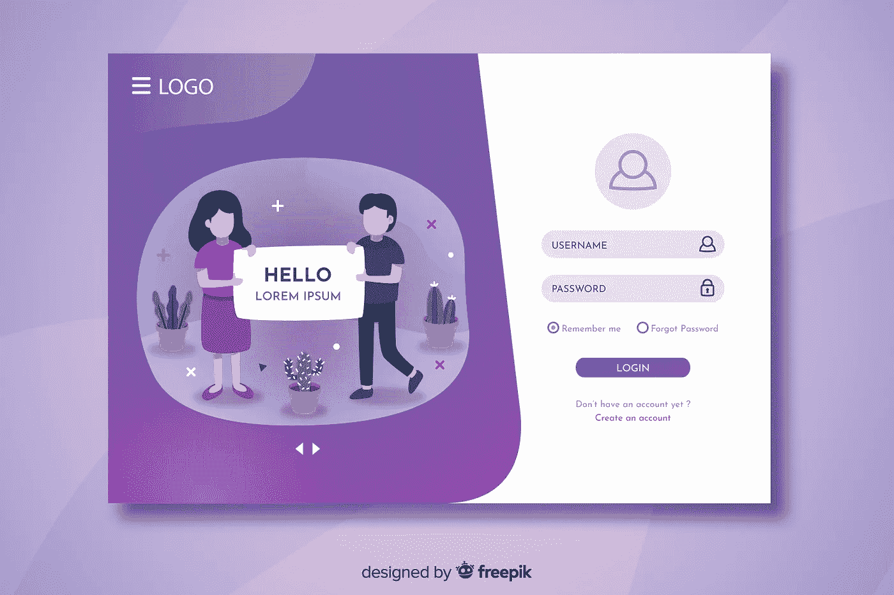
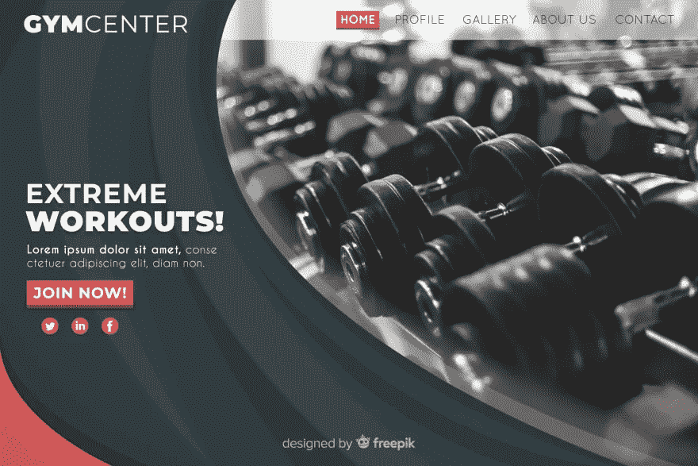

# 这 11 个面向初学者的 HTML 项目创意将帮助你开始创建令人惊叹的前端开发人员组合

> 原文：<https://blog.devgenius.io/those-11-html-project-ideas-for-beginners-will-help-you-to-start-creating-amazing-front-end-89b9f6e2b5d0?source=collection_archive---------7----------------------->

[Duomly —编程在线课程](https://www.duomly.com)

本文原载于[https://www . blog . duomly . com/html-project-ideas-for-初学者](https://www.blog.duomly.com/html-project-ideas-for-beginners)

创建你的编码作品集可能很有挑战性，尤其是如果你是一个新手并且没有很多想法的话。

你可能想知道你能创造出什么样的或大或小的项目来打动你未来的雇主并迅速找到工作。

获得正确的想法并不容易，所以我们想给你一个简短的系列，为前端开发人员提供项目想法，你可以练习并保存在你的 Github 帐户中作为你的编码组合。

该系列将分为三篇文章，一篇是关于 HTML 和 CSS 项目的基础知识。第二个是 Javascript 项目列表，你可以通过它来训练和积累经验。第三个是您可以练习框架知识并创建完整的前端堆栈产品组合的项目列表。

除此之外，在每篇文章中，我将与您分享一些有用的资源，您可以在那里找到免费的照片、图形或完整的代码布局。

和往常一样，对于那些更喜欢看电视而不是阅读的人，我们在 Youtube 上有一集关于相同主题的节目，所以请加入我们的 Youtube 频道。

初学者的 HTML 项目思路

你准备好开始了吗？

# 前端开发人员组合的 HTML 和 CSS 项目

在你学习道路的开始，你将学习 HTML & CSS 技能。这些技能在您未来将要创建的几乎所有前端项目中都是必不可少的。这意味着你需要对这两者有扎实的知识和理解。

值得一提的是，当你将要构建 HTML & CSS 项目时，你应该考虑使用任何流行的 CSS 框架来构建一两个项目，比如 Bootstrap 或者文章[中描述的那些。](https://www.blog.duomly.com/css-frameworks/)

但也有好消息。如果你理解 CSS 框架的主要概念，它们使用起来会非常相似。

总之，在下面，你会看到一个可以使用 HTML & CSS 构建的项目列表。你应该至少选择其中的几个，首先，试着从头开始写，当你对这些技能感到舒服时，试着用 CSS 框架创建几个项目。

除此之外，请记住，您的所有项目都应该是移动友好的。

此外，在本文的最后，您将找到一些资源，在那里您可以找到免费的布局来编码。

开始列表吧！

# 1.简单传记网站

练习 HTML & CSS 技能最简单的方法就是创建一个简单的网页，网页上有你崇拜的人的文字和图片。

# 2.带有表单的联系人页面

初学者的第二个项目将是一个表单联系页面。它应该包含几个字段和一个发送表单的按钮。

# 3.登记表

为了获得更多的表单实践，您可以创建一个稍微高级一点的注册表单，带有一个徽标图像、选择字段、复选框和注册按钮。

[Duomly —编程在线课程](https://www.duomly.com)

# 4.产品登录页面

您可以创建的另一个简单项目是一个简单的产品登录页面。在这个项目中，您可以包含新闻稿形式、产品图像和一些文本等元素。

# 5.餐厅菜单页面

您可以为您的投资组合创建的下一个令人兴奋的项目是餐馆菜单页面。为了让它更高级一点，你可以把位置分成几类，每一类都有列表、图片和按钮来选择，或者定价。

# 6.健身俱乐部网站

另一个令人兴奋、引人注目的项目是你最喜欢的健身俱乐部的网站。您可以通过添加课程、时间表、照片库和价格卡等元素进行更多练习。

[Duomly —编程在线课程](https://www.duomly.com)

# 7.投资组合页面

这一点不仅是一个很好的练习，也是你投资组合的一个地方，它也可以是你的简历，你可以在网上创建和发布。

您可以通过创建几个页面，如主页、关于我、项目或联系人，使其更高级。

除此之外，尝试使用一些 CSS 动画也是一个不错的主意。如果你想了解更多关于使用 [CSS 动画](https://www.blog.duomly.com/css-animations-cheatsheet/)的信息，看看我们前段时间发表的文章。

# 8.CRM 视图

使用 HTML & CSS 完成的下一个令人兴奋的项目是 CRM 视图。它有一个不同的设计，它必须是用户友好的，经常使用垂直菜单，表格和分页。这些元素在简单的网站设计中并不常见。

用 Bootstrap 或 [CSS grid](https://www.blog.duomly.com/css-grid-tutorial/) 创建这个项目来学习定位元素可能是个好主意。

# 9.应用程序页面

对于初学者来说，另一个有趣的项目是编写应用程序登录页面。你可以选择你最喜欢的移动应用程序，或者想象一下你有一天想要开发的应用程序，然后为这个应用程序创建一个登陆页面。

在这里放置关于应用程序的信息，带有图标的功能部分，它如何工作部分，一些图像，以及从 iOS 和 Android 上的应用程序下载的按钮。

# 10.美容用品商店

电子商务是该项目的另一个想法，这可能是你的编码组合中的一个伟大的位置。创建美容产品商店时，您可以建立:

*   带有滑块和特色产品的主页，
*   带有描述和“添加到卡片”按钮的产品页面，
*   购物车页面，带有结帐表单。

# 11.电子书店

这个列表中的最后一个想法是一个数码产品在线商店。因此，您可以创建一个包含产品和类别的页面，以及一个包含下载按钮的获取产品页面，我们可以在填写结帐表单后获取产品。

# 结论

在上面的列表中，你可以为一个项目找到 11 个想法来练习 HTML 和 CSS 技能。你应该把所有的项目都保存在你的 Github 账户中，以便向你未来的雇主展示，或者添加新的功能或技术来开发项目。

如果你不知道如何创建一个 Github 账号，可以查看我们的[教程](https://www.youtube.com/watch?v=70e58se9lHk)。

我希望你作为初学者会发现它是有用的。如果你有其他想法，在评论里分享给别人。

此外，请记住我们将在几天后创建的其他前端技术项目创意。

# 资源:

这里是承诺的资源！

**自由布局:**
[https://freebiesbug.com](https://freebiesbug.com/)
[https://www.freewebtemplates.com](https://www.freewebtemplates.com/)
[https://colorlib.com/wp/templates/aznews](https://colorlib.com/wp/templates/aznews)【页脚演职员表必须保留位置】
[https://free-css.com/free-css-templates](https://free-css.com/free-css-templates)
[https://templated.co](https://templated.co/)
**自由图片:**
[https://pixabay.com](https://pixabay.com/)
[https://www.pexels.com](https://www.pexels.com/)
[https://unsplash.com](https://unsplash.com/)
[https://kab](https://kaboompics.com/)

[Duomly —编程在线课程](https://www.duomly.com)

感谢您的阅读，
来自 Duomly 的安娜