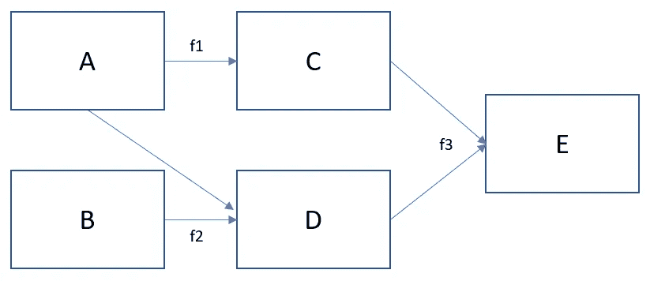

# 关于建立软件模型的思考

> 原文：<https://blog.devgenius.io/thoughts-on-building-software-models-a1321bfbc4d1?source=collection_archive---------38----------------------->


乌韦·亨塞尔在 [Unsplash](https://unsplash.com?utm_source=medium&utm_medium=referral) 上的照片

我最近教了一门课程，关于如何为初级到中级程序员构建软件模型。作为其中的一部分，我试图提炼出支撑良好建模实践的一般思想。

因此，除了语法和如何编写函数的基础知识之外，当我们设计和编写软件时，真正重要的是什么？好的模型和坏的模型之间的区别是什么，我们是否按计划舒适地交付，或者是否上周每天工作 16 小时很忙碌？

每个人做事都不一样，很少有绝对；这是对我有用的:

*   纸片测试
*   接口与实现
*   没有捷径(但有捷径)
*   不要目光短浅
*   编码你的想法
*   纵观全局，拥有自己的作品

**纸片测试**

你能在一张纸上画出你的模型并向某人解释吗？有人可能是开发伙伴或最终用户，技术或非技术人员。但是如果你不能用最简单的术语向某人解释它，我会说它太复杂了，或者你没有完全理解它。

模型的大小无关紧要；对于复杂的模型，你应该能够以一种直观的方式自上而下地解释模型。

与此相反，在设计模型时，纸和笔是你最好的朋友。它迫使你将模型削减到最基本的部分——输入、计算、输出——并鼓励你用一种不依赖于任何特定语言的通用方式来思考。


照片由 [Mike Tinnion](https://unsplash.com/@m15ky?utm_source=medium&utm_medium=referral) 在 [Unsplash](https://unsplash.com?utm_source=medium&utm_medium=referral) : **笔和纸是你设计模型时最好的朋友**

**接口与实现**

在软件开发的上下文中，接口的概念可以定义为*什么软件做什么*，而实现可以定义为*它如何做*。接口当然可以用非常明确的术语来定义，例如作为一个类的公共接口，但是这里我们考虑一般的形式。

*   接口是高级的，实现是低级的
*   界面是设计，实现是细节
*   接口独立于代码而存在
*   接口先于实现

一个有用的问题是，你在接口和实现上花了多少时间(什么时候)。用基本模型对想法进行初步探索是好的，但是如果没有一些迭代设计和构建的元素，这不应该演变成一个越来越复杂的模型。我们都在实践中见过它；模型是在两个星期的赶工中建成的，5 年后还在使用！

我的经验是，在接口和实现任务方面，尽量保持 80/20 的比例。如果我花了超过 20%的时间在细节上，这是缺乏清晰性和前瞻性的表现。

**没有捷径(但有捷径)**


由 [Benjamin Elliott](https://unsplash.com/@benjaminjohnelliott?utm_source=medium&utm_medium=referral) 在 [Unsplash](https://unsplash.com?utm_source=medium&utm_medium=referral) : **上拍摄的照片知道一个项目的终点在哪里并不总是容易的**

想想你最近参与的一个项目。从开始到结束花了多长时间？如果你必须再做一次，知道你现在在做什么，你会花多长时间？

我的经验是，事后看来，一个持续六个月到一年的项目可以在不到两个月的时间内完成。这里没有魔法。当你对自己想做的事情有一个清晰的想法时，并不需要那么长时间！

“长切”有多种来源，包括:

*   不了解利益相关者想要/需要什么
*   利益相关者不了解利益相关者想要/需要什么
*   糟糕的设计
*   使用“锁定”开发代码
*   测试延迟

您永远不会有完美的预见——需求和资源可能会在没有警告的情况下发生变化——但在大多数情况下，通过预先进行相关的对话和设计决策，可以避免长切:

*   积极地让利益相关者真正了解他们需要什么和不需要什么(同样重要)；作为一名开发人员，您的观点可以帮助您制定一套清晰的需求
*   用“如果事情发生变化怎么办？”来保持设计的模块化远景
*   从一开始就进行测试，最好是使用一个自动化的框架，您可以在这个框架上进行构建，并在项目的剩余部分中加以利用
*   让别人来评审你的设计；做这件事没有唯一正确的方法，听取他人的观点总是有用的

**不要短视**


Felix Mittermeier 在 [Unsplash](https://unsplash.com?utm_source=medium&utm_medium=referral) 上拍摄的照片；**玩长线游戏；物有所值**

你愿意现在有 1000 还是一年后有 2000？

除非你真的需要钱，否则这是显而易见的。你会放弃眼前的奖励，在未来获得更大的奖励。

软件开发没有什么不同，除了它不那么容易识别收益和成本，从而做出理性的决定。另外，这并不总是你能决定的。

我试图从长远或战略的角度来看待设计决策。没有简单的规则，但是问一些基本的问题会有帮助:

*   这符合涉众的要求吗？他们容易改变吗？如果是这样的话，我们能适应吗？
*   模型是否经过充分测试？是不是一开始就在测试？如果没有，我们是否遗漏了容易传播的错误？有可用的自动化测试框架吗？
*   它简单到需要的程度了吗？我们是否增加了不必要的复杂性？
*   有记录吗？对于一个新的开发人员来说，吸收模型的开销是多少，这样他们就可以根据需要进行未来的开发了？
*   够快吗？以后还需要更快吗？
*   是否可扩展？未来需要可扩展吗？
*   它的可扩展性如何？
*   是模块化的吗？如果模型的一部分发生变化，需要改变整个结构还是只改变一部分？

共同点是总是有更多(潜在的)工作要做，如果你预先考虑到这一点，你可以将未来需要做的工作数量减到最少。额外的工作变得不像最初工作的自然延伸那样特别。

着眼长远并不总是一个受欢迎的选择——回报不太明显——但这是值得的。只要做好准备，让你现在多花一点时间，为将来节省更多的时间。

**编码你的想法**

根据*的一张纸测试*，模型设计应该简单，并反映出我们如何概念化一个问题。以下面的草图为例:



依赖结构和步骤顺序是清楚的。在一个高层次上，我们应该期望主文件密切关注这一点。类似于…

```
A = ... // construct from inputs
B = ... // construct from inputs
C = f1(A)
D = f2(A,B)
D = f3(C,D)
```

这一点很重要，原因如下:

*   **透明性和健壮性**——如果你的代码试图做什么很清楚，那么就很容易看出它是否在做这件事——模型审计很简单，下一个接手模型的人不会诅咒你的名字:)
*   **成本** —结构不良的模型很难维护，而且会耗费大量的人力和时间。最初的构建时间可能比随后花费在它上面的时间要小

那么我们该怎么做呢？对模型进行编码，使其反映概念设计。我发现了一些有用的方法:

*   一旦你建立了一个模型，请另一个开发人员通读代码，并勾画出他们对代码试图做什么的解释。这是一个有用的练习，可以突出实现在翻译和预期设计中的迷失之处
*   应用**函数式编程**技术。我将在另一篇文章中详述这一点，但简而言之，函数式编程是一种非常自然地将您头脑中的想法转化为代码的方式，并且您也能够编写相当少的代码来实现相同的结果

**看大图，拥有自己的作品**


由[菲德尔·费尔南多](https://unsplash.com/@fifernando?utm_source=medium&utm_medium=referral)在 [Unsplash](https://unsplash.com?utm_source=medium&utm_medium=referral) 拍摄的照片

背景很重要。如果你在做一个大项目的一部分，理解各个部分如何组合成一个整体仍然很重要。

为什么？交流。

如果项目中的个人理解底层(比如代码的细节)和高层(项目试图实现的目标和原因)，并且能够将两者联系起来，那么这确实有助于减少会议、电话和电子邮件的开销。

我有时会花一半的时间打电话或在会议室里做很少的事情。会议是重要的，但是纯粹的数量可能是压倒性的，有时它表明在项目中没有一个单一的、明确的前进方向。

作为一名开发人员，你可以选择积极参与项目:问我们在做什么，为什么。项目管理的艺术是找到从你所在的地方到你想要的地方的最佳路径，而开发人员的观点对于实现这个目标是至关重要的。

感谢阅读。我很想听听你对此的看法！